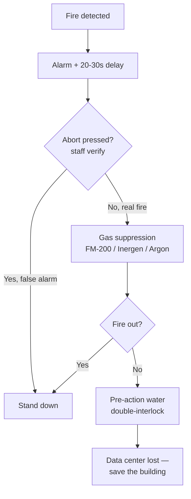
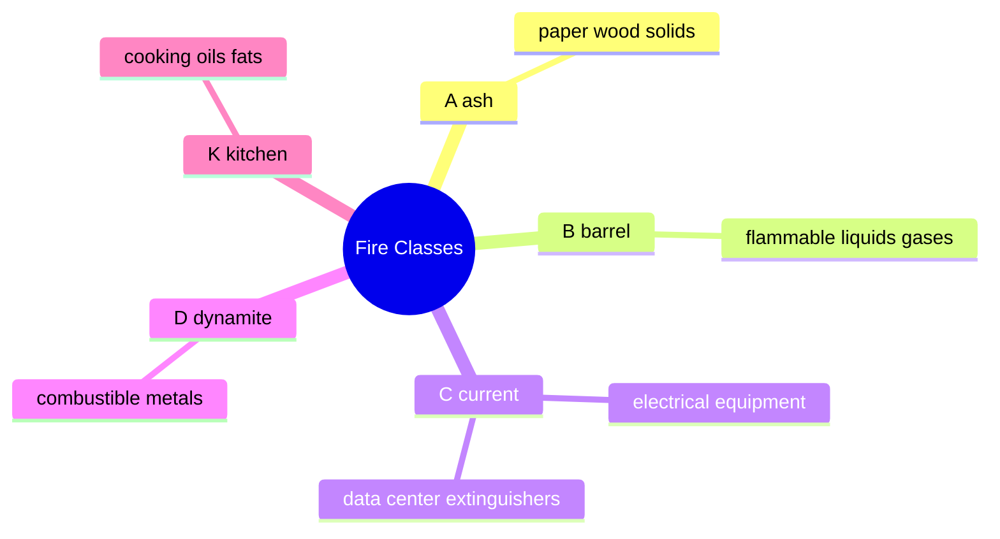

# Fire Suppression

## Overview

Fire suppression is a life-safety and availability control: protect people first, then the building, then the equipment. For the exam, the recurring theme is that **water is the last resort in a data center** — gas systems put out fires without soaking the servers. Most of what follows is detection types, suppression agents, and sprinkler designs, plus a few facts (Halon banned, CO2 kills people) that show up as distractors.

## The Fire Triangle

Fire needs three things — remove any one and it goes out:
- **Oxygen**
- **Heat**
- **Fuel**

## Strategies in a Data Center

1. **Remove oxygen** — gas systems (FM-200, Halon, Argon, Inergen, FE-13, CO2). Most common.
2. **Remove heat** — fire extinguishers (foam/chemical); water (last resort)
3. **Remove fuel** — not feasible (the servers/racks are the fuel)

Water is the LAST resort in a data center. At that point, the data center is lost and we're saving the building.

## Fire Detection Types

| Type | How it works | Notes |
|------|--------------|-------|
| **Heat** | Temperature or rate-of-rise threshold | Triggers alarm + suppression |
| **Smoke (ionization)** | Small radioactive source generates charge; smoke/particles interrupt it | Needs clean environment |
| **Smoke (photoelectric)** | LED light; particles interrupt detection | Needs clean environment |
| **Flame** | Detects IR from actual flames | Needs line-of-sight |

All trigger warning lights + sirens + suppression with typically a **20-30 second delay**. Most systems have an **abort button** — hold it (or press repeatedly) while staff check for actual fire.

Most data centers also have an **activation button** — don't put it where someone can lean against it.

## Sprinkler Bulb Colors

Sprinkler head bulbs break at specific temperatures:

| Color | °F | °C |
|-------|-----|-----|
| Orange | 135 | 57 |
| Red | 155 | 68 |
| Yellow | 174 | 79 |
| Green | 200 | 93 |
| Blue | 286 | 141 |

Data centers and offices typically use orange/red/yellow. Each sprinkler head is independent — one breaking doesn't activate the rest.

## Sprinkler Pipe Types

| Type | Description | Use |
|------|-------------|-----|
| **Wet pipe** | Water in the pipe right up to the sprinkler head | Most common in offices; bad for data centers (leak risk) |
| **Dry pipe** | Compressed air in the pipe; water enters when sprinkler head breaks | Frost-prone areas |
| **Deluge** | All sprinkler heads open; valve holds water back | High-hazard industrial, not data center |
| **Pre-action single-interlock** | Water enters pipes when fire alarm triggers; released when sprinkler opens | Data center option |
| **Pre-action double-interlock** | Water enters pipes ONLY when fire alarm triggers AND sprinkler opens | Best for data centers; sometimes with manual confirmation step |

**Rule: water is last resort. Fail upstream first (gas suppression).**

## Fire Suppression Gases

### CO2
- Displaces oxygen
- Colorless, odorless
- **Dangerous to people** — only for unmanned areas
- If used in manned areas, requires extensive training + clear signage

### Halon 1301
- Was the data center standard
- Fast, safe for equipment, small storage footprint, (at the right concentration) not lethal
- **Depletes ozone** → banned under the Montreal Protocol (halon phase-out)
- Only recycled Halon allowed in existing systems; no new production
- Exceptions: asthma inhalers, aircraft/submarine fire suppression

### FM-200, Argon, FE-13, Inergen
- Modern replacements
- Lower oxygen content enough to extinguish fire without killing people (though breathing is labored)
- FM-200 is the most common

## Fire Classes (US — know these)

| Class | Fuel | Mnemonic |
|-------|------|----------|
| **A** | Ordinary solid combustibles (paper, wood) | **A** = **a**sh |
| **B** | Flammable liquids/gases | **B** = **b**arrel |
| **C** | Electrical equipment | **C** = **c**urrent |
| **D** | Combustible metals | **D** = **d**ynamite |
| **K** | Cooking oils and fats | **K** = **k**itchen |

Common extinguishers in US: **ABCD** combo (single extinguisher rated for all four).
Data center extinguishers: **Class C** (electrical).

## Fire Extinguisher Use: PASS

- **P**ull the pin
- **A**im at the base of the fire (not at the flames)
- **S**queeze the handle slowly
- **S**weep side to side

## Extinguisher Types

- **Soda-acid** — historical; water + sodium bicarbonate + small acid vial; pressurized on break
- **Dry powder** — removes oxygen + lowers temp; often used on metal fires
- **Wet chemical** — foam + water; removes oxygen and lowers temperature; most common

## Exam Tips

- Water is last resort for data centers
- Halon is banned (Montreal Protocol); FM-200 is the replacement
- CO2 kills people — unmanned only
- Double-interlock pre-action = best for data centers
- Sprinkler bulb colors map to trigger temps
- PASS: Pull, Aim, Squeeze, Sweep
- US fire classes: A (ash) B (barrel) C (current) D (dynamite) K (kitchen)

## Diagrams

### Suppression Escalation — Flowchart

> Gas first; water is the last resort once the data center is already lost.

**Takeaway:** Detect → verify → gas → (only if all else fails) water. Water = last resort.

### US Fire Classes — Mindmap

> Match the fuel to the class and mnemonic.

**Takeaway:** A ash · B barrel · C current · D dynamite · K kitchen. Data centers use Class C.

## Related Topics

- [Physical Security](Physical%20Security.md)
- [Environmental Controls](Environmental%20Controls.md)
- [Personnel Safety](Personnel%20Safety.md)
