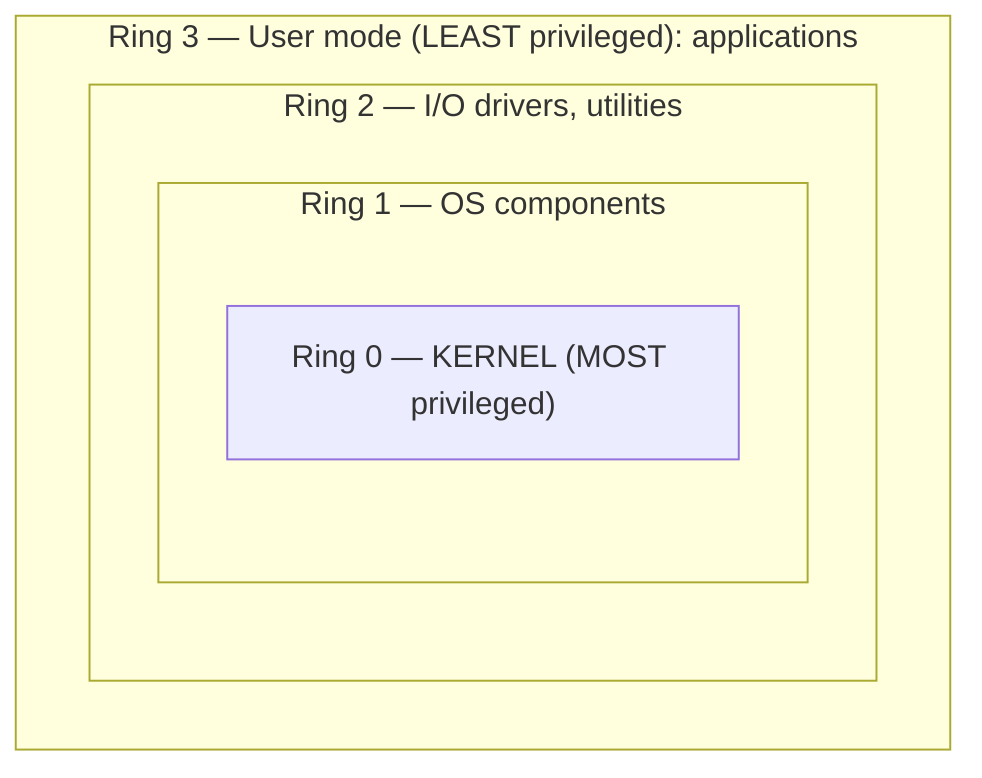

# Hardware Architecture

## Overview

How computer hardware is structured, where memory sits relative to the CPU, and the security features built into hardware.

## System Unit

The case and all internal hardware: motherboard, CPU, memory, firmware, expansion slots.

## Bus Architecture

Legacy systems used a single shared bus. Modern systems use a **Northbridge + Southbridge** split:

| | Northbridge (memory controller hub) | Southbridge (I/O controller hub) |
|--|-------------------------------------|---------------------------------|
| Connects | CPU, system memory, graphics | Peripherals, hard drives |
| Speed | Faster | Slower |

In newer processors (Intel Sandy Bridge, AMD Fusion forward), the Northbridge is integrated onto the CPU.

## Memory Hierarchy (closer to CPU = faster)

1. CPU registers
2. L1 cache (on the CPU die)
3. L2 cache (attached to CPU)
4. Main memory (RAM)
5. Storage (disk / SSD)

## BIOS

Low-level firmware OS that runs when the system starts:
- **POST** (Power-On Self-Test) — checks BIOS, memory, devices
- Locates boot sector, loads kernel, executes higher-level OS
- Stored in **EEPROM** today (older: ROM, PROM, EPROM — know these for the exam)
- EEPROM is "flashable" = updatable = also attackable if compromised

## WORM Media
**Write Once, Read Many** — CDs/DVDs (non-rewritable), some legacy ROM. Used for log retention where logs must be unalterable.

## Security Features in Hardware

### TPM (Trusted Platform Module)
- International standard for a secure crypto processor
- Dedicated microprocessor on the motherboard
- Functions: generate random numbers, symmetric/asymmetric encryption, hashing, secure key storage, message digests
- **Protects boot integrity** — critical because a compromised BIOS is very bad

### DEP (Data Execution Prevention)
- Prevents code execution from memory regions reserved for data or OS/programs
- Blocks malicious programs from executing in trusted memory regions

### ASLR (Address Space Layout Randomization)
- Randomizes memory addresses where executables load
- Defeats **buffer overflow attacks** that rely on predictable memory locations
- Analogy: kidnap target takes a different route home every day — attacker can't predict

## Multicore Execution

- A core can execute **one thread at a given instant**. A **dual-core** single processor runs **two threads simultaneously** (one per core). More threads can *exist* (queued/scheduled), but the number of cores caps how many run at the same instant.

## CPU Vulnerabilities — Spectre & Meltdown

- **Speculative-execution** flaws: the CPU pre-executes instructions it *might* need, leaking data across security boundaries (one process/VM reads another's memory).
- Mitigated by **OS/firmware microcode updates** (with some performance cost).

## CPU Memory Protection

- Logical segmentation — one process can't read another's memory
- Hardware segmentation — specific memory addresses for specific processes
- **Virtual memory** — use disk as overflow (slow, but expands effective RAM)

## Exam Tips

- Northbridge is faster; Southbridge is slower
- BIOS = low-level OS in EEPROM
- TPM is **hardware** — a chip on the motherboard
- DEP blocks code execution in data regions
- ASLR randomizes memory addresses
- WORM = Write Once, Read Many (good for logs)

## Diagrams

### Ring Protection Model

> Nested rings = privilege levels. Lower ring number = more privilege.

**Takeaway:** **Ring 0 = kernel (most privileged)**, **Ring 3 = user apps (least)**. Maps to processor states: Ring 0 = supervisor/kernel mode, Ring 3 = problem/user mode.

## Related Topics

- [Security Architecture Concepts](Security%20Architecture%20Concepts.md)
- [Memory and Data Remanence](../02-asset-security/Memory%20and%20Data%20Remanence.md)
- [Cryptography](Cryptography.md)
