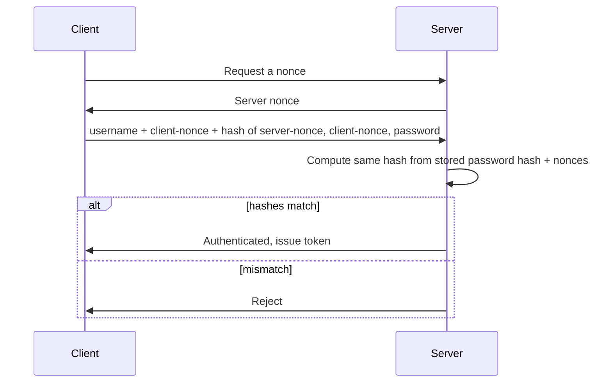

# Hashing - Detail

## Overview

**One-way function.** Variable-length input → fixed-length output (also called a **message digest** or **MD**).

- Only provides **integrity**
- Not encryption — cannot be reversed
- Used to prove a file / drive / message hasn't changed

### Change Any Byte → Completely Different Hash
Changing a single comma in a 1,800-word text produces a completely different hash. That's the avalanche effect.

## Collisions

Two different inputs producing the same hash. Every hash algorithm has theoretical collisions; a strong hash makes them computationally infeasible to find. A **chosen-text collision** (where attacker makes specific content match an existing hash) is far harder than a **random collision** — MD5 has chosen-text weaknesses.

## Hash Algorithms

### MD5
- 128-bit output
- Fast, widely used
- **Broken for collision resistance** — should not be used where collisions matter
- Still widely used for file integrity checks where chosen-text attacks aren't a concern

### MD6
- Successor to MD5
- Entered SHA-3 competition; withdrawn after flaws discovered
- Rarely seen in practice

### SHA Family (Secure Hash Algorithms)
| Family | Output | Notes |
|--------|--------|-------|
| **SHA-1** | 160-bit | Weak collision resistance; widely deployed; deprecate |
| **SHA-2** | 224/256/384/512 | Released 2001-2012; currently secure; most common today |
| **SHA-3** | Variable | Finalized Aug 2015; collision-resistant |

SHA-2 and SHA-3 are both secure and acceptable.

### HAVAL (Hash of Variable Length)
- Based on MD principles
- Output: 128/160/192/224/256 bits (you pick)
- Faster but less widely adopted

### RIPEMD / RIPEMD-160
- Community-developed (not government or contest) — answer to concerns about backdoors
- RIPEMD 128/256/320 — **not secure**
- **RIPEMD-160** — still secure but not widely used

## Salting

Random data added to input before hashing.

**Why:** Defends against **rainbow tables** (precomputed hash databases of common passwords). Without salt, if an attacker steals the hashes and knows the algorithm, they just look up your hash in a rainbow table — your password is now theirs. Salting means each user's hash is different even if two users have the same password.

Salts are stored alongside the hash; they don't have to be secret.

## Nonces

"Number used once" — an arbitrary, single-use value.

**Uses:**
- Defend against **replay attacks** — if each authentication includes a fresh nonce, an attacker can't replay a captured exchange
- Initialization vector in hash functions

### Typical Nonce-Based Auth Flow
1. Client requests a nonce from server
2. Server sends back a nonce
3. Client sends: username + client-nonce + hash(server-nonce, client-nonce, password)
4. Server computes the same hash using its stored password hash and nonces
5. If they match → authenticated → server issues a token

## Why Hashing Matters in Forensics

Hash a compromised drive at seizure. Make a bit-for-bit copy. Hash the copy. Both hashes must match — proves integrity. Do forensic work on the copy. Re-hash when done. All three hashes must match — proves the copy wasn't altered during analysis. Preserves integrity for court.

## Exam Tips

- Hashing = one-way, integrity only
- Variable-length input → fixed-length output
- MD5 is broken for collisions (don't use for security-critical integrity)
- SHA-2 / SHA-3 are current standards
- RIPEMD-160 is secure; other RIPEMD variants are not
- Salting defeats rainbow tables
- Nonces defeat replay attacks

## Diagrams

### Nonce-Based Authentication — Sequence

> A fresh nonce each time defeats replay attacks.

**Takeaway:** The password never crosses the wire; the per-session nonce makes a captured exchange unreplayable.

## Related Topics

- [Cryptography](Cryptography.md)
- [Symmetric Encryption Detail](Symmetric%20Encryption%20Detail.md)
- [Asymmetric Encryption Detail](Asymmetric%20Encryption%20Detail.md)
- [Digital Forensics](../07-security-operations/Digital%20Forensics.md)
- [Access Control Attacks](../05-identity-and-access-management/Access%20Control%20Attacks.md)
