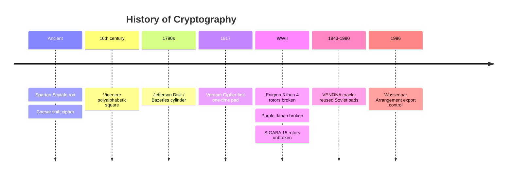

# History of Cryptography

## Overview

Easy exam points — pure memorization. Know the key names, what they did, and any notable events.

## Ancient / Classical

### Spartan Scytale
Wrap a cloth strip around a stick of specific diameter. Write message along the rod. Unwrapped cloth looks random — only same-diameter rod reveals message. **Symmetric:** both parties need identically-sized rods (the shared secret).

### Caesar Cipher
Substitution cipher. Shift letters N positions (e.g., shift 3: "pass the exam" → "sdvv wkh hadp").

### Vigenère Cipher (16th century)
**Polyalphabetic** cipher using a keyword and a 26×26 alphabet square (Vigenère square). Plaintext along top, key along side; intersection gives ciphertext.

### Cipher Disk
Two concentric disks with alphabets. Can rotate inner disk periodically (e.g., 3 letters every 5 messages) for added strength.

## World War Era

### Enigma (Germany, WWII)
Rotor-based cipher machine. Started with **3 rotors** (17,576 combinations); broken by Polish military pre-war. Germans added a **4th rotor** (~450K combinations) — eventually broken by Alan Turing's team at Bletchley Park and a US team of female scientists. **The Imitation Game** dramatizes this. Breakthrough likely shortened WWII by years, saving millions of lives.

### Purple (Japan, WWII)
US name for a Japanese rotary cipher similar to Enigma. 3 rotors. Broken by US, UK, and Russia. When Russia decrypted messages showing Japan would attack Southeast Asia (not Russia), they moved Eastern Front troops to defend Moscow.

## Vernam Cipher and One-Time Pads

**One-Time Pads** are the only mathematically unbreakable encryption — **if used correctly**:
- Truly random key
- Key used **only once**
- Both parties have identical pads
- Key kept secure

**Vernam Cipher** — first known OTP use; bits XORed with plaintext bits.

### Project VENONA (1943-1980)
US + UK project to break Soviet OTP communication. KGB pads should have been unbreakable — but they **reused** pads. With enough ciphertext, the pads cracked. Identified many high-level US spies.

**Lesson:** Most encryption "breaks" aren't algorithmic — they're implementation failures (reused pad, leaked key, weak random source, side channel).

## 20th Century

### Jefferson Disk / Bazeries Cylinder
Multiple alphabet disks on a shared axle, order agreed between parties. Invented by US President Jefferson; improved by Bazeries.

### SIGABA (US, WWII-1950s)
US rotor machine with **15 rotors** (billions of options). No known cryptanalytic break during its service life. Retired due to size, weight, fragility, complexity.

## Cold War Export Control

### COCOM (1947-1994)
Coordinating Committee for Multilateral Export Controls. Prevented export of critical tech (including crypto) from Western countries to the Soviet bloc.

### Wassenaar Arrangement (1996-present)
Successor to COCOM. Limits export of military + dual-use technologies (crypto is dual-use). Some participating countries also restrict strong-crypto imports, because strong crypto prevents those countries from spying on their own citizens.

## Exam Tips

- Enigma rotors: 3 (broken early) → 4 (broken by Turing's team)
- One-time pads are unbreakable **only if** truly random + one-time + secure
- VENONA = Soviet OTP cracked because pads were reused
- Wassenaar Arrangement = current export control framework

## Diagrams

### Cryptography Through Time — Timeline

> The names and events the exam asks about, in order.

**Takeaway:** One-time pads are unbreakable only if truly random + used once; VENONA broke them because pads were reused.

## Related Topics

- [Cryptography](Cryptography.md)
- [Laws and Regulations](../01-security-and-risk-management/Laws%20and%20Regulations.md) — Wassenaar Arrangement
