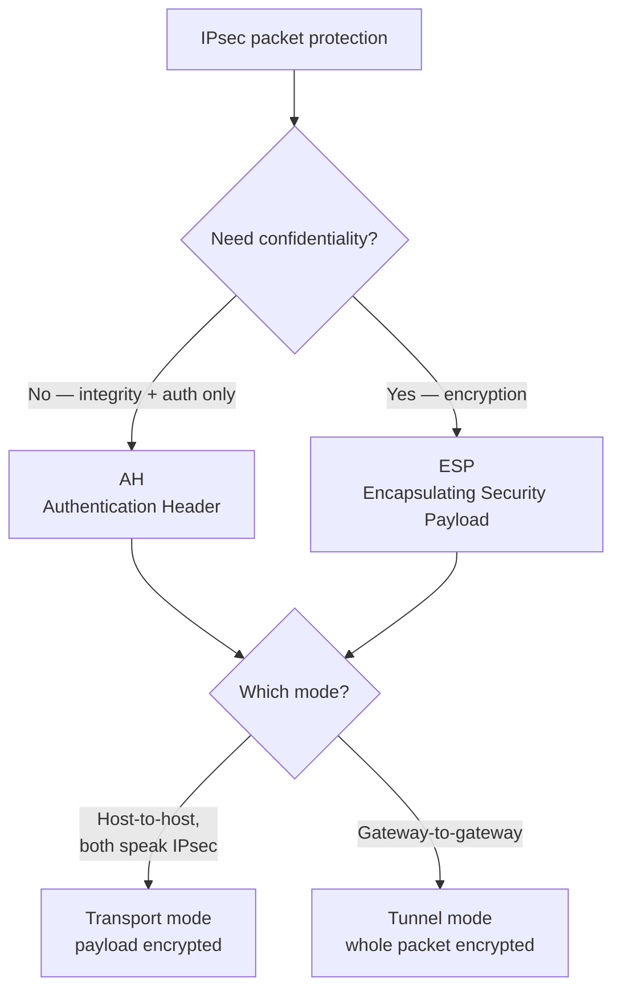

# IPsec and PGP

## Overview

Two workhorse standards that apply cryptography to real traffic. **IPsec** secures data in transit at the **network layer** — it protects whole IP packets, which is why it's the backbone of VPNs. **PGP** secures data at the **application/content layer** — individual emails and files. Knowing which layer each operates at is what most exam questions hinge on.

## IPsec

Most common use: **VPN tunnels** — securely connecting remote users/sites back to corporate networks.

- **IPv6** — IPsec is built in
- **IPv4** — IPsec is bolted on (Internet was originally designed for closed, trusted networks)

### IPsec Components

| Component | Provides | Notes |
|-----------|----------|-------|
| **AH** (Authentication Header) | Integrity + authentication + protection against replay | **No confidentiality** — packet contents still visible |
| **ESP** (Encapsulating Security Payload) | Confidentiality + integrity + authentication | Does everything AH does plus encryption |

Can use AH and ESP separately or together.

### Security Associations (SA)

- **Simplex connections** (one direction only)
- Need one SA per direction per protocol → if using both AH and ESP bidirectionally = 4 SAs
- Each SA has a unique **SPI** (Security Parameter Index — 32-bit)

### ISAKMP
Internet Security Association and Key Management Protocol — handles SA creation and key exchange.

### IPsec Modes
| Mode | What's encrypted | Use case |
|------|------------------|----------|
| **Transport mode** | Payload only | Both endpoints natively support IPsec (host-to-host) |
| **Tunnel mode** | Entire packet including headers | Gateway-to-gateway, when endpoints don't speak IPsec |

### IKE - Internet Key Exchange
Negotiates protocols, encryption algorithms, and hash functions between the two endpoints. Picks the strongest option both sides support.

## PGP - Pretty Good Privacy

Provides confidentiality, integrity, authentication, non-repudiation. Uses asymmetric + symmetric + hashing.

### Uses
- Email encryption
- File and directory encryption
- Full or partial disk encryption

### Flexibility
Framework is open — you can choose your symmetric/asymmetric/hash algorithms based on your security needs.

### Trust Model: Web of Trust
"If you trust me, and I trust Bob, then you trust Bob." No central CA — decentralized trust propagation. Different from X.509's hierarchical CA model.

## S/MIME (Secure MIME)

- MIME (Multipurpose Internet Mail Extensions) = standard for email encoding, including character sets and attachments — **not secure on its own**
- **S/MIME** = MIME + PKI for encryption and authentication
- Encryption/decryption happens in the email client or at the server (**S/MIME gateway**)
- Uses X.509 / CA-issued certificates (unlike PGP's web of trust)

## Exam Tips

- IPsec: AH = no confidentiality; ESP = confidentiality + everything else
- SAs are simplex → need 2+ for bidirectional
- Tunnel mode = gateway-to-gateway (encapsulates full packet)
- Transport mode = host-to-host
- PGP uses **web of trust**; S/MIME uses **PKI / CA hierarchy**
- IKE picks the strongest mutually-supported protocols

## Diagrams

### IPsec Decisions — Flowchart

> Pick the protocol (confidentiality?) then the mode (who are the endpoints?).

**Takeaway:** AH = no confidentiality; ESP = everything. Transport = host-to-host; Tunnel = gateway-to-gateway.

## Related Topics

- [Cryptography](Cryptography.md)
- [Network Protocols](../04-communication-and-network-security/Network%20Protocols.md)
- [Digital Signatures and PKI](Digital%20Signatures%20and%20PKI.md)
- [MAC HMAC SSL and TLS](MAC%20HMAC%20SSL%20and%20TLS.md)
