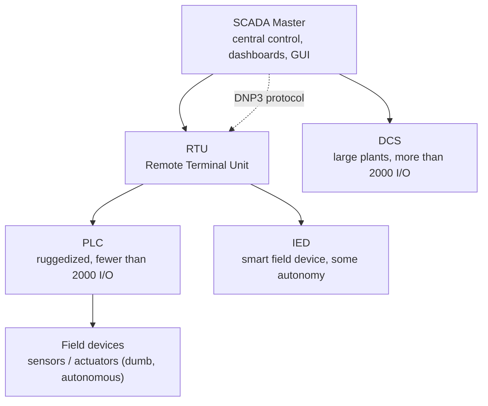

# Industrial Control Systems (ICS)

## Overview

ICS is the umbrella term for the control systems and instrumentation that run industrial production — automating and monitoring power plants, water treatment, factories, and other infrastructure. It matters for security because these systems run **critical, physical processes** where the priority order flips: **availability and safety come before confidentiality**, downtime can be life-threatening, and the kit was built for uptime and ruggedness, not patching. Many devices are legacy, hard to update, and increasingly internet-connected — a growing attack surface.

## Where ICS Is Used
- Power plants, water / wastewater treatment
- Transportation
- Windmills / wind farms
- Manufacturing

## SCADA (Supervisory Control and Data Acquisition)

Back-end command-and-control architecture using computers, networked data, and GUI interfaces to supervise and manage subcomponents.

### Common Components

| Component | Role |
|-----------|------|
| **SCADA master** | Central control — dashboards, management |
| **RTU** (Remote Terminal Unit) | Intermediate — communicates with field devices |
| **IED** (Intelligent Electronic Device) | Smart field device with some autonomy |
| **DCS** (Distributed Control System) | Computerized control for large plants — autonomous controllers across many I/O points (usually >2000) |
| **PLC** (Programmable Logic Controller) | Industrial computer, ruggedized, for smaller setups (<2000 I/O points) |

DCS vs PLC — use DCS for large complex installations; PLC for smaller or embedded.

### Communication
- Often uses **DNP3** (Distributed Network Protocol v3)
- Low bandwidth needs → some systems use dial-up or radio
- Often not constant connections — field devices push data at intervals, or master polls

### Autonomy Gradient
The closer to the SCADA master, the "smarter." Field devices (PLCs in a windmill) are relatively dumb and autonomous — operating on local parameters (wind speed, direction) and reporting back.

### Windmill Example
A windmill starts spinning only when wind speed and direction meet local parameters. If you want to change those parameters, you log in to that specific windmill via the SCADA system.

## Security Considerations

- ICS networks were historically air-gapped; increasingly internet-connected — increasing risk
- Stuxnet (US/Israel) targeted Iranian centrifuges via industrial control attack
- Legacy devices often can't be patched
- Protocols like DNP3 were designed without security — need overlays

## Exam Tips

- **SCADA** = the back-end supervisory system
- **DCS** = large installations (>2000 I/O points)
- **PLC** = smaller / embedded
- DNP3 is a common ICS protocol
- Field devices are dumb + autonomous; SCADA is smart + centralized
- Stuxnet is a famous ICS attack — pure integrity attack

## Diagrams

### SCADA Hierarchy — Flowchart

> Smart and centralized at the top; dumb and autonomous at the edge.

**Takeaway:** SCADA = smart + centralized; field devices = dumb + autonomous. DCS for large installs, PLC for small.

## Related Topics

- [IoT Security](IoT%20Security.md)
- [Network Protocols](../04-communication-and-network-security/Network%20Protocols.md)
- [Attackers and Attack Types](../01-security-and-risk-management/Attackers%20and%20Attack%20Types.md)
