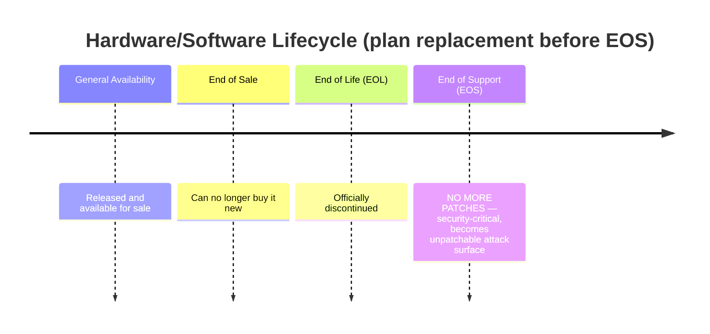

# Information System Lifecycle

## Overview

Every system goes through phases from planning to decommission. Security must be built in at every phase — not bolted on later.

## Phases

### 1. Initiation and Planning
- Define scope, objectives, security requirements
- Gather stakeholders, identify purpose
- Risk assessment: identify threats and vulnerabilities
- Establishes the roadmap; **security baked in from the start**

### 2. Development and Acquisition
- Build vs. buy decision
- Remember: "system" = hardware + software + middleware — all of it
- Custom code, COTS software, hardware selection
- Verify everything meets security and functional requirements **before** buying

### 3. Implementation
- Install, configure, harden
- Stage in test/staging VLANs first; only promote to production after validation
- Ensure alignment with policies and standards

### 4. Operations and Maintenance (longest phase)
- Day-to-day running
- Monitoring, patching, auditing
- Ongoing — protect against evolving threats and business changes

### 5. Decommission and Disposal
- Securely migrate or destroy data
- Wipe / destroy media (match disposal to original data classification)
- Recycle hardware per environmental regulations
- Manage software license transfer/termination

## Cross-Phase Considerations

- **Risk management** — ongoing, not one-time
- **Compliance** — laws and regulations evolve; monitor
- **Access control** — least privilege throughout
- **Change management** — every change through a formal process, with rollback plans
- **Incident response** — plan covers this specific system
- **BCP / DRP** — backups, redundancy, documented recovery
- **User training / awareness** — users are the weakest link
- **Continuous monitoring** — vulnerability scans, logs, pen tests

## Exam Tips

- Security applies to **every** phase
- Operations and maintenance is the longest phase — most incidents happen here
- Decommission requires secure data handling
- "System" = hardware + software + everything needed to make it function

## Diagrams

### Manufacturer Product Lifecycle — Timeline

> Timeline diagrams are ideal for ordered life stages.

**Takeaway:** Order = GA → End of Sale → EOL → **End of Support (last & most important)**. Replace systems *before* EOS.

## Related Topics

- [Information Life Cycle](../02-asset-security/Information%20Life%20Cycle.md) — data lifecycle (Domain 2)
- [Secure SDLC](../08-software-development-security/Secure%20SDLC.md) — software-specific
- [Change and Configuration Management](../07-security-operations/Change%20and%20Configuration%20Management.md)
- [Risk Management](../01-security-and-risk-management/Risk%20Management.md)
