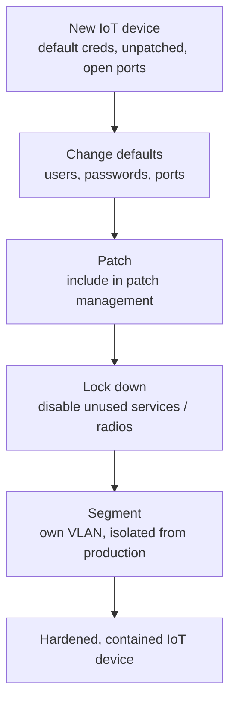

# IoT (Internet of Things) Security

## Overview

Anything you can put "smart" in front of — smart TV, smart thermostat, smart fridge, smart phone, smart car. Whenever we make something easier, we often make it less secure, and IoT is the poster child.

## Why IoT Is Risky

- Designed for **functionality**, not security
- Often never patched (some don't even support patching)
- Default usernames/passwords, well-known ports
- Very basic or no security controls
- Easy attack vector into the network

**Example:** A hacker compromised a smart TV in a conference room (default creds, unpatched, outdated Unix) and pivoted from there to the rest of the network. The other defenses didn't matter because IoT wasn't segmented.

## Hardening IoT Devices

1. **Change defaults** — usernames, passwords, ports where possible
2. **Patch** — include IoT in patch management; pick vendors who actually release patches
3. **Segment** — put IoT devices on their **own VLAN**, isolated from production
4. **Lock down** — disable unused ports, services, Bluetooth/Wi-Fi capabilities not needed
5. **Choose wisely** — when buying, favor vendors with a security track record

## Vendor Selection

When you can influence purchasing:
- Favor vendors who actually push patches
- Ask about security features, not just functionality
- Check if patches have been released for past vulnerabilities

## Embedded Systems

A computer **built into a larger device** with a **fixed, dedicated function** — medical devices, automotive ECUs, appliances, industrial controllers. Like IoT, they're **hard/impossible to patch**, so secure them by **isolation and secure-by-design** rather than relying on updates.

## Smartphones

Smartphones are IoT too. Modern phones are generally better patched than other IoT (automatic updates, short patch cycles), but secure design might still place them on an IoT VLAN rather than the primary corporate network.

## Exam Tips

- IoT devices are the weakest link in most modern networks
- Default strategy: **harden + patch + segment**
- Security must be designed in — most IoT vendors don't
- Smart devices should be isolated from sensitive networks

## Diagrams

### IoT Hardening — Flowchart

> The default strategy: harden, patch, segment.

**Takeaway:** IoT is the weakest link — security must be added on by harden + patch + segment, since vendors rarely build it in.

## Related Topics

- [Secure Network Architecture](../04-communication-and-network-security/Secure%20Network%20Architecture.md)
- [Mobile Device Security](Mobile%20Device%20Security.md)
- [Defense in Depth](../01-security-and-risk-management/Defense%20in%20Depth.md)
