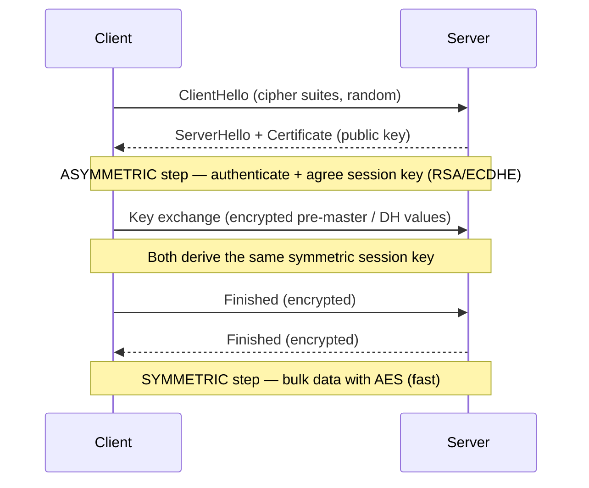

# MAC, HMAC, SSL, and TLS

## Overview

Several different things share the "MAC" abbreviation in cybersecurity. On the exam, context disambiguates — but know the options.

### "MAC" Has 3 Meanings in CISSP (Critical Disambiguation)

Same letters, three different concepts — **context decides which one**:

1. **Message Authentication Code** — crypto integrity value (the TLS one, this note)
2. **Mandatory Access Control** — access-control model using labels / clearances (Domain 5)
3. **Media Access Control** — the **MAC address**, a Layer 2 hardware address (Domain 4)

## MAC - Message Authentication Code

A hash function that **uses a key**. Provides integrity AND authenticity (plain hashing only provides integrity).

Example: **CBC-MAC** — uses Cipher Block Chaining with DES.

### MAC in the TLS Context (Tamper-Detection Seal)

In TLS, the **MAC is a short cryptographic value attached to each message** that proves:
- **Integrity** — the data was not altered in transit
- **Authenticity** — it came from someone holding the **shared secret key** established in the handshake

**How it works:** the sender computes a MAC over the message using the shared secret key + message contents and **appends** it. The receiver **recomputes** the MAC and **compares** — a mismatch means tampered/corrupted → message rejected. TLS uses **HMAC** (hash-based MAC, e.g., **HMAC-SHA256**).

It provides **integrity + authenticity, NOT confidentiality** — confidentiality is **AES's** job. The MAC sits **alongside** the encryption.

**Full TLS picture:**
- **Confidentiality** → **AES** (symmetric encryption)
- **Integrity + authenticity** → **MAC / HMAC**
- **Authentication + key exchange** → **asymmetric (RSA / ECDHE) + certificates**

**One-liner:** in TLS the MAC is the **tamper-detection seal on each message** (proves not changed + from the right party); **AES hides the data, the MAC protects it from modification**.

## HMAC - Hashed Message Authentication Code

Combines MAC + hashing with a pre-shared key. Flow:
1. Sender XORs plaintext with shared key
2. Hashes the result
3. Combines that hash with the key again → produces HMAC
4. Receiver does the same with their copy of the key; if HMACs match, authenticated

Pre-shared key required (symmetric).

## SSL - Secure Sockets Layer

Mostly deprecated. Current version SSL 3.0 — less secure than TLS.

## TLS - Transport Layer Security

Successor to SSL. Used by virtually every HTTPS website today, plus email, IM, VoIP, etc.

### SSL/TLS Handshake (high level)
1. **TCP 3-way handshake** — SYN / SYN-ACK / ACK (connection established)
2. **Client Hello** — sends SSL/TLS version, session ID, supported cipher suites
3. **Server Hello + Certificate** — server selects cipher, sends certificate, optionally requests client cert (rare)
4. **Client responds** — sends pre-master secret; optionally authenticates with client cert
5. **Finish** — both sides confirm ready; encrypted exchange begins

### Client Certificates
Optional in SSL/TLS handshake. Most web servers don't require them — they just want you to visit. Required only when you need mutual authentication (highly secure systems).

## TLS Is a Protocol; AES Is a Cipher It Uses (Hybrid Crypto)

A common exam confusion: **TLS is not a cipher — it's a protocol.** AES is one of the symmetric ciphers TLS uses to do the actual encryption. They operate at different levels:

- **TLS** = the protocol that secures data **in transit** (the **S in HTTPS**). It provides **confidentiality** (encryption), **integrity** (MAC/HMAC), and **authentication** (certificates / PKI).
- **AES** = the fast symmetric block cipher TLS typically selects to encrypt the bulk of the data.

### How they fit together (the handshake is hybrid cryptography)
1. The TLS handshake uses **asymmetric** crypto (**RSA** or **ECDHE**) to **authenticate** the server (via its certificate) and **exchange a session key**.
2. Once the shared session key is established, TLS **switches to a symmetric cipher (usually AES)** for **bulk data encryption**.

This is **hybrid cryptography**: asymmetric to **set up** the connection (secure for key exchange/authentication but slow), then symmetric/AES to **do the work** (fast for large volumes of data).

**One-liner:** AES = fast symmetric cipher doing the bulk encryption; TLS = the protocol that authenticates, exchanges the key asymmetrically, then uses AES to protect data in transit.

## Exam Tips

- **TLS is a protocol, not a cipher** — it *uses* ciphers like AES
- TLS handshake = **asymmetric (RSA/ECDHE) to exchange the session key → symmetric (AES) for bulk** = hybrid crypto
- TLS provides confidentiality + integrity + authentication; the **S in HTTPS**
- MAC (in crypto) = keyed hash for integrity + authenticity
- HMAC = specific construction combining MAC with hashing
- TLS has replaced SSL; SSL 3.0 is the current / final SSL version
- TLS handshake: TCP 3-way → Client Hello → Server Hello → key exchange → Finish
- Client certificates are optional and rarely required

## Diagrams

### TLS Handshake — Hybrid Crypto Sequence

**Takeaway:** Asymmetric to set up + exchange the key, then symmetric (AES) for bulk = hybrid crypto.

## Related Topics

- [Cryptography](Cryptography.md)
- [Network Protocols](../04-communication-and-network-security/Network%20Protocols.md)
- [Digital Signatures and PKI](Digital%20Signatures%20and%20PKI.md)
