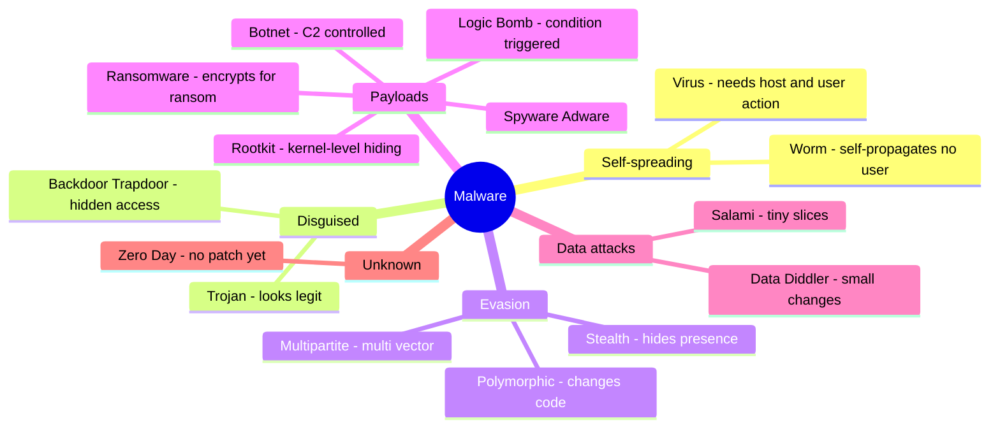

# Malware

## Overview

Catchall term for malicious software compromising systems or data. Exam won't ask definitions — expect scenarios where a keyword identifies a type.

## Virus Types

Require **human interaction** to spread; common vector: USB drives, opened files.

| Type | Keyword / clue |
|------|----------------|
| **Macro / document virus** | Written in macro language, embedded in Word / Outlook / Excel. "Enable macros" warnings. Common in whaling attacks. |
| **Boot sector virus** | Lives in the boot sector (loads before OS). Antimalware can pre-boot scan. |
| **Stealth virus** | Hides from OS and antivirus |
| **Polymorphic virus** | Changes its signature to evade signature-based detection (poly = many, morph = change) |
| **Multipart / multipartite virus** | Spreads via multiple vectors (e.g., boot sector + disk files) — cleaning one part lets the other reinfect |

## Non-Virus Malware

| Type | Keyword / clue |
|------|----------------|
| **Worm** | **Self-propagating** — spreads on its own, no user needed. Aggressive → easy to detect via traffic anomalies. |
| **Trojan** | Disguised as legitimate software (look like Greek gift horse). CEO gets fake "legal document" attachment. |
| **Rootkit** | Replaces part of OS/kernel. User rootkit = Ring 3; kernel rootkit = Ring 0. Very hard to detect. |
| **Logic bomb** | Triggers on specific event/time (if-then). Former employee sabotage is a classic case. Dormant until trigger = hard to find. |
| **Packer** | Compresses executables. Neutral technology but abused by malware to evade signatures. Hash check detects tampering. |
| **Fileless malware** | Runs **only in memory** (e.g., via PowerShell/living-off-the-land), leaving **no file on disk** → evades file/signature-based detection. |
| **Ransomware** | Encrypts/locks the victim's data and demands payment for the key. |
| **Botnet** | Network of compromised hosts ("bots") run via **command-and-control (C2)** — used for DDoS, spam. |

## Antivirus Engines

**Signature-based:**
- Match known patterns
- Fast, low false positives
- Can't catch zero-days

**Heuristic / Behavior-based:**
- Baseline of normal → alert on deviations
- Catches novel malware
- High false-positive rate; needs tuning
- Risk: if the baseline was captured on an already-compromised system, infected behavior looks "normal"

Modern AV uses both.

## Server-side vs. Client-side Attacks

| | Server-side (service-side) | Client-side |
|--|----------------------------|-------------|
| **Who initiates** | Attacker comes to your server | You go out (browse, click) |
| **Typical vector** | External attacker targeting a specific system | User visits compromised site, opens attachment |
| **Firewall behavior** | Unsolicited inbound traffic — more scrutiny | You initiated → less scrutiny |
| **Success pattern** | Works when you **don't do** what you should (missing patches, weak config) | Works when you **do** what you shouldn't |

## Exam Tips

- **Worm** = self-propagating (no user needed)
- **Virus** = needs human interaction
- **Rootkit** = kernel/user level OS replacement
- **Logic bomb** = triggered by event
- **Polymorphic** = changes its signature to evade sig-based AV
- Signature-based misses zero-days; behavior-based has false positives
- 95% of breaches = doing something you shouldn't OR not doing something you should

## Diagrams

### Malware Taxonomy — Mindmap

**Takeaway:** Virus needs user action; **worm self-spreads**. Polymorphic = changes code; stealth = hides. Signature detection misses new — heuristic catches it.

## Related Topics

- [Attackers and Attack Types](../01-security-and-risk-management/Attackers%20and%20Attack%20Types.md)
- [Software Vulnerabilities and Attacks](../08-software-development-security/Software%20Vulnerabilities%20and%20Attacks.md)
- [Security Operations Concepts](../07-security-operations/Security%20Operations%20Concepts.md)
