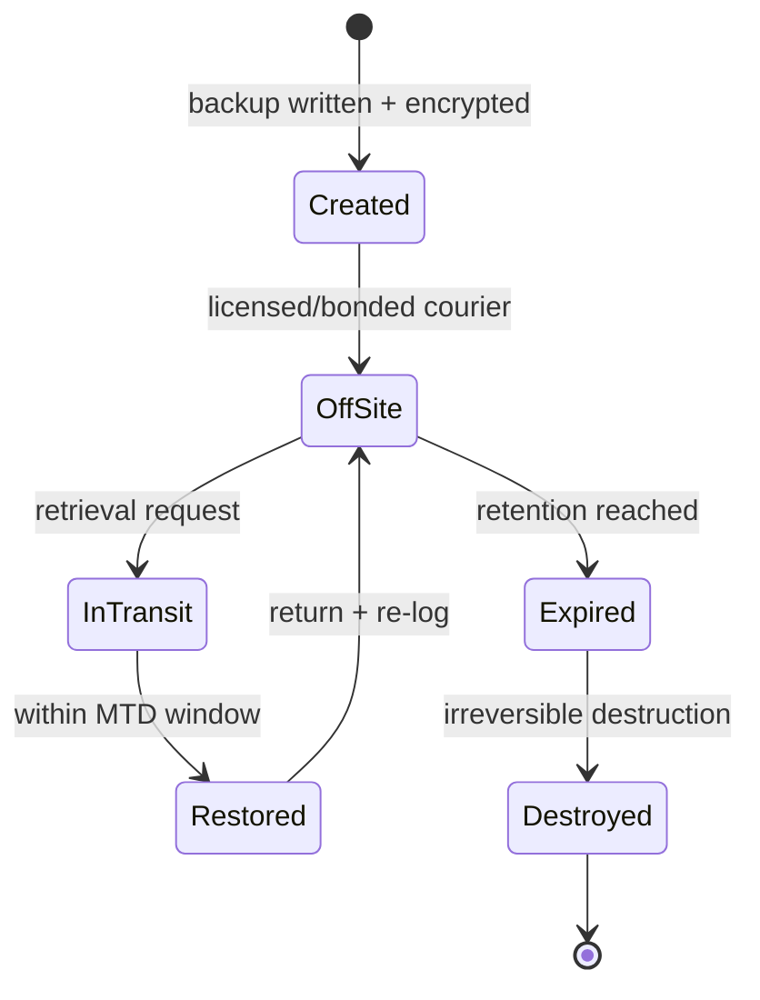

# Media Storage

## Overview

After you back up, you need to store the media securely. Poor storage practices defeat the entire purpose of backups.

## Key Rules

### Off-Site, Always
Keeping backups in the same building (even a different room) is useless if the building burns down. Off-site storage must be:
- Licensed and bonded for the job
- Climate controlled (specific temperature + humidity for tape longevity)
- Far enough away to survive local disasters
- Close enough to retrieve tapes within your MTD window
- Physically secure

### Encryption, Always
Data at rest on media = encrypted. No exceptions.

### Chain of Custody
- Courier personnel must be licensed and bonded
- Maintain an authorized-pickup list — only named individuals allowed to take tapes
- Log every pickup and delivery

## Horror Stories (don't do)

- **Under-the-floor stash** — 10,000+ tapes found in the subflooring of a data center. If the data center floods, so do the backups.
- **Employee taking tapes home** — cheap off-site plan; unencrypted tapes; house burglarized; massive breach
- **Supply cabinet storage** — unencrypted tapes next to pens and paperclips in an unlocked cabinet

All expensive mistakes. $5-10K/year for proper off-site storage is far cheaper than the alternatives.

## Tape Capacity (context)
LTO-8: ~12 TB native, ~30 TB compressed, in a cartridge roughly the size of a deck of cards.

## Retention

Each backup may have different retention requirements based on:
- How long the data is **useful**
- How long the data is **legally required** to be kept
- Use the longer of the two, unless privacy law caps it

### Examples
- **Patient records** — often kept forever (or for the life of the business). If the business closes, data must transfer somewhere.
- **Payroll records** — often 7 years in the US
- **Credit card transaction records** — you (if not a processor) may be legally required to **delete** after hand-off to processor. Many breaches lost data that should never have been retained.

### End-of-Retention
Expired tapes returned and securely destroyed (disposal must be fully irreversible).

## Tracking
You need a full, accurate inventory of every tape:
- What's on it
- Where it is (off-site, on-site, in transit)
- Retention expiration
- Matching identifier on the physical tape

Without this, restoring from backup is guesswork — and you can't demonstrate due care.

## Exam Tips

- Off-site + encrypted + licensed/bonded courier + inventory
- Proper retention tied to legal AND business requirements (longer wins, unless privacy law caps it)
- Expired tapes destroyed, not reused, not handed off
- Bad storage of backups = breach waiting to happen

## Diagrams

### Backup Media Lifecycle — State Diagram

> From written-and-encrypted to irreversibly destroyed.

**Takeaway:** Off-site + encrypted + tracked at every state; expired tapes are securely destroyed, never reused.

## Related Topics

- [Data Retention and Destruction](../02-asset-security/Data%20Retention%20and%20Destruction.md)
- [Disaster Recovery](../07-security-operations/Disaster%20Recovery.md)
- [Business Continuity Planning](../01-security-and-risk-management/Business%20Continuity%20Planning.md)
