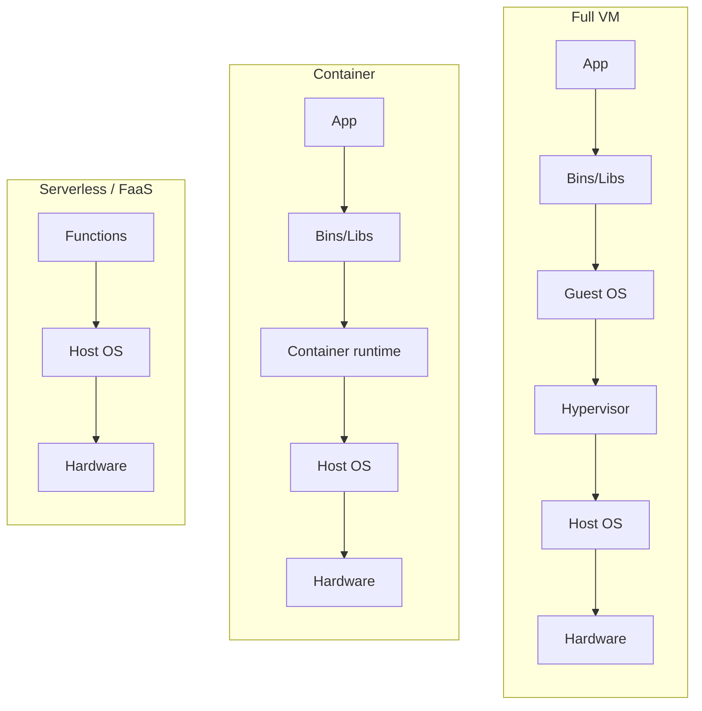

# Microservices, Containerization, and Serverless

## Overview

Modern alternatives to monolithic applications — each with different trade-offs and security implications.

## Microservices

Break large applications into independent, single-purpose services.

### Characteristics
- **High cohesion, low coupling** — each service does one thing well
- Autonomous and independent
- Resilient and fault-tolerant — one fails, others keep running
- Business-aligned
- Different services can use different programming languages, data stores

### Pros
- Small independent deployment cycles
- Small teams per service
- Easier to understand and modify
- Individual service failure doesn't kill the app

### Cons
- Distributed testing is complex
- Integration and management get complicated
- More failure surfaces → need better monitoring, error detection, recovery

## Containerization (OS-level virtualization)

Apps packaged with their dependencies, sharing the host OS kernel but isolated from each other.

### Compared to Full Virtualization
- Full VM stack: Hardware → Host OS → Hypervisor → Guest OS → Bins/Libs → App
- Container stack: Hardware → Host OS → Container runtime → Bins/Libs → App
  - **No guest OS** — big efficiency win
  - Sometimes no hypervisor

### Benefits
- Portable, fast to deploy, easy to scale
- **10-100× more app instances per server** than traditional VMs
- Improved security (apps isolated in containers with limited resource access)

## Serverless (Function-as-a-Service / FaaS)

Stack: Hardware → Host OS → Functions.

### How It Works
- Customer maintains code; provider manages everything else
- **No persistent resources** — functions run in short bursts
- Results pushed to storage after computation
- You pay only for compute used — not idle

### Elasticity vs. Scalability

| | Scalability | Elasticity |
|--|-------------|------------|
| **What it is** | Add resources when needed | Resources auto-scale with demand |
| **Cost model** | Pay for provisioned capacity (often wasted) | Pay for what you use |
| **Diagram** | Resources > usage, gap = waste | Resources track usage tightly |

Serverless is the elasticity pattern — ideal for variable workloads.

## Exam Tips

- Microservices = single-purpose, autonomous, high cohesion/low coupling
- Containers skip the guest OS — far more dense than VMs
- Serverless = FaaS = pay-per-use, no persistent resources
- **Elasticity** ≠ **scalability** — scalability adds capacity; elasticity tracks demand

## Diagrams

### Deployment Stacks — Flowchart

> Each model strips away a layer — VM keeps a guest OS, containers drop it, serverless drops almost everything.

**Takeaway:** Containers skip the guest OS (far denser than VMs); serverless = just your functions, provider runs the rest, pay-per-use.

## Related Topics

- [Virtualization Cloud and Distributed Computing](Virtualization%20Cloud%20and%20Distributed%20Computing.md)
- [DevSecOps and CI-CD](../08-software-development-security/DevSecOps%20and%20CI-CD.md)
- [Secure Design Principles](Secure%20Design%20Principles.md)
