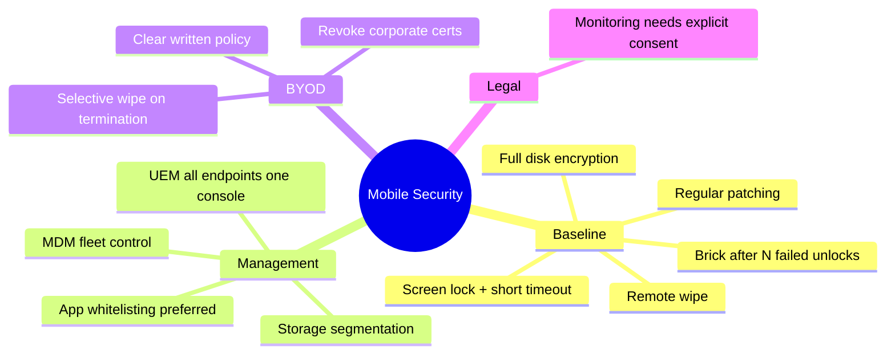

# Mobile Device Security

## Overview

Any device you can walk around with — phones, tablets, laptops, USB drives, external hard drives, CDs. With IoT exploding, mobile risk grows exponentially.

## Typical Threats

Most internal risk isn't malicious — it's users who don't know better or take shortcuts.

**Example (doctor):** Didn't have his laptop, so he configured an insecure mail client on his phone to check patient records. Did it repeatedly. Phone was stolen — all that PHI exposed. Not malicious, just convenient. Our job is to close the loophole AND give users the right tool.

## Baseline Mobile Security

- **Full disk encryption** (default on current Android/iOS — leave it on)
- **Remote wipe** capability
- **Screen lock** with short auto-lock timeout
- **Brick after N failed unlocks** (e.g., 10 wrong passcodes)
- **Disable removable storage** on company-issued devices
- Regular patching
- Lock down USB, CD, network, wireless where possible
- Disable auto-run on attached media

## BYOD (Bring Your Own Device)

Users bring their own devices to work. Great for user experience; risky for security.

### Required Controls
- Clear **BYOD policy** — what's acceptable, what isn't
- Help desk support scope (you can't support every device)
- Consider enrolling personal devices in MDM (with user consent)
- Legal scope — in many jurisdictions, monitoring employee-owned devices requires signed consent

## MDM (Mobile Device Management)

Central system for managing many devices:
- Push standard baseline configuration
- Group-specific profiles (server team gets X, sales gets Y)
- **Application whitelisting** (preferred) or blacklisting
- Storage segmentation
- Remote access, remote backups
- Push new configurations

### UEM (Unified Endpoint Management)
The evolution of MDM — **one tool to manage ALL endpoints**: mobile + desktop + IoT, under a single console/policy.

### MDM on Termination
- Wipe company data — either full wipe OR selective wipe of company-container data only (for BYOD)
- Revoke corporate credentials/certs

## Legal Considerations

MDM can see traffic, location, calls. Make sure:
- Monitoring is legal in your jurisdiction
- Users sign explicit consent before MDM enrollment
- Policies specify what's monitored and why

## Key Questions Before Rolling Out Mobile

- How do we ensure devices are returned / wiped on termination?
- How do we keep sensitive data off mobile devices altogether (where possible)?
- Patching process?
- Anti-malware?
- Encryption verified?
- Training and awareness plan?

## Exam Tips

- Mobile device = anything portable with data
- MDM = central control for the fleet
- BYOD = user owns device; higher risk, needs explicit policy
- **Whitelisting** (allowlist) is preferred over blacklisting
- Encryption + remote wipe are the baseline
- Monitoring requires explicit user notice/consent

## Diagrams

### Mobile Security — Mindmap

> Baseline controls, central management, and the BYOD/legal wrinkles.

**Takeaway:** Encryption + remote wipe are the floor; MDM/UEM enforces the fleet; BYOD needs policy + consent + selective wipe.

## Related Topics

- [IoT Security](IoT%20Security.md)
- [Data Loss Prevention](../02-asset-security/Data%20Loss%20Prevention.md)
- [Security Policies and Standards](../01-security-and-risk-management/Security%20Policies%20and%20Standards.md) — AUP / BYOD policy
