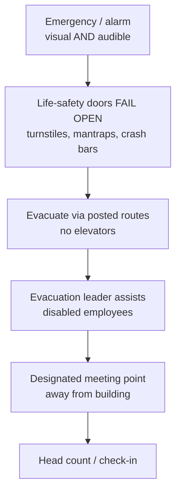

# Personnel Safety

## Overview

**People are always more important than things.** Your management might disagree, you might personally prefer your server to your colleague, but on the exam (and in law, and in ethics), human safety wins. Every time.

## Emergency Planning

### Clear Policies and Procedures
- Written evacuation procedures, posted and trained
- Designated evacuation leaders (one per floor in larger buildings)
- Designated meeting point, well away from the building
- Check-in procedure at meeting point (evacuation leader confirms everyone accounted for)
- Special plans for disabled/assisted-access employees (elevators usually offline during emergency)

### Drills
Ideally quarterly; in practice most orgs do annually (regulatory minimum). More drills = better outcomes when it's real.

## Physical Controls That Support Safety

### Panic Bars (Crash Bars)
Horizontal bar across an exterior door — push to open. Allows rapid exit. Some are for everyday use; others are emergency-only and alarmed.

- **Label clearly**: "Opening this door will sound the alarm"
- Train staff so they don't inadvertently trigger alarms

### Fail Open
In emergencies, these fail open (people-safety prioritized over property):
- Turnstiles
- Mantraps
- Electronic doors
- Crash-bar doors

### Alarm Systems
Visual AND audible:
- Strobes/lights throughout building (people with hearing impairments; noisy spaces)
- Sirens throughout (people looking away from lights)
- Ensure coverage — someone wearing headphones in a quiet corner should still see the strobe

## Warning / Duress Systems

Used for large-scale emergencies:
- Hurricane warnings (Hawaii: siren test first Monday of each month at 11:45)
- Tsunamis, chemical incidents, violent threats
- Big outdoor speakers / sirens
- Modern additions: automated text, email, phone notifications
- Keeps people in affected areas informed and directed

## Exam Tips

- People > property, every time
- Fail open for life-safety systems (turnstiles, mantraps, crash-bar doors)
- Evacuation plans require training and drills
- Alerting must be both audible AND visual
- Special provisions for disabled employees

## Diagrams

### Emergency Response — Flowchart

> Life-safety systems fail open; people get out and get counted.

**Takeaway:** People over property — life-safety controls fail open, and everyone is accounted for at the meeting point.

## Related Topics

- [Physical Security](Physical%20Security.md)
- [Fire Suppression](Fire%20Suppression.md)
- [Business Continuity Planning](../01-security-and-risk-management/Business%20Continuity%20Planning.md)
