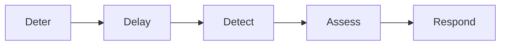
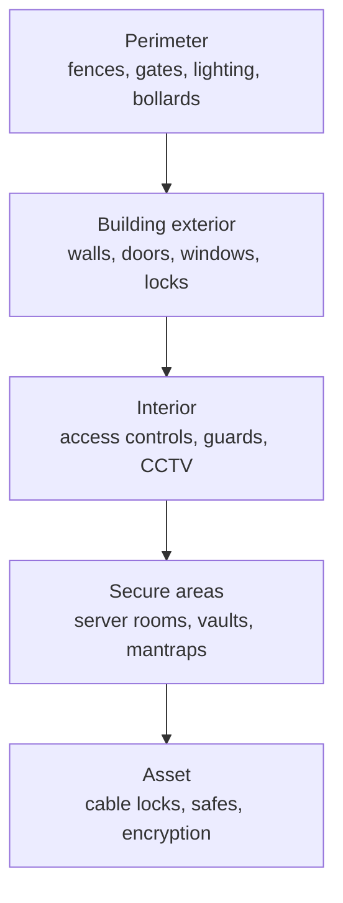

# Physical Security

## Overview

Physical security protects facilities, equipment, and personnel from physical threats through layered controls. It matters because every logical control you build sits on top of physical access: if an attacker can walk to the server, pull a drive, or clamp a sniffer onto a cable, encryption and firewalls stop helping. Think in layers from the property line inward — perimeter, building, interior, secure area, asset — so no single failure exposes what's inside.

## Key Concepts

### Functional Order of Physical Controls
**Deter → Delay → Detect → Assess → Respond.** Discourage the actor, slow them down, notice the event, evaluate it, then act.

> **#1 priority in all physical security = safety of PEOPLE.** Life safety always overrides asset protection.

### CPTED (Crime Prevention Through Environmental Design)
Designing the physical environment — **layout, lighting, landscaping, natural surveillance, clear sightlines** — to **deter crime** before controls like guards/cameras are even needed.

### Defense in Depth (Physical Layers)
1. **Perimeter** - fences, gates, lighting, bollards
2. **Building exterior** - walls, doors, windows, locks
3. **Interior** - access controls, guards, CCTV
4. **Secure areas** - server rooms, vaults, mantraps
5. **Asset** - cable locks, safes, device encryption

### Fence Heights
| Height | Role | Deters |
|--------|------|--------|
| 3-4 ft (~1 m) | Deterrent | Casual trespassers |
| 6-7 ft | Deterrent / preventive | Most intruders |
| 8 ft + barbed wire | Preventive | Determined intruders |

### Gate Classes (ASTM)
- **Class I** — Residential
- **Class II** — Commercial / general access (parking garage)
- **Class III** — Industrial / limited access (loading docks)
- **Class IV** — Restricted access (airport secure side, prison)

### Bollards
Posts (metal cylinders or disguised as concrete planters) preventing vehicles from entering an area. Deterrent/preventive.

### Lighting
- Measured in **lumens** (total light output) or **lux** (lumens per square meter)
- Must illuminate **100%** of the area — any gap becomes the attack path
- Can be static, motion-activated, or Fresnel (searchlight; should be random/pseudo-random to prevent prediction)

### CCTV
- "Closed-circuit" because they physically connect back (wired). Wireless IP cameras technically aren't CC.
- Both **detective** and **deterrent**
- **Visible light cameras** — need light in the room
- **Infrared** — detect heat; work in darkness
- **Light-enhancing** — amplify available light (green tint)
- Store to NVR (**Network Video Recorder**) in a separate, secure location — not just a local DVR. Centralized storage prevents on-site tampering.
- Mobile/PTZ cameras must use random or pseudo-random sweep while still covering 100%

### Lock Types
- **Warded locks** - cheapest, least secure
- **Tumbler locks** - pin, wafer, or lever (most common) — vulnerable to picking and **lock bumping** (shaved-down key tapped into lock; pins jump, turn)
- **Combination locks** - no key; finite combinations; vulnerable to brute-force and shoulder surfing; keys also wear (reveals digits used)
- **Cipher locks** - electronic keypad
- **Smart locks** - card/fob/biometric
- **Master keys** — open any door in a security zone (admin privileges; protect accordingly)
- **Core keys / interchangeable cores** — figure-8 locks; easy to swap the core (and easy to steal if the core key is compromised — use dual control)

### Access Cards
| Type | How it works | Security | Copy time |
|------|--------------|----------|-----------|
| **Contact smart card** | Physical insert (like DoD CAC or credit card chip) | High — ICC chip stores unique data | Hard |
| **Contactless smart card** | RFID read at short range (~30-60 cm) | High, but attackers can skim from short range → use RFID-blocking wallets | Hard |
| **Magnetic stripe card** | Stripe read by terminal | **Low** — trivially copyable in seconds | Very easy |

### Tailgating / Piggybacking
Following someone through a controlled entry without authenticating. Countered by:
- Training/awareness (users must not hold doors)
- **Mantraps** — two-door airlock; only one person at a time (often with weight sensors to detect multiple occupants)
- **Turnstiles** — tall turnstiles (preventive) or short ones (deterrent)
- Both **fail open** — people-safety priority wins in emergencies

### Contraband Checks
Preventive + detective + deterrent. In high-security facilities (intelligence, some courthouses), checks go **both directions** — Edward Snowden smuggled SD cards out in a Rubik's Cube.

### CCTV Considerations
- Focal length determines field of view
- PTZ (Pan-Tilt-Zoom) for wide coverage
- Should cover entry points, sensitive areas, and parking
- Recording and retention must meet policy requirements

### Fire Suppression
| Agent | Use | Notes |
|-------|-----|-------|
| **Water (wet pipe)** | General | Always charged with water; fastest response |
| **Water (dry pipe)** | Cold areas | Water held back by valve; prevents freezing |
| **Water (deluge)** | High hazard | Massive water release (not for data centers) |
| **Water (pre-action)** | Data centers | Two triggers required (detection + heat); prevents accidental discharge |
| **CO2** | Unmanned areas | Displaces oxygen; **dangerous to people** |
| **FM-200/Clean Agent** | Data centers | Safe for people and equipment |
| **Halon** | Legacy | Depletes ozone; no longer manufactured |

### Environmental Controls
- **HVAC** - temperature (68-77°F / 20-25°C, per ASHRAE) and humidity (40-60%)
- **Positive pressurization** - prevents contaminated air from entering
- **EMI/RFI shielding** - Faraday cages, TEMPEST
- **Water detection** - sensors under raised floors

### TEMPEST
- US government program for preventing electromagnetic emanations
- Faraday cage blocks electromagnetic signals
- Protects against eavesdropping through electronic emissions

### Guards and Dogs

| Guard type | Trained | Armed |
|------------|---------|-------|
| **Professional** | Yes | Yes |
| **Amateur** | No | Yes |
| **Pseudo** | Either | **No** |

**Dogs** — deterrent, detective, compensating. Liability concerns limit their use (dog bites = lawsuits). Most common in military, high-security, airports (often for drug/bomb detection, not guarding).

### Sub-Ceilings and Slab-to-Slab Walls

Offices often have sub-ceilings (drop ceilings hiding cables/HVAC). **Data center walls must go slab-to-slab** — true floor to true ceiling — with appropriate fire rating. If the sub-ceiling crosses into the data center, an attacker can just crawl over the wall. Doors and floors must match the same fire rating.

### Motion and Intrusion Sensors

| Type | How it works |
|------|--------------|
| **Passive (light-based)** | Detects motion via visible light changes |
| **Ultrasound / microwave** | Sends signal; triggers on anomalous return |
| **Infrared** | Detects heat signatures |
| **Photoelectric / laser** | Beam broken = trigger (real security, not movie lasers) |
| **Door/window contact sensors** | Magnetic contacts |
| **Glass-break (metal-strip foil)** | Foil around window; broken = trigger |

## Exam Tips

- **Pre-action** sprinkler is best for data centers (requires two triggers)
- **Halon** is no longer manufactured (ozone depletion — Montreal Protocol, halon phase-out) - FM-200 is the replacement
- **CO2** can kill people - only for unmanned areas
- Humidity too high = corrosion; too low = static electricity
- Mantrap/airlock = two doors that cannot be open simultaneously (prevents tailgating)
- Mantraps/turnstiles/crash-bar doors **fail open** (life safety > property)
- Magnetic stripe cards are trivially cloned — avoid where security matters
- Lock bumping beats most pin tumbler locks in seconds

## Diagrams

### Functional Order of Controls — Flowchart

> The sequence every physical control program follows.

### Defense in Depth — Physical Layers

> Layer inward from the property line so no single failure exposes the asset.

**Takeaway:** People-safety first; controls work in layers (deter → delay → detect → assess → respond) from the perimeter to the asset.

## Related Topics

- [Defense in Depth](../01-security-and-risk-management/Defense%20in%20Depth.md)
- [Domain 7 - Security Operations](../07-security-operations/00%20Domain%207%20-%20Security%20Operations.md) - physical security operations
- [Security Architecture Concepts](Security%20Architecture%20Concepts.md)
