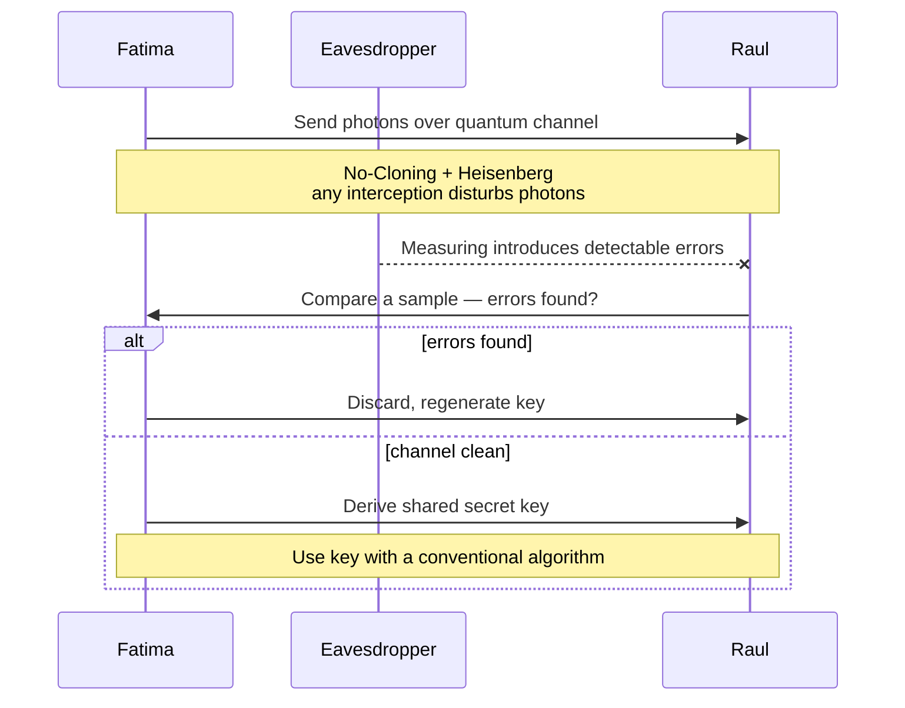

# Quantum Cryptography

## Overview

Uses quantum mechanics — specifically quantum entanglement — to secure communication. Still emerging, but a growing exam topic.

## Core Concepts

### Quantum Entanglement
A physical phenomenon where two particles become linked — the state of one can't be described independently of the other, even at distance.

### QKD (Quantum Key Distribution)
Most well-known application of quantum cryptography.

**How it works (simplified):**
1. Parties (Fatima and Raul) send **photons** (single particles of light) through a quantum channel
2. Confirm the channel is secure
3. Use the remaining photons to generate a shared secret key (a random string of bits)
4. Use conventional algorithms with that key for the actual messages

### Why QKD Is Secure

**Heisenberg Uncertainty Principle** — you can't measure certain paired properties (e.g., position + momentum) with perfect accuracy simultaneously. Eavesdropping on a quantum channel **disturbs the photons**, introducing detectable errors.

**No-Cloning Theorem** — impossible to create a perfect copy of an unknown quantum state. Eavesdropper can't just copy photons and pass them along.

Together: any eavesdropping attempt is detectable in real-time. Parties can discard compromised photons and generate a new key.

## Current Limitations

- **Range** — photons fragile over distance; absorbed or scattered. Work around with **quantum repeaters** (analogous to DSL line repeaters) and **satellite-based QKD** (satellites as trusted nodes).
- **Cost and complexity** — specialized hardware (single-photon detectors, quantum sources) is expensive and hard to integrate with existing infrastructure.

Cost and complexity will drop over time.

## Applications

Beyond just key distribution:
- Secure communication between data centers
- Financial transactions
- Critical infrastructure (power grids, water)
- Quantum digital signatures
- Quantum secret sharing
- Quantum document sharing
- Quantum secure direct communication

## Exam Tips

- QKD uses photons to establish a secure key over a quantum channel
- Security based on Heisenberg Uncertainty + No-Cloning Theorem
- Eavesdropping is **detectable** in real time → regenerate key
- Current limitations: range + cost
- Post-quantum cryptography is a broader field — algorithms that resist quantum attack

## Diagrams

### QKD Photon Exchange — Sequence

> Eavesdropping disturbs the photons, so it is detectable in real time.

**Takeaway:** Security rests on physics (No-Cloning + Heisenberg), not math — interception is detectable, so the key is regenerated.

## Related Topics

- [Cryptography](Cryptography.md)
- [Asymmetric Encryption Detail](Asymmetric%20Encryption%20Detail.md)
- [Hashing Detail](Hashing%20Detail.md)
