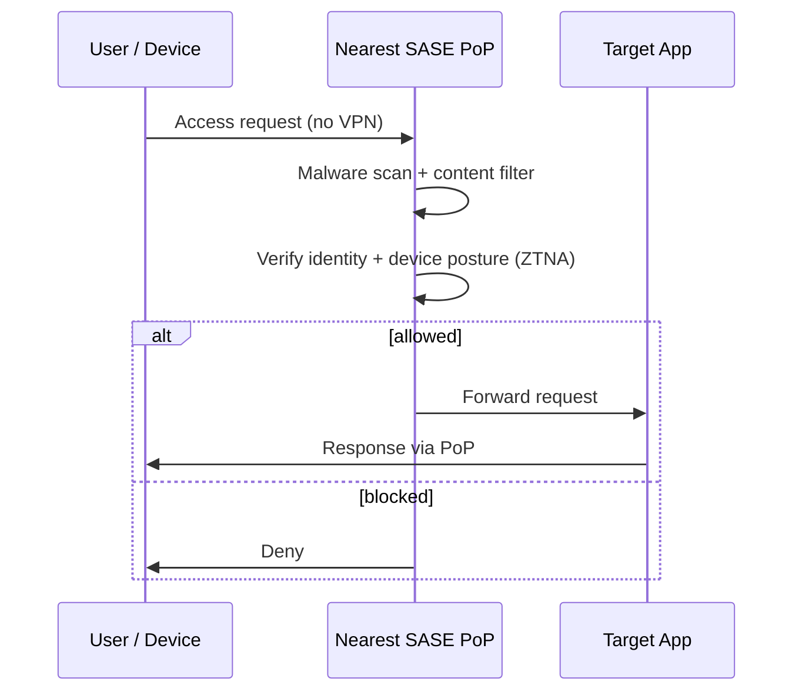

# SASE - Secure Access Service Edge

## Overview

Combines network security and WAN functions into a single cloud-delivered service. Addresses the fact that the traditional "castle and moat" perimeter has dissolved — with cloud, remote work, and mobile, there's no single perimeter to defend.

## Key Components

### SD-WAN (Software-Defined Wide Area Networking)
Dynamic traffic management across multiple WAN connections; direct-to-internet for cloud apps.

### Integrated Security Services
Embedded in the WAN fabric:
- Next-generation firewall
- Secure web gateway
- CASB (Cloud Access Security Broker)
- Zero Trust Network Access (ZTNA)
- DLP

### Cloud-Native Architecture
Leverages global reach + scalability of the cloud. Traditional security had hardware boxes in fixed locations; SASE doesn't.

### Zero Trust Model
- Never trust, always verify
- Verifies every access request as if from the public internet
- Same stringent access control regardless of origin

## How It Works

1. User requests access (to cloud app, internal resource)
2. Request routes to nearest **SASE Point of Presence (PoP)**
3. PoP inspects: malware scan, content filter, access control based on identity + device posture
4. If safe, forwards to the target app
5. Transparent to user — no traditional VPN required

## Benefits

- Scales with demand (cloud-native)
- Consistent policy enforcement anywhere
- Simpler management (single integrated platform vs. many point solutions)
- Reduced attack surface
- Lower cost over time

## Challenges

- Requires careful planning — evaluate current architecture, specific needs
- **Cultural shift** in IT — legacy roles and responsibilities need to evolve
- People resist change; lead your team through it

## Exam Tips

- SASE = SD-WAN + cloud-delivered security + zero trust
- Replaces the traditional perimeter model
- Built on never-trust-always-verify
- Use for distributed/remote/cloud-heavy orgs

## Diagrams

### SASE Access Flow — Sequence

> Every request routes through the nearest PoP for inspection — no traditional VPN.

**Takeaway:** SASE = SD-WAN + cloud-delivered security + zero trust; the PoP inspects every request regardless of origin.

## Related Topics

- [Secure Network Architecture](../04-communication-and-network-security/Secure%20Network%20Architecture.md)
- [Secure Design Principles](Secure%20Design%20Principles.md) — Zero Trust
- [Virtualization Cloud and Distributed Computing](Virtualization%20Cloud%20and%20Distributed%20Computing.md)
- [Network Devices and Components](../04-communication-and-network-security/Network%20Devices%20and%20Components.md) — CASB, NGFW
