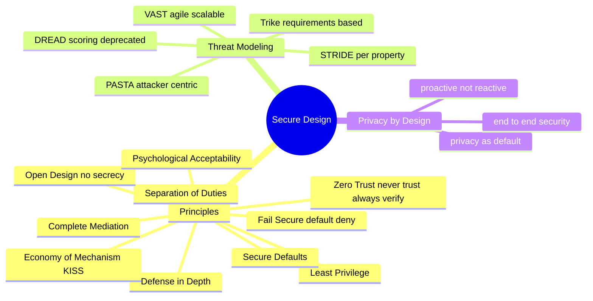

# Secure Design Principles

## Overview

Secure systems aren't secured after the fact — the strongest designs bake security in from the first decision. These principles are the time-tested rules of thumb for doing that: minimize what can go wrong, assume failure will happen, and never rely on secrecy or implicit trust. The exam tests them by name, so learn the label and the one-line idea behind each.

## Key Concepts

### Core Principles
| Principle | Description |
|-----------|-------------|
| **Least Privilege** | Give only the minimum access needed |
| **Separation of Duties** | No single person controls an entire critical process |
| **Defense in Depth** | Multiple layers of security controls |
| **Fail Secure/Closed (fail-safe)** | On failure, default to a secure/denied state — don't fail open |
| **Fail Open** | System allows access on failure (availability/life-safety priority) |
| **Secure Defaults** | Ship in the most secure configuration out of the box; users opt into *less* security, never into more |
| **Economy of Mechanism (KISS)** | Keep security designs simple — complexity is the enemy of security |
| **Complete Mediation** | Check every access attempt, every time |
| **Open Design** | Security should not depend on secrecy of design (Kerckhoffs' principle) |
| **Least Common Mechanism** | Minimize shared resources between subjects |
| **Psychological Acceptability** | Security should not make systems unusable |
| **Zero Trust** | Never trust, always verify - regardless of location |

### Zero Trust Architecture
- No implicit trust based on network location
- Verify every request as if it comes from an untrusted network
- Micro-segmentation of networks
- Continuous authentication and authorization
- Principle: "Never trust, always verify" (NIST SP 800-207)
- Also called **perimeterless security**
- Replaces the old **Trust but Verify** model — which fails because the vast majority of serious breaches come from compromised privileged accounts

### Privacy by Design (7 Principles)
1. Proactive not reactive
2. Privacy as the default
3. Privacy embedded into design
4. Full functionality (positive-sum, not zero-sum)
5. End-to-end security (full lifecycle)
6. Visibility and transparency
7. Respect for user privacy

### Threat Modeling Frameworks

**STRIDE (Microsoft)** — maps to violated security property:
- **S**poofing → Authenticity
- **T**ampering → Integrity
- **R**epudiation → Non-repudiation
- **I**nformation Disclosure → Confidentiality
- **D**enial of Service → Availability
- **E**levation of Privilege → Authorization

**DREAD (Microsoft, deprecated 2008)** — scoring threats 1-10 on:
- **D**amage potential
- **R**eproducibility
- **E**xploitability
- **A**ffected users
- **D**iscoverability

**PASTA** (Process for Attack Simulation and Threat Analysis) — 7-step, attacker-centric, asset-focused:
1. Definition of Objectives (DO)
2. Definition of Technical Scope (DTS)
3. Application Decomposition and Analysis (ADA)
4. Threat Analysis (TA)
5. Weaknesses and Vulnerability Analysis (WVA)
6. Attack Modeling and Simulation (AMS)
7. Risk Analysis and Management (RAM)

**Trike** — requirements-based, 4 stages:
1. Requirements Model
2. Risk Assessment
3. Data Flow Diagrams
4. Risk Values Assignment

**VAST** — scalable, Agile/DevOps-friendly (covered elsewhere).

### Shared Responsibility Model (Cloud)

| Model | Provider manages | Customer manages |
|-------|------------------|------------------|
| **On-premises** | Nothing | Everything |
| **IaaS** | Hardware, virtualization, networking | OS, middleware, runtime, data, apps |
| **PaaS** | Up through runtime | Apps + data |
| **SaaS** | Almost everything | Data + access |

**Lesson:** A political data-analytics firm exposed roughly 200 million voter records by disabling a cloud storage security default. That was the customer's fault, not the provider's — shared responsibility still requires the customer to do their part. Responsibility shifts toward the provider as you move from IaaS → PaaS → SaaS, but the customer never fully escapes it.

## Exam Tips

- **Fail secure/fail-safe** = deny access on failure (for confidentiality/integrity)
- **Fail open** = allow access on failure (for life safety - fire doors)
- **Secure defaults** = the product is locked down out of the box; the user has to deliberately weaken it
- **KISS / Economy of Mechanism** = simpler design = smaller attack surface = easier to verify
- Zero Trust does NOT mean no trust - it means trust must be earned and verified
- Defense in depth = if one layer fails, others still protect
- Least privilege applies to people, processes, and systems

## Diagrams

### Secure Design — Mindmap

> Principles, threat-modeling frameworks, and privacy-by-design at a glance.

**Takeaway:** Bake security in; STRIDE maps to violated properties; Zero Trust = verify every request.

## Related Topics

- [Least Privilege](../01-security-and-risk-management/Least%20Privilege.md)
- [Separation of Duties](../01-security-and-risk-management/Separation%20of%20Duties.md)
- [Defense in Depth](../01-security-and-risk-management/Defense%20in%20Depth.md)
- [Security Models](Security%20Models.md)
- [Security Architecture Concepts](Security%20Architecture%20Concepts.md)
