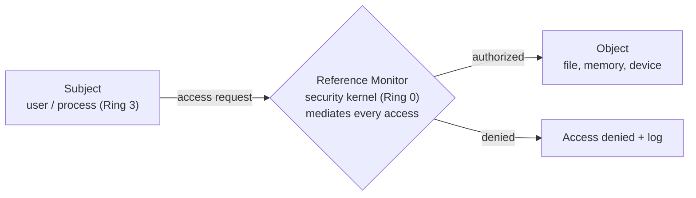

# Secure Operating Systems

## Overview

How the OS kernel is structured and how file/user permissions are enforced.

## Kernel Types

| Type | Structure | Trade-off |
|------|-----------|-----------|
| **Monolithic kernel** | Single static executable; all functionality compiled in; runs in supervisor mode | Fast but huge; any bug is a big bug |
| **Microkernel** | Minimal core; extensions loaded as modules (some run in Ring 3) | Smaller, more modular; slightly slower |

### Reference Monitor
The abstract concept that handles all access between subjects and objects. The **security kernel** is the concrete implementation (hardware + firmware + software).

## Supervisor vs. User Mode
- **Kernel mode / supervisor mode** (Ring 0) — unrestricted access to memory, CPU, disk. Most trusted, most powerful. Crashes are unrecoverable.
- **User mode / problem mode** (Ring 3) — no direct hardware access; everything via APIs. Most of what users see. Crashes usually recoverable.

Physical/logical separation between them is a key security design.

## File and User Permissions

### Linux / Unix
- Read, Write, Execute
- Settable at Owner, Group, World levels

### Windows NTFS (Discretionary Access Control)
- Read, Read & Execute, Write, Modify, Full Control
- **Full Control** includes the right to change permissions and can remove the original owner
- Settable at User, Group, World levels
- Check via: right-click icon → Properties → Security tab

In enterprise environments, permissions are centrally controlled and automated (Group Policy, etc.), not set per-user on each machine.

## Exam Tips

- Ring 0 = kernel / supervisor = unrestricted
- Ring 3 = user / problem = API access only
- Monolithic = everything compiled in; microkernel = modular
- Reference monitor = concept; security kernel = implementation
- In corporate env, file permissions are centrally managed, not locally configured

## Diagrams

### Reference Monitor — Flowchart

> The concept that mediates every subject-to-object access; the security kernel implements it.

**Takeaway:** Reference monitor = the concept (complete mediation); security kernel = the concrete implementation in the TCB.

## Related Topics

- [Security Architecture Concepts](Security%20Architecture%20Concepts.md) — ring model details
- [Access Control Models](../05-identity-and-access-management/Access%20Control%20Models.md)
- [Security Models](Security%20Models.md)
