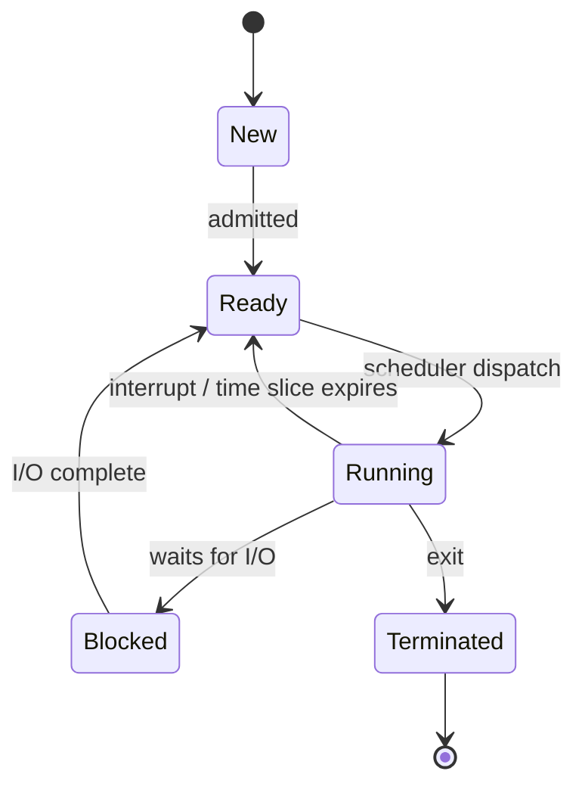

# Security Architecture Concepts

## Overview

Security isn't bolted on at the end — it's a property of how a system is built. This note covers the foundational hardware and OS concepts (rings, processes, memory, the TCB) that decide whether a system can enforce its security policy at all, plus the enterprise frameworks that organize security across a whole business. The recurring theme: protection comes from **separation** — separating privileged code from user code, one process's memory from another's, and the trusted core from everything else.

## Key Concepts

### CPU and Processing
- **Protection Rings**: Ring 0 (kernel) → Ring 3 (user applications)
  - Ring 0 = most privileged (OS kernel / supervisor mode)
  - Ring 3 = least privileged (user apps / problem mode)
  - In practice, rings 1 and 2 are collapsed for performance — only 0 and 3 used
  - **Ring -1** = hypervisor mode (only exists in virtualized systems)
- **Process isolation** - preventing processes from accessing each other's memory
- **Multitasking** - running multiple processes (time-sharing CPU)

### Multi-* Terminology (easy exam keyword trap)

| Term | Means |
|------|-------|
| **Multithreading** | CPU/core executes multiple threads of a single process concurrently |
| **Multiprocessing** | System uses multiple CPUs at the same time |
| **Multitasking** | Multiple tasks share a common resource (CPU) |
| **Multiprogramming** | System runs multiple programs at once |

### CPU Architecture Basics
- **ALU** (Arithmetic Logic Unit) — does the math / logic
- **CU** (Control Unit) — traffic cop; handles fetches, execution ordering, registers
- CPU basic cycle: **Fetch → Decode → Execute → Store** (one per clock cycle, but **pipelining** overlaps them)
- Clock speed e.g. 4.2 GHz = 4.2 billion cycles/sec

### Processes, Threads, Interrupts
- **Process / heavyweight process / task** — executable program + its data in memory
- **Thread / lightweight process** — child of a process; shares memory with parent (low overhead)
- **Interrupt** — hardware or software signal telling CPU to stop and handle something more important
- Process states: New → Ready → Running → Blocked → Terminated

### Memory Management
- **Swapping** — moving an entire process between primary and secondary memory
- **Paging** — moving part of a process (a page/block) in or out
- **Virtual memory** — using disk as overflow for RAM (slow, but useful)

### Memory Protection
- **Address space layout randomization (ASLR)** - randomize memory addresses
- **Data Execution Prevention (DEP)** - prevent code execution in data areas
- **Memory segmentation** - dividing memory into segments with permissions
- **Virtual memory** - abstraction layer between processes and physical memory

### Security Modes of Operation
| Mode | Clearance | Need-to-Know | Formal Approval |
|------|-----------|-------------|-----------------|
| **Dedicated** | All users cleared to highest level | All data | All data |
| **System High** | All users cleared to highest level | Not for all data | All data |
| **Compartmented** | All users cleared to highest level | Not for all data | Only for what they need |
| **Multilevel** | Not all users cleared to highest | Not for all data | Only for what they need |

### Trusted Computing
- **TCB** (Trusted Computing Base) - all hardware, firmware, software enforcing security
- **Security Perimeter** - boundary of the TCB
- **Reference Monitor** - abstract concept; mediates all access
- **Security Kernel** - implementation of the reference monitor (hardware, firmware, software)
- **TPM** (Trusted Platform Module) - hardware chip for key storage and integrity

### Covert Channels
- Unauthorized communication paths
- **Covert Storage Channel** - writes to shared storage (e.g., file attributes, file size conveys meaning)
- **Covert Timing Channel** - modulates system timing to signal information

### Layering vs the OSI Model

Layering (logical hardware separation: hardware → kernel/drivers → OS → applications) helps enforce that changes at one layer only affect adjacent layers. **Do not confuse** this with the OSI networking model — they're unrelated concepts.

### Abstraction

Hiding unnecessary details from the user. When you double-click an icon, you don't see the millions of calculations, kernel calls, driver handoffs. That's good design.

### Open vs Closed Systems

| | Open | Closed |
|--|------|--------|
| **Built to** | Open standards (interoperable) | Proprietary |
| **Components** | Interchangeable across vendors | Vendor-locked |
| **Auditing/testing** | Extensive community scrutiny | Limited; security-through-obscurity |
| **Typical use** | Most organizations | Niche — where vendor control matters |

Open systems are generally considered more secure because they get more scrutiny.

### Enterprise Security Architecture Frameworks

Where the models and hardware concepts above are about *one system*, these frameworks are about organizing security across the *whole enterprise* — giving everyone a shared structure so business goals, IT, and security line up instead of being designed in silos. Three names show up on the exam; the trick is matching each to its angle.

| Framework | What it is | Distinguishing angle |
|-----------|-----------|----------------------|
| **Zachman** | A **taxonomy/matrix** for enterprise architecture: the **what / how / where / who / when / why** questions (columns) crossed with stakeholder **perspectives** (rows — planner, owner, designer, builder, etc.) | It's a *classification grid*, not a process. It tells you what to document, not how to build. |
| **SABSA** (Sherwood Applied Business Security Architecture) | A **risk- and business-driven** security architecture framework, also a 6×6 matrix but layered from contextual → conceptual → logical → physical → component → operational | The **security-specific, business-driven** one. Every control traces back to a business requirement and risk. |
| **TOGAF** (The Open Group Architecture Framework) | A general-purpose EA **method**, built around the **ADM** (Architecture Development Method) life cycle | The **process/method** for actually developing an architecture (general EA, not security-specific). |

Quick disambiguation: Zachman = *what to capture* (taxonomy), TOGAF = *how to build it* (method/ADM), SABSA = the *security-and-risk-driven* one.

### Compliance & Standards Frameworks

| Framework | What it is |
|-----------|-----------|
| **FISMA** | US **law** requiring federal agencies to secure their information systems (implemented via the NIST RMF). |
| **FedRAMP** | Standardized security **authorization for cloud services** sold to the US government. |
| **ISO/IEC 27001** | The **certifiable ISMS** (information security *management system*). |
| **ISO/IEC 27002** | The **catalog of security controls** that supports 27001. |

### Scoping vs Tailoring (control baselines)

- **Scoping** = **removing** controls from a baseline that don't apply to your system.
- **Tailoring** = **adjusting/customizing** the baseline to fit (including substituting **compensating controls**).

## Exam Tips

- Ring 0 = kernel (most privileged), Ring 3 = applications (least privileged)
- TCB includes ALL components that enforce security policy
- Reference monitor is the concept; security kernel is the implementation
- **Multilevel** mode is the most restrictive (not all users cleared to highest)
- Covert channels are hard to eliminate and are a key concern in classified systems
- EA frameworks: **Zachman** = taxonomy/matrix (what to document), **TOGAF** = method/ADM (how to build), **SABSA** = risk- and business-driven *security* architecture

### Common traps
- **Zachman vs. TOGAF:** Zachman is a *classification grid* (it asks what/how/where/who/when/why per perspective); TOGAF is a *process* (the ADM life cycle). "Matrix/taxonomy" → Zachman; "method/ADM/life cycle" → TOGAF.
- **SABSA** is the only one of the three that is **security- and risk-specific** and **business-driven** — if the stem emphasizes traceability from business risk to control, pick SABSA.

## Diagrams

### Process States — State Diagram

> How the OS scheduler moves a process from creation to termination.

**Takeaway:** New → Ready → Running → (Blocked) → Terminated; a process only runs when the scheduler dispatches it from Ready.

## Related Topics

- [Security Models](Security%20Models.md) - models enforced by the architecture
- [Secure Design Principles](Secure%20Design%20Principles.md)
- [Domain 8 - Software Development Security](../08-software-development-security/00%20Domain%208%20-%20Software%20Development%20Security.md) - software security architecture
