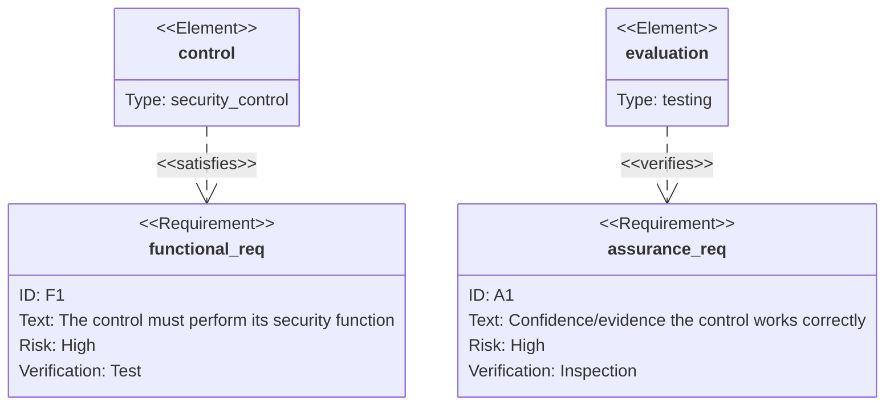
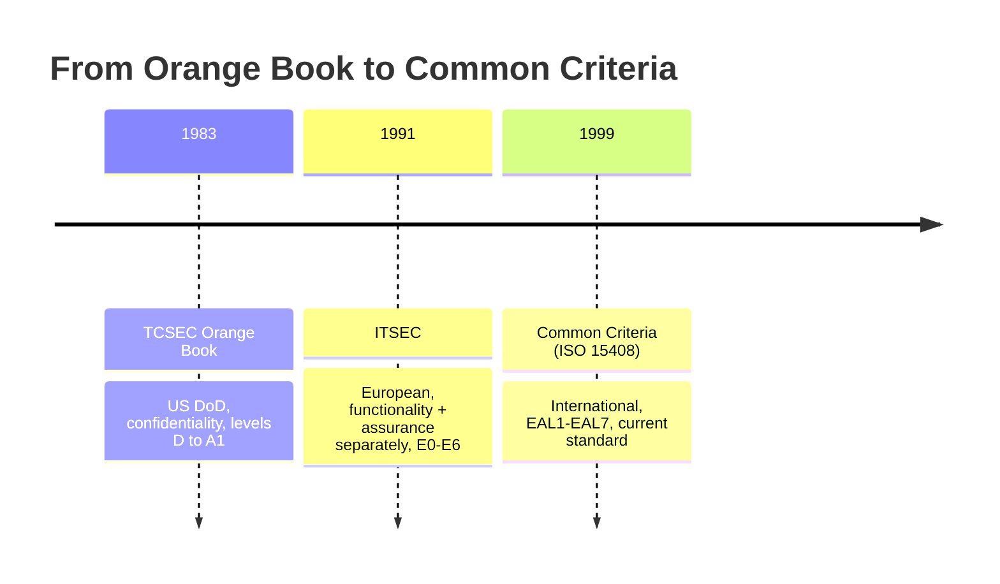

# Security Evaluation Criteria

## Overview

Standards used to evaluate and certify the security of information systems.

## Key Concepts

### Functional vs. Assurance Requirements

Every evaluation answers two separate questions, and the exam loves to test the difference:

- **Functional requirement** — does the control actually *do* what it's supposed to? (e.g., the firewall blocks the traffic it should)
- **Assurance requirement** — how much *confidence and evidence* do we have that it works correctly and keeps working? (testing, design documentation, formal proofs)

A control can be functionally complete yet have weak assurance — it does the right thing, but nobody has proven it reliably. Common Criteria rates both, and **EAL is an assurance scale**: a higher EAL means more rigorous evidence, not more features.

### Common Criteria (ISO 15408) - Current Standard
- International standard for evaluating IT security products
- **Target of Evaluation (TOE)** - the product being evaluated
- **Protection Profile (PP)** - requirements for a category of products
- **Security Target (ST)** - vendor's security claims about their product
- **Evaluation Assurance Levels (EAL):**

| EAL | Name | Description |
|-----|------|-------------|
| EAL 1 | Functionally tested | Basic testing |
| EAL 2 | Structurally tested | Development documentation review |
| EAL 3 | Methodically tested and checked | More thorough testing |
| EAL 4 | Methodically designed, tested, and reviewed | Most common for commercial |
| EAL 5 | Semi-formally designed and tested | Academic analysis |
| EAL 6 | Semi-formally verified design and tested | High security |
| EAL 7 | Formally verified design and tested | Highest, for extreme risk |

### TCSEC (Orange Book) - Historical
- US DoD standard from the 1980s (replaced by Common Criteria)
- Part of the "Rainbow Series" (multiple books, different topics — know Orange Book + Red Book)
- **Orange Book** = computer system evaluation (no networking)
- **Red Book** = networking
- Focused on **confidentiality**
- Levels: D (minimal) → C1/C2 → B1/B2/B3 → A1 (verified design)
- C2 = controlled access protection (most common commercial)
- B = mandatory access controls

### ITSEC - Historical (European)
- First successful international model
- Contained references to Orange Book
- Evaluated both **functionality and assurance** separately
- Levels: E0-E6
- Now retired

### EAL Mnemonic (Common Criteria levels 1-7)

> "Fun **stress** method — medical doctors seem somewhat verifiably foolish."

Functionally → Structurally → Methodically → Methodically designed → Semi-formally designed → Semi-formally verified → Formally verified.

### Key Terms
- **Certification** - technical evaluation of a system against criteria
- **Accreditation** - management's formal acceptance of the residual risk
- Certification is technical; accreditation is a business decision

## Exam Tips

- Common Criteria is the **current** international standard
- EAL 4 is the most common for commercial products
- Higher EAL does not mean more secure - it means more thoroughly tested (EAL measures **assurance**)
- **Functional** = does the control do its job? **Assurance** = how confident are we that it does? Know this split cold
- **Certification** = technical evaluation; **Accreditation** = management approval
- TCSEC and ITSEC are historical but may still appear on the exam

## Diagrams

### Functional vs Assurance — Requirement Diagram

> Requirement diagrams link requirements to what satisfies/verifies them.

**Takeaway:** **Functional** = does the control *do* its job? **Assurance** = how much *confidence/evidence* it works. Common Criteria rates both.

### Evolution of Evaluation Criteria — Timeline

> Each standard fed into the next; Common Criteria is the current international standard.

**Takeaway:** TCSEC (US, confidentiality) → ITSEC (Europe, splits functionality/assurance) → Common Criteria (international, EAL 1-7).

## Related Topics

- [Security Models](Security%20Models.md) - models that systems are evaluated against
- [Security Architecture Concepts](Security%20Architecture%20Concepts.md)
- [Risk Management](../01-security-and-risk-management/Risk%20Management.md) - evaluation supports risk decisions
