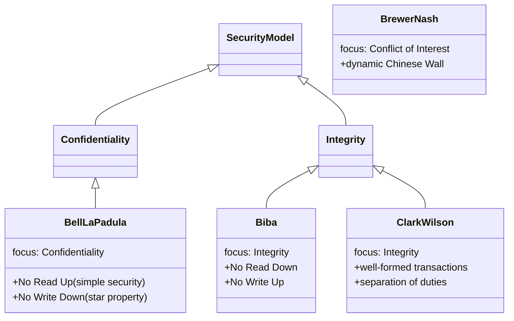

# Security Models

## Overview

A security model is the formal blueprint that turns a written security *policy* ("keep secrets secret," "keep data trustworthy") into precise rules a system can actually enforce. The policy says what you want; the model says exactly which reads and writes are allowed so that goal holds. That's why the exam keeps pairing each model with a single goal — Bell-LaPadula with confidentiality, Biba with integrity — and why the famous ones are just two or three rules each. Learn the goal first, then the rules follow.

## Key Concepts

### Bell-LaPadula Model (Confidentiality)
- Focuses on **confidentiality** (military/government classification)
- **Simple Security Property** - "No Read Up" (subject cannot read above their clearance)
- **Star (*) Property** - "No Write Down" (subject cannot write below their clearance)
- **Strong Star Property** - read and write only at your own level
- Prevents information leaking from higher to lower classifications

### Biba Integrity Model (Integrity)
- Focuses on **integrity** (opposite of Bell-LaPadula)
- **Simple Integrity Axiom** - "No Read Down" (cannot read from lower integrity)
- **Star (*) Integrity Axiom** - "No Write Up" (cannot write to higher integrity)
- Prevents corruption of higher-integrity data by lower-integrity subjects

### Clark-Wilson Model (Integrity - Commercial)
- Designed for **commercial integrity** (well-formed transactions)
- **Constrained Data Items (CDI)** - data subject to integrity controls
- **Unconstrained Data Items (UDI)** - uncontrolled data
- **Transformation Procedures (TP)** - authorized programs that modify CDIs
- **Integrity Verification Procedures (IVP)** - check data integrity
- Enforces separation of duties and well-formed transactions
- **Access triple:** subject → program (TP) → object — subjects access data **only through authorized programs**, never directly

### Other Models
| Model | Focus | Key Concept |
|-------|-------|-------------|
| **Brewer-Nash (Chinese Wall / Information Barriers)** | Confidentiality | Prevents conflicts of interest — dynamic access based on prior activity |
| **Lattice-Based (LBAC)** | Confidentiality | Labels form a lattice; by Dorothy Denning (1976). Also "label-based access control." |
| **Graham-Denning** | Access control | 8 primitive protection rights (create/delete/read/grant for objects + subjects) |
| **Harrison-Ruzzo-Ullman (HRU)** | Access control | Extension of Graham-Denning; treats subjects as objects; adds enter/delete right; access control matrix |
| **Take-Grant** | Access control | 4 rules — take, grant, create, remove; subjects transfer rights |
| **Lipner** | Integrity + Confidentiality | Combines Bell-LaPadula and Biba |
| **Goguen-Meseguer (Non-interference)** | Non-interference | Higher-level actions must not affect lower-level state; cares about what subjects *know* about the system |
| **Sutherland** | Integrity | State-machine model preventing interference |

### Lipner, Graham-Denning, and HRU (worth a closer look)

These three come up as distractors, so know what each one actually does.

- **Lipner** — not a brand-new model but an *implementation* that bolts Bell-LaPadula and Biba together so a single system enforces **both confidentiality and integrity** at once. Use it when "which approach gives me secrecy AND trustworthy data?" is the question — neither BLP nor Biba alone does both.
- **Graham-Denning** — steps down to the mechanics of access control. It defines **8 primitive protection rights (commands)** for the basic housekeeping any secure system needs: securely **create/delete a subject**, **create/delete an object**, and **grant/transfer/delete/read access rights**. Think of it as the minimum verb list for managing who-can-do-what.
- **Harrison-Ruzzo-Ullman (HRU)** — extends Graham-Denning by modeling those rights in an **access control matrix** plus **commands** that add or remove rights (and it treats subjects as just another kind of object). Its headline result is theoretical but examinable: the **"safety" question — can a given subject ever obtain a given right? — is undecidable in the general case.** No algorithm can answer it for every system, which is *why* real systems fall back on constrained, well-understood models rather than arbitrary rule sets.

### Access Control Matrix

A table with subjects as rows, objects as columns, cells holding permissions.
- **Row** = Capability list (what one subject can do across everything)
- **Column** = ACL (who can do what on one object)

### Zachman Framework

Enterprise architecture framework — a 6×6 grid:
- **Columns (what):** What, How, Where, Who, When, Why
- **Rows (roles):** Planner, Owner, Designer, Builder, Programmer, User

Maps data/process/network needs to each role's perspective.

### State Machine Model
- System is secure if every state it can be in is secure
- Transitions between states must maintain security
- Foundation for Bell-LaPadula and Biba

### Information Flow Model
- Controls how information moves between objects
- Data should only flow in authorized directions
- Covert channels violate information flow policies

## Security Modes of Operation

How systems handle users of different clearance levels:

| Mode | NDA | Clearance | Formal access approval | Need-to-know |
|------|-----|-----------|------------------------|-------------|
| **Dedicated** | All info | All info | All info | All info |
| **System High** | All info | All info | All info | Some info (access limited by need-to-know) |
| **Compartmented** | All info | All info | Some info | Some info |
| **Multilevel** | All info | Some info | Some info | Some info |

**Mnemonic:** Multi-LEVEL has multiple levels of clearance. Compartmented = different compartments. System High = high security posture. Dedicated = system dedicated to people who have everything.

## Exam Tips

- **Bell-LaPadula** = Confidentiality = "No Read Up, No Write Down"
- **Biba** = Integrity = "No Read Down, No Write Up" (exact opposite)
- **Clark-Wilson** = Commercial integrity = well-formed transactions (one consistent state to another) + separation of duties + intermediary programs
- **Brewer-Nash** = Dynamic; access changes based on what you've already accessed (conflict of interest)
- Remember: Bell-LaPadula and Biba are mirror opposites
- **LBAC** → Dorothy Denning → labels form a lattice
- Clark-Wilson uses an **intermediary program** between subject and object (think Amazon inventory — you don't directly change it)
- **Lipner** = the one that delivers **both confidentiality AND integrity** (BLP + Biba combined)
- **Graham-Denning** = **8 primitive rights/commands** for creating/deleting subjects & objects and managing access rights
- **HRU** = access-matrix + commands; "safety is **undecidable**" is its signature fact

### Common traps
- **Graham-Denning vs. HRU:** Graham-Denning defines the 8 primitive operations; HRU is the *extension* that adds the access matrix and proves safety undecidable. If the question stresses "undecidable" or "access matrix," it's HRU.
- **Lipner vs. Clark-Wilson:** both touch commercial/integrity territory, but Lipner's distinguishing claim is enforcing **confidentiality + integrity together** by fusing BLP and Biba. Clark-Wilson is integrity via well-formed transactions and separation of duties.
- **Brewer-Nash** is the *dynamic* one (access depends on what you've already touched) — don't confuse with the static lattice models.

## Diagrams

### Security Models — Class Diagram

> Class diagrams show types and how they relate/inherit.

**Takeaway:** **BLP = confidentiality** (no read up / no write down) · **Biba = integrity** (no read down / no write up) · Clark-Wilson = integrity via transactions · Brewer-Nash = dynamic conflict-of-interest.

## Related Topics

- [Security Architecture Concepts](Security%20Architecture%20Concepts.md)
- [Domain 5 - Identity and Access Management](../05-identity-and-access-management/00%20Domain%205%20-%20Identity%20and%20Access%20Management.md) - access control implementation
- [Secure Design Principles](Secure%20Design%20Principles.md)
- [Security Evaluation Criteria](Security%20Evaluation%20Criteria.md)
