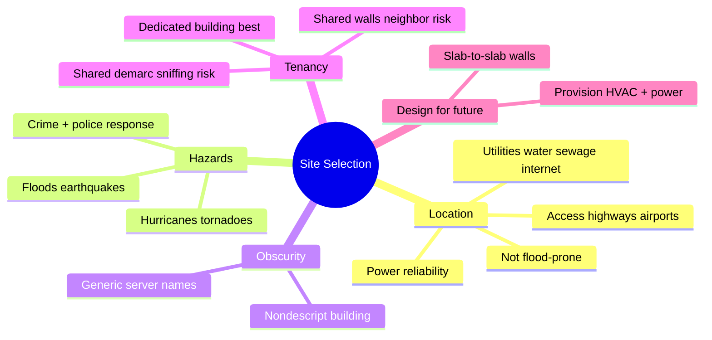

# Site Selection, Design, and Configuration

## Overview

Before you can secure a facility, you need to pick the right location and design it for security from day one.

### Term
**Greenfield** — undeveloped land for a brand-new facility.

### Topography
The physical shape of the land — hills, valleys, trees, streams. Relevant for military settings and can affect security. More commonly in private sector: flood zones, seismic activity, extreme weather.

## Site Selection Considerations

- **Power reliability** — blackouts, brownouts, grid stability
- **Utilities** — water, sewage, internet (fast + redundant providers)
- **Crime** — local crime rates, police response time
- **Natural hazards** — floods, earthquakes, tsunamis, hurricanes, tornadoes
- **Weather** — snow loads, ability to get staff in/out
- **Access** — highways, airports
- **Not flood-prone** (for data centers)

## Obscurity
Nondescript buildings attract less attention. It's security through obscurity but still a useful layer. Don't advertise where the data center is — inside or outside.

- Don't name servers "CreditCardServer1" or "PayrollServer1" (one place used Simpsons character names)
- Big walls with no windows scream data center; so do massive HVAC and generator footprints. Determined attackers will still find you — obscurity just reduces casual interest.

## Shared Tenancy

Renting part of a building creates real issues:
- Other tenants' bad security becomes your concern
- Lobby security desk may be easy to bypass for determined attackers
- Neighboring tenants may be able to break through walls / crawl spaces / sub-ceilings to reach your area
- Real example: bank robbers tunneled through walls from neighboring businesses

### Wiring Closets and Demarc
- Shared wiring closets mean other tenants may physically access your cables
- Copper Ethernet → sniffer clamps can pick up traffic
- Shared **demarcation point** (where ISP lines terminate and your network begins) is worse — everyone shares one. Pay ISP extra for encryption if possible, push building owner for strong access controls, or seek a different location.

For high-security needs: dedicate a whole building to yourself with buffer space from neighbors.

## Server Rooms and Data Centers

### Pop-Up Server Rooms
When the real data center outgrows its capacity, teams often put servers in whatever room is available — wiring closets, storage rooms, under desks in offices with windows. These rooms aren't designed for it:
- Wrong walls, wrong doors
- No environmental controls
- Wrong location (e.g., below bathrooms where water leaks)

Real story: servers under desks with outside windows, no UPS → power outage at 3am required an on-call engineer to come in and manually power them on.

### Slab-to-Slab Walls
Data center walls must go from **true floor to true ceiling** (slab to slab), with appropriate fire rating, matching-rated doors, and matching-rated floor/ceiling material. Think of it as a fully enclosed box.

## Design for Future

- HVAC and power are chronically under-provisioned for future growth
- Power story: data center with UPSs on both sides, but server team plugged everything into one side only. When one UPS dropped, load jumped to 115% on the other, which protectively shut itself off, killing 75% of the data center.
- Lesson: good design doesn't matter if implementation ignores it

## Flood Considerations

If the site is flood-prone — can you build somewhere else? Do the cost-benefit:
- Original location cost vs. expected flood damage cost
- Senior management understands the numbers → they decide
- Document the analysis so you're not scapegoated later

## Exam Tips

- Pick sites based on: power, utilities, crime, natural hazards, access
- Greenfield = undeveloped land
- Nondescript buildings + generic server names reduce attack surface
- Shared tenancy = neighbors' security problems become yours
- Slab-to-slab walls for data centers
- Design for future: HVAC, power, space
- Document your due diligence for risk decisions

## Diagrams

### Site Selection Factors — Mindmap

> What to weigh before you ever pour the foundation.

**Takeaway:** Pick on power/utilities/hazards/crime/access; obscurity and slab-to-slab walls add layers; shared tenancy imports the neighbors' risk.

## Related Topics

- [Physical Security](Physical%20Security.md)
- [Environmental Controls](Environmental%20Controls.md)
- [Risk Management](../01-security-and-risk-management/Risk%20Management.md)
