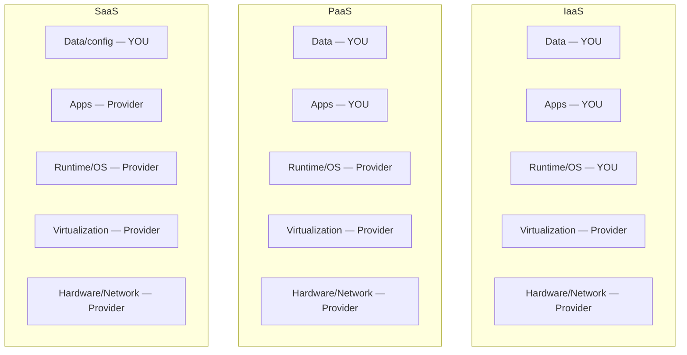

# Virtualization, Cloud, and Distributed Computing

## Overview

Modern computing is rarely one server doing one job. Understanding virtualization, cloud, and distributed architectures is critical — and heavily weighted on the exam.

> "There is no cloud. It's just someone else's computer somewhere else."

## Virtualization

One powerful host running multiple virtual machines (VMs / clients), each with its own OS and applications. Examples: VMware, Hyper-V, Xen.

### Benefits
- Much cheaper than physical (more workloads per watt)
- Minutes to provision vs. weeks
- Snapshots, easy backups, easy cloning
- Dynamic resource allocation
- Much smaller data center footprint — a blade chassis can host hundreds of VMs

### Hypervisor Types

| Type | Where it sits | Use case |
|------|--------------|----------|
| **Type 1 (bare-metal)** | Directly on hardware (Ring -1) | Data centers — most efficient |
| **Type 2 (hosted)** | On top of a host OS | Desktop / testing |

### Virtualization Security Concerns

- **VM escape** — attacker breaks from one VM into another on the same host
- **Segmentation** — keep same-trust VMs together; separate VLANs; don't mix security zones on one host
- **Hypervisor attacks** — hypervisor compromise = all VMs compromised
- **Oversubscription** — hosts have shared resources; overloaded = cascading slowdowns/crashes; monitor utilization and trends

## Cloud Computing

### 5 Essential Characteristics (NIST)
**On-Demand Self-Service, Broad Network Access, Resource Pooling, Rapid Elasticity, Measured Service.**

### Cloud Roles (+ GDPR mapping)
- **Cloud Consumer** = the customer → maps to GDPR **Controller** (accountable for the data).
- **Cloud Provider** = delivers the service → GDPR **Processor**.
- **Cloud Broker** = intermediary that aggregates/manages services.
- **Cloud Auditor** = independent assessment of the service.

### Cloud Types
| Type | Ownership | Tenancy |
|------|-----------|---------|
| **Private** | Your org (on-prem or vendor-hosted) | Single-tenant |
| **Public** | Cloud service provider (AWS, Azure, GCP, IBM) | Shared / multi-tenant — **99% of cloud** |
| **Hybrid** | Mix of private + public | Keep sensitive workloads internal |
| **Community** | Group of orgs with shared mission/compliance | Shared among members |

### Service Models
| Model | You manage | Provider manages |
|-------|------------|------------------|
| **IaaS** (Infrastructure) | OS, middleware, runtime, data, apps | Data center, networking, storage, virtualization |
| **PaaS** (Platform) | Apps + data | Everything through runtime |
| **SaaS** (Software) | Data + access | Almost everything |

> **Pizza analogy:** Homemade = on-prem. Take-and-bake = IaaS (they provide pizza, you cook). Delivery = PaaS. Dine at the restaurant = SaaS.

### When to Cloud (and When Not)
- Non-critical, latency-tolerant → often cloud makes financial sense
- Mission-critical, latency-sensitive, sovereign data → often stays internal
- **Always** audit vendor security — right to audit, right to pentest
- Compliance scope extends to anyone handling your data

## Grid Computing

Many systems donate unused resources to a shared computation pool. Each node gets a subtask.

- **BOINC** (Berkeley) — ~4M machines running scientific research
- **Peer-to-peer networks** — every node is both client and server
- Distinct from **Distributed Computing Environments (DCE)** where every node has a centralized resource manager and acts as one unified system

## Thin Clients

Lightweight endpoints — most processing happens elsewhere:
- **Diskless workstation** — boots from network, hits a VM host
- **Thin client application** — app runs on server, accessed via browser/port 443. SaaS is largely thin-client.

Security benefit: sensitive data stays off local machines.

## Distributed Systems (DCE)

Multiple nodes behaving as one unified system with centralized resource management.
- **Horizontal scaling** — add more nodes (vs. vertical = bigger per node)
- **Modular growth, fault tolerance, low latency** via geographic distribution
- Examples: websites, cell networks, peer-to-peer, research, blockchain

### Distributed Database
Data is stored in **more than one database** but is still **logically connected**. The user perceives the database as a **single entity**, even though it comprises numerous parts interconnected over a network. (Contrast: hierarchical, relational, and normalized describe how data is *structured*, not whether it's physically spread across locations.)

### Blockchain
- Distributed ledger spread across peers
- Every transaction rehashes the full ledger → high integrity
- Famous use: cryptocurrency

## High-Performance Computing (HPC)

Aggregate of nodes acting as one, designed for complex calculations — supercomputers. Must balance **compute, network, storage** — a bottleneck in any one neutralizes the others.

## Edge Computing

Move compute + data close to users/devices:
- CDNs (Content Delivery Networks) — most common edge computing
- IoT, self-driving cars, medical devices, video conferencing
- Reduces latency, reduces bandwidth

## Exam Tips

- Type 1 hypervisor = bare-metal, production. Type 2 = desktop.
- SaaS: you manage data + access only. IaaS: you manage OS and up.
- Keep same-trust VMs on the same host; segment different trust levels
- Shared responsibility still puts you on the hook (AWS voter breach = customer's fault)
- **Public cloud = ~99% of cloud usage** — know IaaS/PaaS/SaaS cold
- Number of symmetric keys = n(n-1)/2 (relevant to cloud key management)

## Diagrams

### Cloud Shared Responsibility — IaaS vs PaaS vs SaaS

> Who manages each layer. Customer's burden shrinks as you move IaaS → SaaS.

**Takeaway:** Provider secures **OF** the cloud; customer secures **IN** the cloud. **You always own your DATA**, no matter the model. IaaS = you manage most; SaaS = you manage least (just data/config).

## Related Topics

- [Secure Design Principles](Secure%20Design%20Principles.md) — shared responsibility
- [Network Devices and Components](../04-communication-and-network-security/Network%20Devices%20and%20Components.md)
- [Risk Management](../01-security-and-risk-management/Risk%20Management.md)
- [Supply Chain Risk Management](../01-security-and-risk-management/Supply%20Chain%20Risk%20Management.md)
