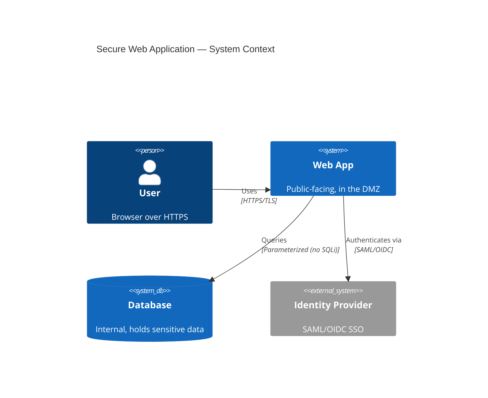

# Web Architecture and Attacks

## Overview

The Internet was designed for closed, trusted networks (military, universities, research). Security was bolted on later. Every after-the-fact addition is inherently weaker than security designed in from the start.

## Applets

Small embedded applications in web browsers / other software:
- **Java applets** — run in a sandbox (segmented from OS); OS-agnostic
- **ActiveX** — runs with certificates; Windows-only; deeper OS interaction (= higher risk)

Legacy technology; largely obsolete but may still appear on the exam.

## OWASP Top 10

Updated ~every 4 years. Don't memorize version-specific details — know what each category is, how it compromises you, and how to defend. We cover specific vulnerabilities in [Software Vulnerabilities and Attacks](../08-software-development-security/Software%20Vulnerabilities%20and%20Attacks.md).

Examples:
- Injection (SQL, LDAP, OS)
- Broken authentication
- Sensitive data exposure
- XXE (XML External Entity)
- Broken access control
- Security misconfiguration
- XSS (Cross-Site Scripting)
- Insecure deserialization
- Using components with known vulnerabilities
- Insufficient logging/monitoring

## XML (Extensible Markup Language)

Standard encoding for documents and data. More universal than HTML:
- HTML is mainly for the web; XML is used everywhere (configs, APIs, audit outputs, etc.)
- Security concerns: XXE attacks (see OWASP Top 10)

## SOA (Service-Oriented Architecture)

Software design style where services are provided to all components — reusable modules, often over a network.

Acts as a bridge between backend data and applications. The app doesn't care about backend details; the backend doesn't care which app is calling — they communicate through defined services.

Similar to the abstraction between hardware, kernel, drivers, and OS.

## Exam Tips

- Internet protocols were designed without security — everything added on is weaker than it could have been
- Java applets sandbox; ActiveX doesn't → ActiveX historically more risky
- XML = universal; HTML = web-only
- SOA = reusable services over a network; separation between app and data
- Know OWASP Top 10 categories by name + general idea

## Diagrams

### Web Application Context — C4 Diagram

**Takeaway:** TLS in transit, auth via an external IdP, parameterized DB queries, sensitive data kept internal — security designed into the architecture.

## Related Topics

- [Software Vulnerabilities and Attacks](../08-software-development-security/Software%20Vulnerabilities%20and%20Attacks.md) — OWASP detail
- [Network Protocols](../04-communication-and-network-security/Network%20Protocols.md)
- [Secure Coding Practices](../08-software-development-security/Secure%20Coding%20Practices.md)
