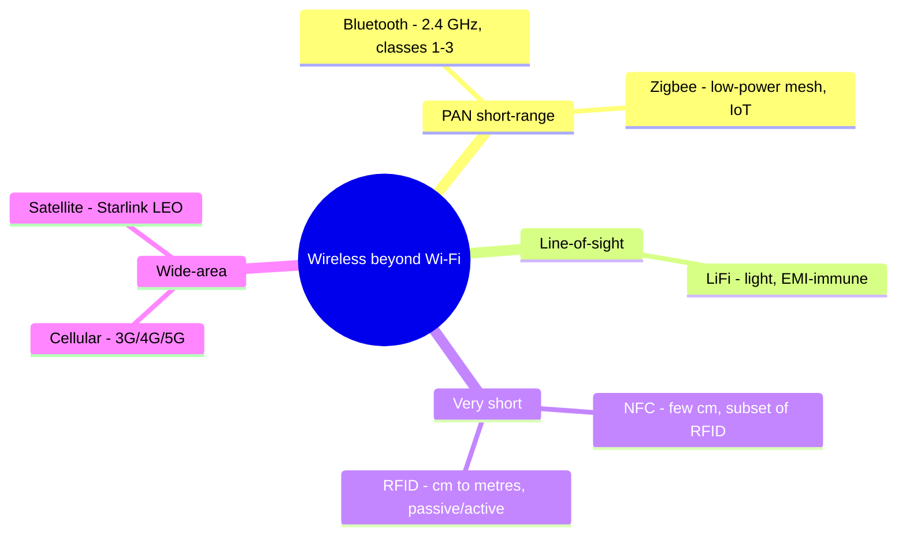

# Bluetooth and Other Wireless Technologies

## Overview

Beyond Wi-Fi, several wireless technologies show up on the exam, each tuned for a different range and purpose: Bluetooth and Zigbee for short-range personal/device networks, LiFi for high-speed line-of-sight, satellite and cellular for wide-area access. The security theme is recurring — most were built for convenience, so encryption and authentication are weak or bolted on. Know each one's range, niche, and headline weakness.

## Bluetooth

PAN — short-range, 2.4 GHz band.

### Bluetooth Classes
| Class | Range |
|-------|-------|
| **Class 1** | Up to 100m (~300 ft) |
| **Class 2** | Up to 10m (~30 ft) |
| **Class 3** | ~1m (less than 10m) |

### Cryptography
- Custom algorithm based on SAFER+ block cipher
- E0 stream cipher for packet confidentiality
- Cryptanalysis shows E0's effective key length is as low as 38 bits — weak
- Authentication based on shared secret, PIN-derived keys

### Security Weaknesses
- First 24 bits of MAC = manufacturer (known)
- Last 24 bits can be brute-forced (no salting, no lockout, no clipping)
- Often "security through obscurity"

### Bluetooth Attacks
| Attack | Severity |
|--------|----------|
| **Bluejacking** | Annoying — unsolicited messages |
| **Bluesnarfing** | Serious — steal data from the device |
| **Bluebugging** | Severe — take full control of the device (mostly affects older unpatched phones) |

### Defenses
- Disable Bluetooth when not in use
- Turn off discovery after pairing
- Ignore unexpected PIN prompts
- Remove paired devices when done
- **Patch and update** regularly

## LiFi

- Uses **light** instead of radio for wireless data
- Up to ~100 Gbps direct line-of-sight; ~70 Mbps reflected
- Immune to radio EMI
- Useful where Wi-Fi isn't allowed (airplane cabins, hospitals, nuclear plants)
- Short range, expensive, emerging

## Zigbee

- Low-power, low-data-rate WPAN mesh
- No line-of-sight required
- Simpler than Bluetooth/Wi-Fi
- Speeds: 20 Kbps (900 MHz) or 250 Kbps (2.4 GHz)
- Mostly inter-device communication (IoT, home automation)

## RFID and NFC

| | RFID | NFC |
|--|------|-----|
| **Range** | Reads tags at a **distance** (cm to many metres, depending on tag type) | Very short — a **few centimetres** |
| **Relationship** | The broader technology | A short-range **subset** of RFID |
| **Frequency** | Multiple bands (LF/HF/UHF) | 13.56 MHz |
| **Typical use** | Asset tracking, inventory, access badges | Contactless payment, phone tap-to-pair, smart cards |

- **Passive** RFID tags have no battery — powered by the reader's field; **active** tags have their own power and longer range.

## Satellite Internet

- Modem + dish (30-90 cm typical)
- Historically: slow, high latency (500ms+), expensive
- **Starlink** changing this — low-orbit satellites, much lower latency, better speeds
- Useful as redundancy for flaky power/cable infrastructure

## Cellular Networks

Wired all the way to the antenna — wireless from antenna to device.

| Gen | Top Speed | Avg Speed | Latency | Cell Size |
|-----|-----------|-----------|---------|-----------|
| 3G | ~2 Mbps | ~144 Kbps | ~500 ms | Medium |
| 4G | ~200 Mbps | ~25 Mbps | 20-30 ms | ~16 km (10 mi) |
| 5G | 5-20 Gbps | 200-400 Mbps | <10 ms | ~500m (1500 ft) — much denser required |

5G is blocked by most solid material (metal, thick walls), requiring dense deployment.

## Exam Tips

- Bluetooth: Class 1 = ~100m; Class 2 = ~10m; Class 3 = ~1m
- Bluejacking (annoying) < Bluesnarfing (steal data) < Bluebugging (full control)
- LiFi = uses light; immune to EMI
- Zigbee = low-power, low-data mesh
- 5G = faster but much shorter range than 4G
- RFID = read at a distance; NFC = a very short-range (cm) subset of RFID

## Diagrams

### Wireless Technologies by Range and Niche
Match each to its range and headline weakness.

## Related Topics

- [Wireless Security](Wireless%20Security.md)
- [IoT Security](../03-security-architecture-and-engineering/IoT%20Security.md)
