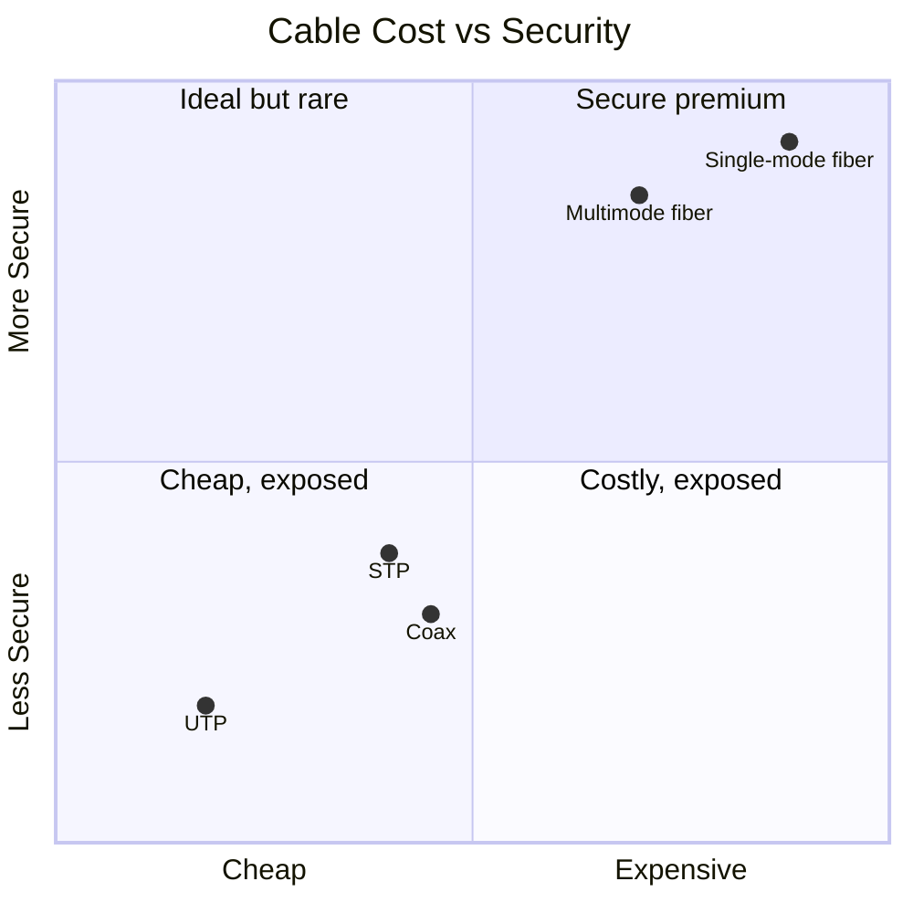

# Cable Types

## Overview

Different cables fit different needs. As IT security pros, we care about EMI susceptibility, sniffability, speed, and distance — and pick the right cable per use case.

## Key Concepts

- **EMI** (Electromagnetic Interference) — external disruption to electrical signals
- **Crosstalk** — signal bleeding between adjacent unshielded cables (confidentiality risk on copper)
- **Attenuation** — signal degradation over distance. **Copper has attenuation; fiber does not (practically).**

## Copper Twisted Pair

| Type | Shielding |
|------|-----------|
| **UTP** (Unshielded Twisted Pair) | Individual pairs twisted; no external shield |
| **STP** (Shielded Twisted Pair) | Each pair individually shielded + outer shield |

- UTP: cheap, flexible, widely used, 1 Gbps typical
- STP: more expensive, stiffer, better EMI resistance — used where security or interference matters

### Connectors
- **RJ45** — Ethernet network connector
- **RJ11** — phone (smaller, fewer pins)

### Copper Ethernet Cable Categories
| Cat | Max Speed | Max Distance | Notes |
|-----|-----------|-------------|-------|
| Cat1-Cat4 | Legacy | — | Phone, Token Ring — obsolete |
| Cat5 | 100 Mbps | 100m | Legacy, probably gone |
| Cat5e | 1 Gbps | 100m | Common |
| Cat6 / Cat6A | 10 Gbps | 55m / 100m | Common in data centers |
| Cat7 | 10 Gbps | 100m | Data center grade, shielded |

**Copper attenuation** means 100m max run for most categories.

## Plenum-Rated Cabling

A **plenum** is the air-handling space above a drop ceiling or under a raised floor used for HVAC return air. Ordinary PVC cable jackets release toxic smoke when they burn, and a plenum would spread that smoke through the building.

- **Plenum-rated cable** has a fire-resistant, **low-smoke** jacket (e.g., FEP/Teflon)
- **Required by fire/building code** in plenum spaces — a life-safety/code requirement, not a performance one

## Coaxial (Coax)

- Central copper core + insulator + metal shield + outer jacket
- Historically for TV and internet; rare in modern data networks but occasionally seen on legacy systems
- Less susceptible to EMI than UTP

## Fiber Optic

Uses **light** (not electricity) through thin glass strands.
- **No EMI susceptibility**
- **Not sniffable** without splicing (very hard)
- Can run alongside power cables
- Breaks if bent too sharply
- More expensive

### Single-Mode vs. Multimode
| Type | Light | Distance | Speed | Use |
|------|-------|----------|-------|-----|
| **Single-mode** | One light path (single mode); narrow core | Up to 150+ miles (240+ km) | Record: 1 Petabit/sec at 50 km | ISP backbones, long-haul |
| **Multimode** | Multiple light paths (modes); wider core | Shorter (modal dispersion limits distance) | Up to 100 Gbps typical | Data center, intra-campus |

### Multimode Grades
| Grade | Speed/Distance |
|-------|----------------|
| OM1 / OM2 | Legacy |
| **OM3** | 10-100 Gbps at 100m |
| **OM4** | 10-100 Gbps at 150m |
| **OM5** | Newest, highest speeds at similar distances |

## Exam Tips

- "Secure cable" → **fiber**
- "Cheapest secure cable" → still **fiber** (cheapest is copper, but not secure)
- Copper = EMI-susceptible + sniffable; fiber = neither
- Copper max run ~100m (attenuation); fiber runs to km range
- Don't run copper Ethernet in the same tray as power; fiber is fine
- Single-mode = long-distance; multimode = shorter-distance, data center
- **Plenum-rated** cable (low-smoke jacket) is **required by code** in air-handling spaces

## Diagrams

### Cable Trade-off: Cost vs Security
Copper is cheap but sniffable/EMI-prone; fiber is pricey but neither. "Secure cable" → fiber.

## Related Topics

- [Network Devices and Components](Network%20Devices%20and%20Components.md)
- [Electricity and Power](../03-security-architecture-and-engineering/Electricity%20and%20Power.md) — EMI defenses
- [Emanations and Covert Channels](../03-security-architecture-and-engineering/Emanations%20and%20Covert%20Channels.md)
