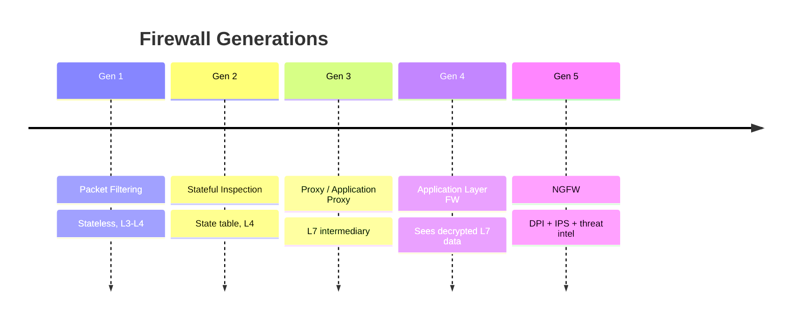
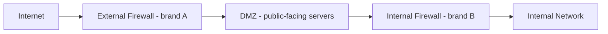

# Firewalls - Detail

## Overview

Firewalls are the primary perimeter enforcement point. Several generations; pick the right one(s) for your architecture.

## Generation 1: Packet Filtering

- Layers 1-3
- Examines source/dest IP and port
- **Stateless** — no session awareness; must allow return traffic explicitly
- Each packet evaluated against access list in order
- Implicit `deny any any` at end
- Fast but limited

## Generation 2: Stateful Inspection

- Layers 1-4
- Tracks connection state in a **state table**
- Reply traffic allowed automatically based on established session
- More secure than packet filtering
- Can crash if state table overflows (defensive SYN flood variants target this)

## Generation 3: Proxy Server / Application Proxy

- Layer 7
- Intermediary — client talks to proxy, proxy talks to target
- Can inspect application content
- Hardened to restrict specific traffic types
- Can also internally segment a network (less common today — VLANs cheaper/simpler)

## Generation 4: Application Layer Firewall

- Layer 7
- Sees **unencrypted** application data (encryption at Layer 6 means lower-layer FW can't read encrypted payloads)
- Can be **host-based** (on the device) or **network-based** (at perimeter)
- Often used together for defense-in-depth

## TCP Wrapper (host-based)

A **TCP wrapper** is a host-based access control / lightweight firewall on Unix/Linux that restricts access to a service by **host or user ID** (via `/etc/hosts.allow` and `/etc/hosts.deny`). Host-level, not a perimeter device.

## Generation 5: Next-Generation Firewall (NGFW)

- Combines traditional + deep packet inspection + IPS + malware filtering
- Application-aware
- Can filter based on signatures (allowlist known-safe apps, block the rest)
- Threat intelligence integration

## Web Application Firewall (WAF)

- Specifically for web apps
- Blocks SQL injection, XSS, CSRF
- Layer 7

### Why WAFs get bypassed (the key insight)
A WAF is a **denylist (blocklist) of known-bad patterns** — and a denylist is fatally asymmetric: **rules are finite; ways to express an attack are infinite.** A bypass = input that achieves the attack **without matching any rule** (encoding, case variation, comments/whitespace, alternate syntax, fragmentation). Deepest cause: the **WAF and the backend parse input differently** — a bypass lives in that gap (WAF reads it as benign, backend as malicious).
- A WAF is **rule-based / signature-based** (uniform rules on the request *content*), NOT attribute-based — same limit as signature IDS/AV missing zero-days.
- So a WAF is **defense-in-depth, NEVER the fix.** Real fix is at the source: **SQLi → parameterized queries; XSS → output encoding + input validation.**

## Proxy vs Firewall — the principle
> **"Proxy" is a technique** (a middleman that terminates & relays connections). **"Firewall" is a purpose** (security). A proxy used *for security* IS a firewall.
- **Proxy firewall = application-layer firewall = L7 firewall** — three names, ONE thing (a firewall that filters *by* proxying).
- A plain **proxy** alone (caching proxy, reverse proxy / load balancer) is NOT a firewall — it relays, it doesn't inspect for attacks.

## Web Application Proxy vs WAF
- **Web application proxy** = a **reverse proxy** for web apps (load balancing, SSL termination, hide backend). **Relays traffic; does NOT inspect for attacks.**
- **WAF** = inspects HTTP for **attacks** (SQLi/XSS) and blocks them. A WAF is essentially a reverse proxy **plus** attack-inspection.

## Firewall Architectures

### Bastion Host
Hardened single-purpose host, typically in DMZ. Stripped of everything non-essential.

### Dual-Homed Host (legacy)
Host with two NICs (internal + external). No routing; users log in to it to hop. Legacy.

### Screened Host (legacy)
Screening router + bastion host. **Single point of failure.**

### Screened Subnet (DMZ between two firewalls)
```
Internet → [External FW] → DMZ (public-facing) → [Internal FW] → Internal Network
```
- Defense in depth
- **Use different brands** for internal vs. external firewalls — a vulnerability in one brand won't affect both

### Three-Legged DMZ (single firewall)
One firewall with 3 interfaces: Internet, DMZ, Internal. Cheaper but **single point of failure**.

### Full Mesh (best)
Two external + two internal firewalls, cross-connected. No single point of failure. Different brands at each tier for maximum diversity.

## Fail Behavior

Firewalls **always fail secure / closed** — if they crash, no traffic passes. Availability loss is better than exposure.

## Implicit Deny

Every ACL ends with an implicit `deny any any`. If no rule explicitly permits, traffic is denied.

## Exam Tips

- Packet filter = stateless; stateful inspection = tracks sessions
- Application-layer firewalls at L7 can see decrypted content
- NGFW = all of the above + DPI + IPS + threat intel
- Screened subnet = DMZ between two firewalls (different brands ideal)
- Full mesh = no single point of failure
- Firewalls fail secure/closed
- Implicit deny at end of every ACL

## Diagrams

### Firewall Generations
Each generation adds visibility at a higher OSI layer.


### Screened Subnet (DMZ between two firewalls)
Two firewalls of different brands so one vulnerability does not breach both tiers.


## Related Topics

- [Network Devices and Components](Network%20Devices%20and%20Components.md)
- [Secure Network Architecture](Secure%20Network%20Architecture.md)
- [Defense in Depth](../01-security-and-risk-management/Defense%20in%20Depth.md)
