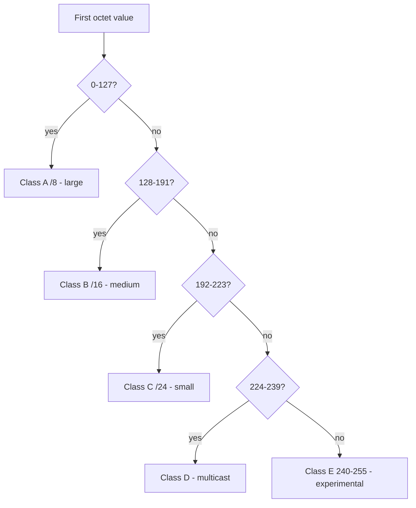

# IP Addresses, MAC Addresses, and Ports

## Overview

Addressing and port numbering — foundational for understanding anything that happens on the network.

## MAC Addresses

"Burned in" layer-2 address, supposed to be unique per NIC — but **easily spoofed**.

### Formats
- **EUI-48** (MAC-48) — 48 bits; first 24 = manufacturer ID, last 24 = device ID
- **EUI-64** — 64 bits; first 24 = manufacturer ID, last 40 = device ID

### IPv6 and 48-bit MACs
IPv6 requires 64-bit MACs. For 48-bit NICs, `FF:FE` is inserted in the middle, padding to 64 bits.

## IPv4

- 32 bits, written as 4 octets in dotted decimal (e.g., `172.16.254.1`)
- ~4 billion total addresses
- Inherently trusting, connectionless (like UDP); reliability added via TCP
- Developed on ARPANET in 1983 — security was never designed in (closed, trusted network)

### Classful Addressing (legacy, still tested)

| Class | First-octet range | Default use |
|-------|-------------------|-------------|
| **A** | 0–127 | Very large networks (/8) |
| **B** | 128–191 | Medium networks (/16) |
| **C** | 192–223 | Small networks (/24) |
| **D** | 224–239 | **Multicast** |
| **E** | 240–255 | **Experimental / reserved** |

(127 within Class A is reserved for loopback.) Classful addressing was replaced by CIDR, but the exam still asks the ranges.

### Public vs. Private Address Ranges

| Range | CIDR | Hosts | Use |
|-------|------|-------|-----|
| 10.0.0.0 – 10.255.255.255 | /8 | ~16.7M | Private |
| 172.16.0.0 – 172.31.255.255 | /12 | ~1M | Private |
| 192.168.0.0 – 192.168.255.255 | /16 | ~65K | Private |
| 127.0.0.0 – 127.255.255.255 | /8 | Loopback only | Special — local only |
| 169.254.0.0 – 169.254.255.255 | /16 | Auto-assigned (APIPA) | Means something is wrong |
| 255.255.255.255 | — | Broadcast | Layer-3 broadcast |

Private addresses are **not routable** on the internet — they're dropped at the router border.

### NAT / PAT
Extended IPv4 lifespan:
- **Static NAT** — 1:1 mapping
- **Pool NAT** — pool of public IPs; only those actively online need one
- **PAT / NAT Overload / One-to-Many** — one public IP + many ports = many private IPs (most common today)

### CIDR (Classless Inter-Domain Routing)
Slash notation divides address space flexibly. `/24` = 256 addresses (254 usable hosts; first = network, last = broadcast). Higher number = smaller network.

### IPv4 Header Fields
- Version, header length, type of service (QoS)
- Identification, flags, offset (fragmentation)
- **TTL** (Time To Live) — decrements at each router; prevents routing loops
- Protocol (TCP/UDP), checksum, source/destination IP, options, padding
- **MTU** typically 1500 bytes; larger packets fragment

## IPv6

- 128 bits, written as 8 groups of 4 hexadecimal digits
- Address space: a 65,000 IPs per square foot of Earth's surface
- **IPsec built in** (in IPv4 it's bolted on)
- Hex digits 0-9 + a-f

### Shortening
Remove leading zeros in each group; replace longest run of all-zero groups with `::` (only once per address).

### IPv6 Header
Similar to IPv4 but simpler:
- Version (6), Traffic Class (QoS), Flow Label (QoS management)
- Payload Length, Next Header, **Hop Limit** (TTL equivalent)
- Source + Destination (128-bit each)

### IPv6 Address Auto-Generation via MAC
Take 64-bit MAC → flip the 7th bit of the first octet → combine with the network prefix (local `fe80::/10` or internet prefix) → IPv6 address.

### Regional Internet Registries (IANA / ICANN)
- **AFRINIC** — Africa
- **ARIN** — US, Canada, parts of Caribbean/Antarctica
- **APNIC** — Asia-Pacific
- **LACNIC** — Latin America, parts of Caribbean
- **RIPE NCC** — Europe, Russia, Middle East, Central Asia

## Ports

65,536 total. Divided into:

| Range | Type | Use |
|-------|------|-----|
| 0-1023 | Well-known | Protocol-assigned (80, 443, 22, 25, etc.) |
| 1024-49151 | Registered | Vendor-assigned (3389 RDP, etc.) |
| 49152-65535 | Private / Dynamic / Ephemeral | Any app — browser picks random for each session |

## Common Ports (know these)

| Port | Proto | Service |
|------|-------|---------|
| 20/21 | TCP | FTP (data/control) |
| 22 | TCP/UDP | SSH, SCP, SFTP |
| 23 | TCP | Telnet (insecure) |
| 25 | TCP | SMTP |
| 53 | TCP/UDP | DNS |
| 67/68 | UDP | DHCP / BOOTP |
| 69 | UDP | TFTP |
| 80 | TCP | HTTP |
| 110 | TCP | POP3 |
| 143 | TCP | IMAP |
| 161/162 | UDP | SNMP |
| 389 | TCP | LDAP |
| 443 | TCP | HTTPS |
| 520 | UDP | RIP |
| 636 | TCP | LDAPS |
| 1433 | TCP | Microsoft SQL Server |
| 1521 | TCP | Oracle SQL |
| 3389 | TCP/UDP | RDP |

## Socket and Socket Pair

- **Socket** = IP + port (e.g., `192.168.1.6:49691`)
- **UDP** uses one socket
- **TCP** uses a socket pair (one per direction)

## Traffic Types

| Type | Description |
|------|-------------|
| **Unicast** | One-to-one |
| **Multicast** | One-to-many (predefined list) — like subscription TV |
| **Broadcast** | One-to-all on the local segment |

### Broadcast Addresses
- **Layer 2 broadcast** — MAC `FF:FF:FF:FF:FF:FF`
- **Limited Layer 3 broadcast** — IP `255.255.255.255` (routers don't forward these)
- **Directed broadcast** — sent to all hosts on a specific subnet (e.g., 192.168.19.255/24)

## Exam Tips

- Know the private IP ranges
- Know the common port numbers
- PAT = NAT overload = one-to-many
- Well-known ports: 0-1023; ephemeral: 49152-65535
- Socket = IP + port
- TCP uses socket pair; UDP uses single socket
- Routers drop layer-3 broadcast (255.255.255.255)
- SQL = 1433 (MS SQL) / 1521 (Oracle), but a **SQL injection** attack rides over the web app — so the attacker's port is usually **443 (HTTPS)**, not the database port
- IPv4 class ranges: A 0–127, B 128–191, C 192–223, D 224–239 (multicast), E 240–255

## Diagrams

### IPv4 Class from First Octet
The first octet's value alone tells you the legacy class.

## Related Topics

- [OSI and TCP-IP Models](OSI%20and%20TCP-IP%20Models.md)
- [Network Protocols](Network%20Protocols.md)
- [IP Support Protocols](IP%20Support%20Protocols.md)
