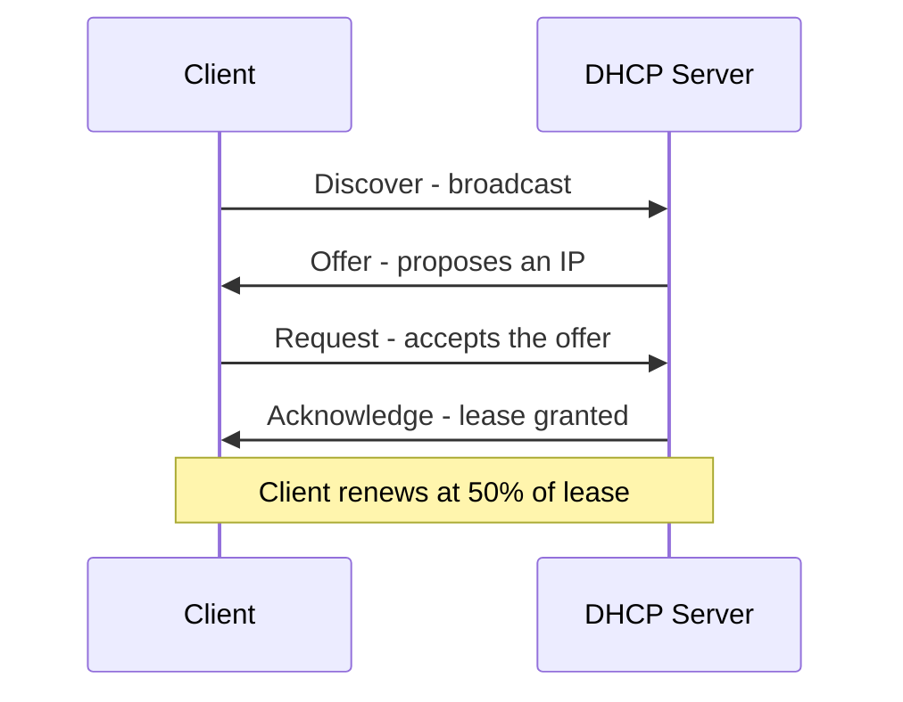

# IP Support Protocols

## Overview

Supporting protocols that make IP networks work — and the attacks against them.

## ARP (Address Resolution Protocol)

Translates IP → MAC on a local network.

- Layer 2/3 (often called "Layer 2.5")
- **Trusting** — no authentication on replies
- Broadcast request ("who has this IP?"), unicast reply

### Reverse ARP (RARP)
Used by diskless workstations — "my MAC is X, what's my IP?"

### ARP Poisoning (Cache Poisoning)
Attacker sends fake ARP replies associating their MAC with a target IP (often the gateway). Victim traffic redirects to the attacker.

**Defense:** hard-code ARP entries for critical devices (gateway, DNS).

## ICMP (Internet Control Message Protocol)

Layer 3. Used for diagnostics and error signaling.

### Ping
ICMP echo request → echo reply. Tests if host is reachable. If blocked, no reply means host might be up but firewalled.

### Traceroute
Clever use of TTL:
1. Send packet with TTL=1 → first router decrements to 0, sends ICMP time-exceeded → you learn hop 1
2. Send packet with TTL=2 → second router responds → you learn hop 2
3. Repeat until reaching the target or TTL=30

If ICMP is blocked somewhere, you see asterisks / timeouts for that hop but can still see subsequent hops.

### ICMP-Based Attacks
- **Ping of death** — malformed oversized packet
- **Smurf** — ICMP broadcast amplification with spoofed source
- Common defense: block or rate-limit incoming ICMP at the border

## Telnet (legacy)

- TCP 23, **plaintext**
- Username, password, and all data in the clear
- **Never use**

## SSH (Secure Shell)

- TCP/UDP 22
- Replaces Telnet, rlogin, rsh, FTP's shell functions
- SSHv1 had flaws; SSHv2 is the current secure version
- Note: sophisticated actors (per Snowden 2013, WikiLeaks 2017) have tools that can break some SSH implementations (BothanSpy, Gyrfalcon)

## FTP Family

| Protocol | Port | Security |
|----------|------|----------|
| **FTP** | TCP 20 (data) / 21 (control) | Plaintext |
| **SFTP** (FTP over SSH) | TCP 22 | Secure |
| **FTPS** (FTP over TLS/SSL) | TCP 20/21 (or 990) | Secure |
| **TFTP** (Trivial FTP) | UDP 69 | **No authentication**, single directory; used for diskless workstation boot and router config saves |

## DNS (Domain Name System)

- TCP/UDP 53
- Translates names → IP addresses
- Uses `gethostbyname` / `gethostbyaddr`
- **Authoritative NS** — authority for a zone
- **Recursive NS** — resolves names by asking others

### DNS Poisoning
Attacker injects fake name/IP into a DNS cache. Works because DNS has no native authentication.

**DNS cache poisoning vs modified HOSTS file (exam diagnostic):** If a wrong IP resolves but `ipconfig /flushdns` clears it (the bad entry does NOT reappear in `ipconfig /displaydns`), the cause is **local DNS cache poisoning**. A **modified HOSTS file** would survive the flush — HOSTS entries are **boot-persistent** and reload into the cache, so they'd still show in `displaydns` after a flush. (The HOSTS file is also checked *before* DNS.)

### DNSSEC
Adds authentication and integrity (PKI signatures). **No confidentiality.**

## DHCP

- UDP 67 (server) / 68 (client)
- **DORA** — Discover → Offer → Request → Acknowledge
- Lease with renewal at halfway point
- Can combine static + dynamic assignment — exclude static ranges from the DHCP pool

## BOOTP

- Predecessor to DHCP; UDP 67/68
- Used by diskless workstations to bootstrap (download OS via TFTP after getting IP via RARP)

## SNMP (Simple Network Management Protocol)

- UDP 161/162
- v1/v2: plaintext (v2 more dangerous because management features expand attack surface if creds leak)
- **v3**: encrypted, authenticated — what you should use
- **SolarWinds hack (2020)** — supply-chain attack affecting ~18,000 organizations; illustrated the risk of third-party monitoring tools and the case for zero trust

## HTTP / HTTPS

- HTTP: TCP 80 (also 8008, 8080) — plaintext
- HTTPS: TCP 443 (also 8443) — TLS
- HTTP/HTTPS = transport; HTML = content (don't confuse)

## Exam Tips

- ARP = trusting; defend critical entries with static mappings
- ICMP disabled at many perimeters — ping failures don't mean host is down
- Traceroute uses TTL manipulation
- Telnet = plaintext = never
- TFTP = no auth, used for boot/config
- DNSSEC = integrity + auth (NOT confidentiality)
- SNMPv3 is the only safe version
- DHCP = DORA

## Diagrams

### DHCP DORA Exchange
Discover → Offer → Request → Acknowledge; renewal at 50% of the lease.

## Related Topics

- [IP Addresses MAC Addresses and Ports](IP%20Addresses%20MAC%20Addresses%20and%20Ports.md)
- [Network Protocols](Network%20Protocols.md)
- [Network Attacks](Network%20Attacks.md)
