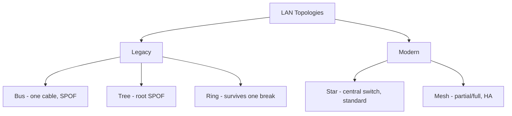

# LAN Technologies and Topologies

## Overview

How networks are physically/logically arranged and what technologies have been used. Some are legacy but still testable.

## Topologies

### Bus
- Single cable with all nodes tapped in
- Any cable break stops traffic beyond that point
- **Legacy, single point of failure**

### Tree
- Mainframe (or root) controls traffic; branches out
- Like bus — single node fails → traffic cut off
- **Legacy**

### Ring
- Nodes in a circle
- If one node fails, traffic can still flow the other way around
- Better than bus/tree but still **legacy**

### Star
- All nodes connect to a central device (today = switch)
- Single node failure affects only that node
- **Current standard** for Ethernet LANs

### Mesh
| Type | Description |
|------|-------------|
| **Partial mesh** | Some nodes connected to each other |
| **Full mesh** | Every node connects to every other node |

Used for redundancy and high-availability — e.g., for server clusters with keepalives.

### Keepalives (in full/partial mesh)
Primary server actively handles traffic. Secondary sends periodic "are you alive?" messages. After N missed responses (e.g., 3), secondary promotes itself to primary.

## CSMA Variants

| | CSMA | CSMA/CD | CSMA/CA |
|--|------|---------|---------|
| **Collision** | — | **Detection** (Ethernet) | **Avoidance** (Wi-Fi) |
| **Mechanism** | Listen before sending | Listen; collide; jam signal; back off | Request-to-Send / Clear-to-Send |

**CSMA/CD** — Ethernet. Pre-switch era hubs had collision problems; modern switched networks put each port on its own collision domain, eliminating the problem.

**CSMA/CA** — Wi-Fi. Only one device can send at a time on a channel; uses RTS/CTS.

### Token Passing
Only the node with the token can send. "Talking stick" model. Used in legacy FDDI, Token Ring.

## Legacy LAN Technologies (recognize)

| Tech | Topology | Access | Speed |
|------|----------|--------|-------|
| **ARCNET** | Star | Token | 2.5 Mbps |
| **Token Ring** | Ring | Token | 16 Mbps |
| **FDDI** (Fiber Distributed Data Interface) | Ring | Token | 100 Mbps; fiber, no EMI; complex + expensive |

## Modern LAN
- **Ethernet** on copper or fiber, star topology
- **Wi-Fi** (802.11) for wireless
- TCP/IP is the universal protocol stack

## Ethernet History Note
Ethernet was designed for closed, trusted networks. Security features and protocols are bolted on — inherently weaker than if designed in.

## Exam Tips

- Star = modern LAN standard
- Bus and tree = single-point-of-failure (legacy)
- Ring survives single failure (can go the other way)
- Mesh = high availability
- CSMA/CD = Ethernet; CSMA/CA = Wi-Fi
- Modern switched Ethernet = no collisions (each port its own collision domain)

## Diagrams

### LAN Topologies: Legacy vs Modern
Bus/tree fail on any break; ring survives one; star is today's standard; mesh adds HA.

## Related Topics

- [Network Devices and Components](Network%20Devices%20and%20Components.md)
- [Networking Basics and Definitions](Networking%20Basics%20and%20Definitions.md)
- [Wireless Security](Wireless%20Security.md)
