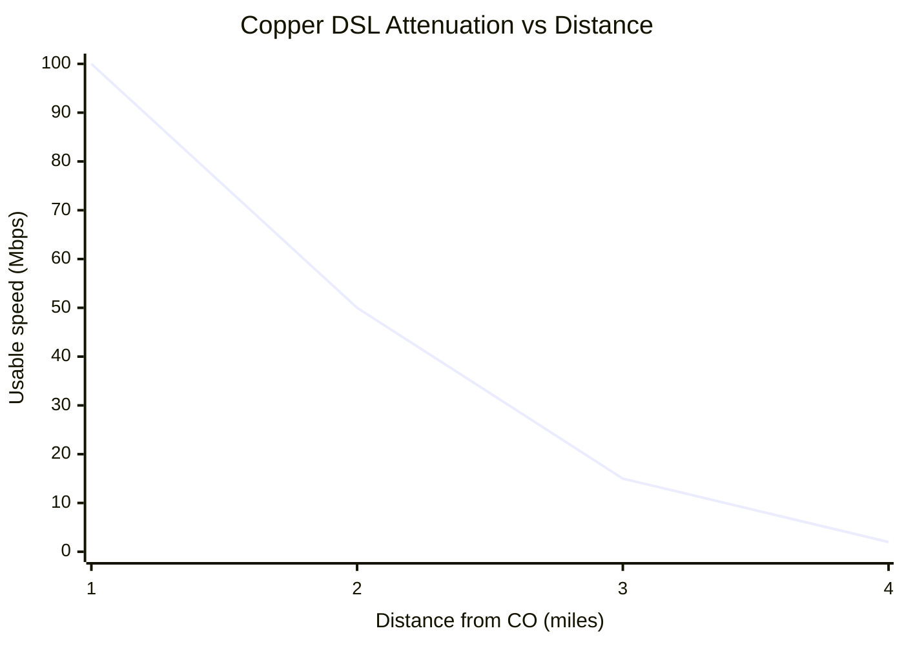

# Modems and Access Technologies

## Overview

"Modem" = **mod**ulator + **dem**odulator. Converts binary to some transmission medium and back.

## Modem Types

| Type | Medium | Speed | Notes |
|------|--------|-------|-------|
| **Dial-up** | Analog phone | ~56 Kbps | Legacy |
| **DSL / ADSL** | Copper phone lines, high frequency | Up to ~100 Mbps | Attenuation-sensitive (distance from central) |
| **Cable** | Coax | Up to 1 Gbps | Originally designed for TV |
| **Fiber** | Fiber | 100 Mbps – 10 Gbps+ | Highest speed/reliability |
| **Satellite** | Radio → satellite | Historically slow + high-latency | Starlink changing this |
| **Powerline** | Electric power lines | Varies | Niche |

## DSL Variants
- **ADSL** (Asymmetric DSL) — e.g., 20 Mbps down / 1 Mbps up (most common consumer; "asymmetric" because down ≠ up)
- **SDSL** (Symmetric) — same up and down
- **ISDN** (Integrated Services Digital Network) — legacy; digital over phone lines; 64 Kbps multiples; circuit or packet switching

## DTE and DCE

| | DTE (Data Terminal Equipment) | DCE (Data Circuit-terminating Equipment) |
|--|-------------------------------|------------------------------------------|
| **What** | Client / endpoint | Modem / ISP edge device |
| **Examples** | Desktop, server, customer router | DSL modem, cable modem, ISP demarc router |

DCE handles signal conversion and clocking.

## Demarcation Point (Demarc)

The physical/logical point where the ISP's responsibility ends and yours begins. Usually at a wall-mounted ISP device or an MPOE (Minimum Point of Entry).

## Attenuation

Copper loses signal over distance:
- <1 mile from central → optimal speeds
- 2-3 miles → significantly reduced
- 4+ miles → may not work

Central office repeaters / amplifiers extend copper runs. **Fiber has no practical attenuation.**

## Exam Tips

- DSL attenuation means distance-from-central matters for speed
- DTE = your device; DCE = modem/ISP side
- Demarc = boundary of responsibility
- Fiber ≫ copper for speed and reliability
- ISDN is legacy but may appear on exam

## Diagrams

### Copper DSL: Speed Falls with Distance
Usable DSL speed drops sharply with distance from the central office (attenuation); fiber does not.

## Related Topics

- [Networking Basics and Definitions](Networking%20Basics%20and%20Definitions.md)
- [Cable Types](Cable%20Types.md)
- [Site Selection](../03-security-architecture-and-engineering/Site%20Selection.md) — demarc considerations
