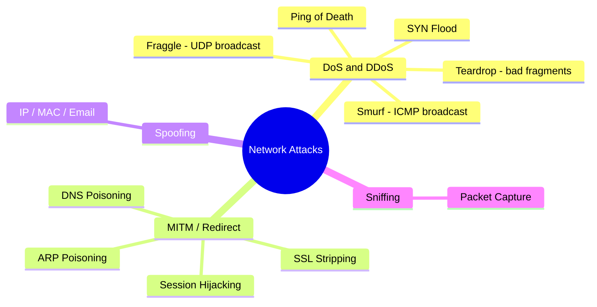

# Network Attacks

## Overview

Most network attacks exploit a protocol that trusts whatever it's told — ARP, DNS, and IP all happily accept forged input because they were designed for closed, friendly networks. It helps to sort attacks by goal: deny service (flood or crash the target), get in the middle (redirect traffic so you can read or alter it), spoof (forge an identity), or sniff (passively read traffic). For the exam, learn the named attack, the layer it hits, and its one-line defense — questions almost always pair an attack with its countermeasure.

## Key Concepts

### Attack Phases (kill-chain order)

**Reconnaissance → Enumeration → Vulnerability Analysis → Exploitation.**

- **Reconnaissance** — *passive*, general info gathering (Whois, DNS records, OSINT, Google) — the target usually can't tell.
- **Enumeration** — *active* probing to list specific resources (valid usernames, shares, services, software versions). Noisier — you're touching the target.
- **Vulnerability Analysis** — match what you found to known weaknesses.
- **Exploitation** — actually break in.

> Recon = collect quietly; Enumeration = actively poke to build a concrete resource list.

### Attack Categories
**DoS/DDoS:**
- **SYN Flood** - fills TCP connection queue with half-open connections
- **Smurf Attack** - ICMP broadcast amplification (spoof source IP)
- **Fraggle Attack** - UDP broadcast amplification (Smurf using UDP)
- **Ping of Death** - oversized ICMP packet causes crash
- **Teardrop** - overlapping IP fragments cause crash
- **DDoS** - distributed attack from many sources (botnets)

**Man-in-the-Middle (MITM):**
- **ARP Spoofing/Poisoning** - fake ARP replies to redirect traffic
- **DNS Spoofing/Poisoning** - corrupt DNS cache with false records
- **SSL Stripping** - downgrade HTTPS to HTTP
- **Session Hijacking** - steal/forge session tokens

**Spoofing:**
- **IP Spoofing** - forging source IP address
- **MAC Spoofing** - forging MAC address
- **Email Spoofing** - forging sender address

**Sniffing/Eavesdropping:**
- **Packet Sniffing** - capturing network traffic (Wireshark)
- Unencrypted protocols are vulnerable
- Switched networks reduce but don't eliminate sniffing risk

### Layer-Specific Attacks
| Layer | Attack |
|-------|--------|
| Physical | Wire tapping, jamming |
| Data Link | ARP poisoning, MAC flooding, VLAN hopping |
| Network | IP spoofing, ICMP attacks, routing attacks |
| Transport | SYN flood, session hijacking |
| Application | SQL injection, XSS, buffer overflow |

### Defenses
| Attack | Defense |
|--------|---------|
| SYN Flood | SYN cookies, rate limiting |
| ARP Spoofing | Dynamic ARP Inspection (DAI), static ARP entries |
| VLAN Hopping | Disable trunk negotiation, use dedicated VLAN for trunks |
| MAC Flooding | Port security (limit MAC addresses per port) |
| DNS Poisoning | DNSSEC |
| Sniffing | Encryption (TLS, IPsec) |
| DDoS | CDN, rate limiting, scrubbing services |

### Ingress vs Egress Filtering
- **Ingress filtering** — screens **inbound** traffic. Drops packets arriving from the internet whose **source IP is one of your internal/private addresses** (spoofed) — they can't legitimately originate outside.
- **Egress filtering** — screens **outbound** traffic. Drops packets leaving your network whose **source IP is NOT in your address range** (spoofed) — this stops your hosts being used to launch spoofed-source **DDoS/amplification** and catches data exfiltration / infected hosts calling out.
- Memory hook: **ingress = block bad inbound; egress = block bad outbound** (the spoofed source can't legitimately leave).

### Deception
- **Honeypot** — a single decoy system that lures and studies attackers. **Honeynet** — a whole decoy network of honeypots. Because no legitimate user has any reason to touch them, **any activity on a honeypot/honeynet is inherently suspicious**.

## Exam Tips

- **Smurf** = ICMP broadcast; **Fraggle** = UDP broadcast
- **ARP** operates at Layer 2 and is inherently insecure (no authentication)
- **SYN flood** exploits the TCP 3-way handshake
- Defense against sniffing = **encryption**
- VLAN hopping exploits trunk port misconfiguration

## Common Traps

- **Smurf vs Fraggle:** both are spoofed-source broadcast amplification — Smurf uses **ICMP**, Fraggle uses **UDP**. The only difference is the protocol.
- **Ping of Death vs Teardrop:** Ping of Death = one oversized packet; Teardrop = overlapping/mangled **fragments**. Both crash via malformed input, but the mechanism differs.
- **DoS vs DDoS:** the "DD" is only about *distribution* (many sources / botnet), not a different technique.
- ARP and DNS poisoning are **MITM/redirection** attacks, not floods — don't file them under DoS.

## Diagrams

### Attack Taxonomy by Goal
Sort each named attack by its objective; the goal usually implies the defense.

## Related Topics

- [OSI and TCP-IP Models](OSI%20and%20TCP-IP%20Models.md) - attacks target specific layers
- [Network Devices and Components](Network%20Devices%20and%20Components.md) - defenses at device level
- [Wireless Security](Wireless%20Security.md) - wireless-specific attacks
- [Domain 7 - Security Operations](../07-security-operations/00%20Domain%207%20-%20Security%20Operations.md) - detecting and responding to attacks
