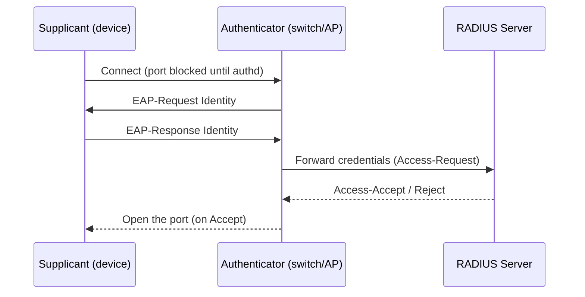

# Network Authentication Protocols

## Overview

Protocols used to authenticate clients to servers/networks. Understand which are legacy (and why) and which are current.

## Legacy — Do Not Use

### PAP (Password Authentication Protocol)
- Credentials sent in **plaintext** at connection start
- Zero protection against eavesdropping/MITM

### CHAP (Challenge-Handshake Authentication Protocol)
- Three-way: challenge → response → accept/reject
- Periodic re-authentication to limit replay attacks
- **Stores passwords in plaintext server-side** — if server is compromised, all passwords exposed

## EAP and Variants (Current)

**EAP** (Extensible Authentication Protocol) is an authentication framework; on wired/wireless LANs it is carried by **802.1X** port-based access control. Three roles:
- **Supplicant** — the client device
- **Authenticator** — network device (switch, AP)
- **Authentication Server** — back-end (often RADIUS)

EAP has many variants. Know at a high level:

| Variant | Key points |
|---------|-----------|
| **PEAP** (Protected EAP) | Encapsulates EAP in TLS tunnel; Cisco/Microsoft/RSA |
| **EAP-MD5** | Weak; client-to-server only; MITM-vulnerable |
| **LEAP** (Lightweight EAP) | Cisco-proprietary; largely Cisco-device-to-device |
| **EAP-TLS** | PKI + **both** client and server certificates; very secure, complex |
| **EAP-TTLS** (Tunneled TLS) | Server cert only; multiple client auth methods; simpler than EAP-TLS |
| **PANA** (Protocol for Carrying Authentication for Network Access) | Uses EAP for key distribution/derivation |

## SLIP vs. PPP

- **SLIP** (Serial Line Internet Protocol) — legacy, minimal features, still used on some microcontrollers for its low overhead
- **PPP** (Point-to-Point Protocol) — widely used on dial-up, DSL, cellular; supports multiple auth methods (including EAP)

## Tunneling Protocols

### PPTP (Point-to-Point Tunneling Protocol)
- Early VPN tunneling
- **No built-in encryption or authentication** — insecure
- **Do not use**

### GRE (Generic Routing Encapsulation)
- Basic tunneling — encapsulates one protocol inside another
- **No encryption of its own** — tunneling ≠ security (pair with IPsec if confidentiality is needed)

### L2TP (Layer 2 Tunneling Protocol)
- Layer 2
- Also lacks built-in encryption — usually paired with IPsec for security (**L2TP/IPsec**)
- Widely used for VPNs + ISP service delivery

### VPN (Virtual Private Network)
Secure tunnel across an unsecured network (usually the internet):
- Remote work access to corporate LAN
- Bypass geo-restrictions
- Protect traffic on public Wi-Fi

Typically uses IPsec, SSL/TLS, or WireGuard under the hood.

**Tunneling vs encryption:** plain tunneling (GRE, L2TP) only *encapsulates* — a VPN = **tunneling + encryption** together. (PPTP does include encryption via MPPE/RC4, but it is weak/broken.)

**Split tunneling** — only some traffic (e.g., corporate subnets) goes through the VPN; everything else goes **directly** to the internet. Faster and saves bandwidth, but the **risk** is that the direct traffic **bypasses corporate inspection/filtering** (no logging, no DLP, no malware scanning). "Full tunnel" forces all traffic through the VPN.

**Mutual authentication** — both parties authenticate each other (not just client → server). Defeats impersonation / MITM and rogue servers.

## AAA — RADIUS vs TACACS+

| | **RADIUS** | **TACACS+** |
|--|-----------|-------------|
| Transport | **UDP** (1812/1813; legacy 1645/1646) | **TCP** (49) |
| Encryption | Encrypts **only the password** | Encrypts the **entire payload** |
| AAA | **Combines** authentication + authorization (accounting separate) | **Separates** all three (Authn/Authz/Acct) |
| Vendor | Open / **cross-vendor** | **Cisco** (proprietary) |

**Diameter** = RADIUS's successor (more features, reliable transport).

## Exam Tips

- PAP = plaintext; CHAP = stored-plaintext on server; both bad
- EAP is a framework; many variants
- EAP-TLS = best (client + server certs)
- PPTP = weak, broken encryption (MPPE/RC4) with MS-CHAPv2 — don't use
- L2TP needs IPsec for security; GRE also has no encryption
- VPN = tunneling **+** encryption; tunneling alone isn't secure
- Split tunneling = some traffic skips the VPN → bypasses corporate inspection
- RADIUS = UDP, encrypts password only, combines AuthN+AuthZ, cross-vendor; TACACS+ = TCP, encrypts whole payload, separates AAA, Cisco

## Diagrams

### CHAP Challenge-Response — Sequence

```mermaid
sequenceDiagram
    participant C as Client
    participant S as Server
    C->>S: Request to authenticate
    S-->>C: Challenge (random nonce)
    Note over C: hash(challenge + shared secret)
    C->>S: Response (the hash) — password NEVER sent
    S-->>C: Compare; Success/Fail
    Note over C,S: Periodically re-challenges during the session
```

**Takeaway:** CHAP never sends the password — only a hash of (challenge + secret). PAP sends it in plaintext (insecure).

### RADIUS / 802.1X (EAP) — Sequence



**Takeaway:** 802.1X = port-based access control: supplicant → authenticator → RADIUS decides → port opens.

## Related Topics

- [Authentication Methods](../05-identity-and-access-management/Authentication%20Methods.md)
- [IPsec and PGP](../03-security-architecture-and-engineering/IPsec%20and%20PGP.md)
- [Authorization and Accountability](../05-identity-and-access-management/Authorization%20and%20Accountability.md) — RADIUS/TACACS+
