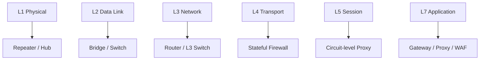

# Network Devices and Components

## Overview

The hardware and software that move and filter traffic — repeaters, hubs, bridges, switches, routers, firewalls, and the monitoring devices around them. The single most useful organizing idea is the OSI layer each device works at: the layer tells you what information the device can see and therefore what it can decide. A switch reads MAC addresses (Layer 2); a router reads IP addresses (Layer 3); a proxy or WAF reads application content (Layer 7). Exam questions lean hard on these layer-to-device mappings and on which device contains a given attack.

## Key Concepts

### Network Devices
| Device | OSI Layer | Function |
|--------|-----------|----------|
| **Repeater** | 1 (Physical) | Amplifies/regenerates signals over long copper runs |
| **Hub** | 1 (Physical) | Multi-port repeater; broadcasts to all ports; half-duplex; no security; obsolete |
| **Bridge** | 2 (Data Link) | Connects two network segments; uses MAC addresses; separates collision domains |
| **Switch** | 2 (Data Link) | Multi-port bridge; forwards based on MAC addresses; **each port = its own collision domain** (no collisions) |
| **Router** | 3 (Network) | Forwards based on IP addresses; creates broadcast domains; connects LAN to WAN |
| **Multilayer Switch** | 3+ | Switching + routing in one device |
| **Gateway** | 7 (Application) | Protocol translation between different networks |

### Switch Security Best Practices
- **Shut unused ports** — attackers or employees plugging in rogue APs can't abuse what's disabled
- **Sticky MAC** — `switchport port-security mac-address sticky` + `maximum 2` records the first N MACs seen and limits the port to them. If another MAC appears, port shuts down. Common setting: 2 (IP phone + workstation daisy-chained).
- **VLAN segmentation** — logically separate HR, Accounting, Payroll, VoIP
- **Trunk ports** between switches with **VLAN pruning** — only carry VLANs that exist on both sides
- **VLAN tagging** — each packet tagged with its VLAN; enables sharing infrastructure across VLANs
- Enterprise switches have **high-speed uplink ports** (10/40/100 Gbps) for switch-to-switch — avoids trunk bottlenecks

### Switch Forwarding Modes
- **Store-and-forward** — receives the **whole frame**, runs an error check (CRC), then forwards. Slower but catches corrupt frames (**accuracy**). Default on most modern switches.
- **Cut-through** — starts forwarding as soon as it reads the **destination MAC**, before the rest of the frame arrives. Faster but **no error check** (passes corrupt frames). "Accuracy over speed" → store-and-forward.

### Router Planes
- **Control plane** — makes routing decisions; holds the RIB (Routing Information Base)
- **Forwarding plane** — forwards packets using the FIB (Forwarding Information Base, derived from RIB)
- SDN separates these two planes entirely, enabling software control

### Firewalls
| Type | OSI Layer | Description |
|------|-----------|-------------|
| **Packet Filtering** | 1-3 | Inspects headers (IP, port); stateless; fast but limited |
| **Stateful Inspection** | 1-4 | Tracks connection state; session table; more secure |
| **Application Proxy / Proxy Server** | 7 | Acts as intermediary; inspects content; slower but thorough |
| **Circuit-Level Proxy** | 5 | Operates at session layer; verifies TCP handshake |
| **Application Layer Firewall** | 7 | Sees unencrypted data (encryption happens at L6, so only L7 firewalls can inspect decrypted content); can be network or host-based |
| **Next-Gen Firewall (NGFW)** | Multiple | Deep packet inspection, IPS, application awareness, threat intelligence, malware filtering |
| **Web Application Firewall (WAF)** | 7 | Protects web apps (SQL injection, XSS) |

### Firewall Architectures

| Architecture | Description |
|--------------|-------------|
| **Bastion Host** | Hardened single-purpose host, typically in DMZ. Stripped of all non-essential services. |
| **Dual-Homed Host** | Host with two NICs — one internal, one external. No routing; users log in to hop. Legacy. |
| **Screened Host** | Screening router + bastion host. Single point of failure — not defense-in-depth. |
| **Screened Subnet** | Two firewalls (external + internal) with DMZ in between. Public-facing servers in DMZ. |
| **Three-Legged DMZ** | Single firewall with 3 interfaces (Internet, DMZ, Internal). Single point of failure. |
| **Full Mesh** | Multiple firewalls of different brands cross-connected. No single point of failure; different vendors avoid sharing vulnerabilities. |

**Firewalls always fail secure/closed** — if the firewall crashes, no traffic passes. Better to lose availability than expose the network.

### Implicit Deny

Every ACL has an implicit `deny any any` at the end. If no rule explicitly permits the traffic, it's denied. Rules are evaluated in order — first match wins.

### Other Security Devices
- **IDS** (Intrusion Detection System) - monitors and alerts (passive, detective)
- **IPS** (Intrusion Prevention System) - monitors and blocks (active, preventive)
- **SIEM** - Security Information and Event Management (log aggregation, correlation, alerting)
- **NAC** (Network Access Control) - enforces security policy before granting access
- **Proxy Server** - intermediary for requests; caching, filtering, anonymity
- **Load Balancer** - distributes traffic across servers
- **VPN Concentrator** - manages VPN connections
- **Sandbox** - isolated environment to run/analyse untrusted code so malware can't reach the real system (detonation chamber for suspicious attachments/files)
- **Honeypot / Honeynet** - decoy system / decoy network that lures attackers; any activity on them is inherently suspicious

### IDS/IPS Detection Methods
| Method | Description | Weakness |
|--------|-------------|----------|
| **Signature-based** | Matches known attack patterns | Cannot detect zero-day attacks |
| **Anomaly/Behavior-based** | Detects deviations from baseline | High false positive rate |
| **Heuristic** | Uses rules and algorithms | Can be evaded |

### Network Segmentation
- **VLAN** - logically separates networks on the same switch (Layer 2). **Separate VLANs CANNOT talk to each other without a router (Layer 3)** — "hardware-imposed segmentation requiring a routing function for intersegment communication" = VLAN. Inter-VLAN routing is done by a router or multilayer/L3 switch.
- **VLAN vs Subnet:** VLAN = L2 segmentation done at the **switch** (separate broadcast domains). Subnet = L3 segmentation by **IP range**. They usually map 1:1, but the *mechanism* differs (switch vs IP addressing).
- **DMZ** - network zone between internal and external (hosts public-facing servers)
- **Subnet** - divides IP network into smaller segments
- **Micro-segmentation** - granular, workload-level isolation (Zero Trust)
- **Air Gap** - complete physical separation

## Exam Tips

- **IDS** = detective (alerts); **IPS** = preventive (blocks)
- Stateful firewalls track connections; stateless (packet filtering) do not
- A **DMZ** hosts public-facing services while protecting the internal network
- Hubs are insecure because they broadcast everything - switches are better
- WAF specifically protects **web applications**

## Diagrams

### Devices by OSI Layer
The layer a device works at tells you what it can see and decide.

## Related Topics

- [OSI and TCP-IP Models](OSI%20and%20TCP-IP%20Models.md) - devices map to OSI layers
- [Secure Network Architecture](Secure%20Network%20Architecture.md) - placing devices correctly
- [Network Attacks](Network%20Attacks.md) - what devices defend against
- [Domain 7 - Security Operations](../07-security-operations/00%20Domain%207%20-%20Security%20Operations.md) - monitoring with IDS/SIEM
