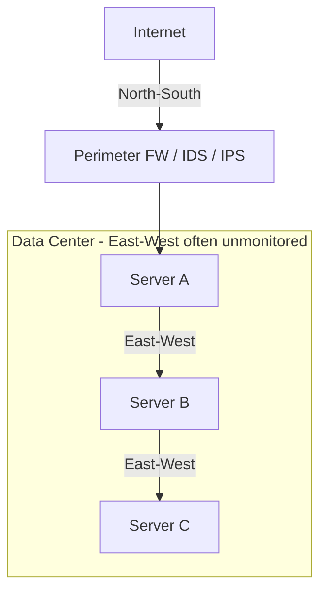

# Network Performance and Traffic Management

## Overview

Measuring and managing how data flows through the network. This matters for three security-relevant reasons: availability (slow or saturated links break services), troubleshooting (you can't fix what you can't see), and detection (abnormal traffic patterns reveal abuse or attack). The exam leans on the difference between bandwidth and throughput, the four metrics that kill real-time traffic, and the north-south vs east-west distinction that explains why lateral attacker movement so often goes unseen.

## Performance Metrics

| Metric | What it is |
|--------|-----------|
| **Bandwidth** | Theoretical maximum of a link (label) |
| **Throughput** | Actual rate of successful transfer (what you really care about) |
| **Latency** | Time for a packet to travel source → destination (ms) |
| **Jitter** | Variation in latency over time |
| **Packet loss** | % of packets dropped or lost |

### Real-Time Impact
- Voice/video/gaming: latency and jitter matter most
- Bulk data: throughput matters most
- UDP traffic dies without retransmission on packet loss; TCP slows down

## North-South vs. East-West Traffic

| | North-South | East-West |
|--|-------------|-----------|
| **Direction** | Between client and server, or network and internet | Between servers/devices within the same segment |
| **Typical security** | Firewalls, IPS/IDS at perimeter | Often **unexamined** — a blind spot |
| **Mitigations** | Perimeter controls | Micro-segmentation, zero trust |

East-west traffic grows with data-center density — servers talking to other servers in the same rack. Lateral movement by attackers lives here.

## Traffic Analysis Tools

| Tool | What it does |
|------|--------------|
| **NetFlow** (Cisco) | Exports flow data (source/dest IP, ports, bytes) |
| **sFlow** | Sampled flow data — lower overhead than NetFlow |
| **Deep Packet Inspection (DPI)** | Examines actual packet contents; slower, privacy-sensitive |
| **SNMP v3** | Polls devices for metrics |

## Network Operations Center (NOC)

Centralized team monitoring network status 24/7. Tooling: ticketing systems, dashboards, alert integration, communication platforms. Similar in structure to a SOC but focused on availability/performance.

### Alert Fatigue
If monitoring is not tuned, real alerts get buried in noise. Tune thresholds, acknowledge known issues, escalate new ones.

## Modern Trends

- **AI / ML** for anomaly detection and predictive maintenance
- **Observability platforms** replacing classic NOC dashboards
- **SD-WAN** with telemetry builtin

## Exam Tips

- Throughput > bandwidth for real-world comparison
- Latency + jitter kill real-time traffic
- North-South (perimeter) vs. East-West (lateral) — micro-segment east-west
- NetFlow / sFlow / DPI are complementary
- Tune your alerts or they become noise

## Diagrams

### North-South vs East-West Traffic
Perimeter controls watch north-south; east-west between servers is the lateral-movement blind spot.

## Related Topics

- [Secure Network Architecture](Secure%20Network%20Architecture.md) — micro-segmentation, zero trust
- [Network Devices and Components](Network%20Devices%20and%20Components.md)
