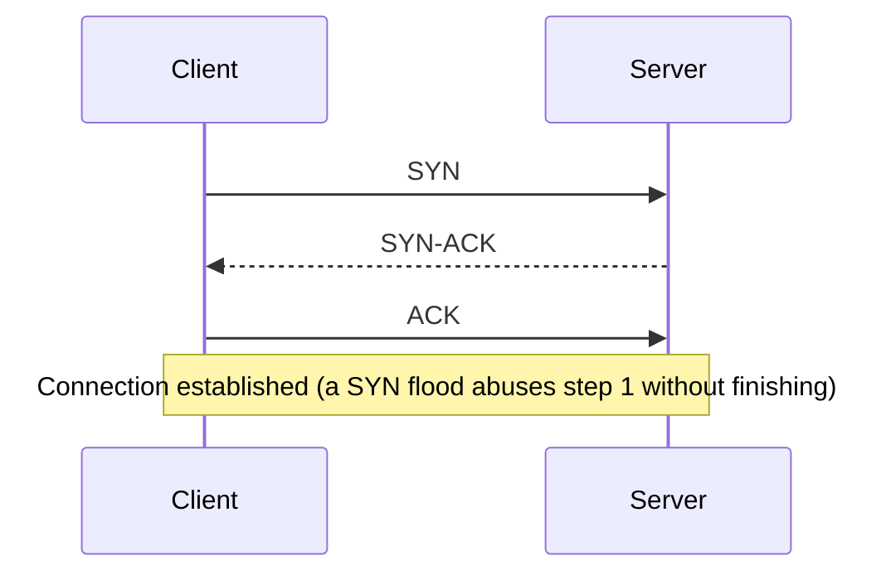
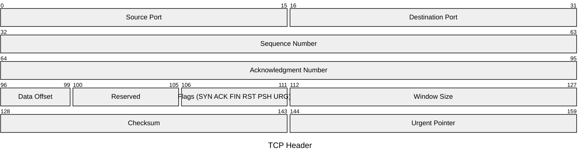

# Network Protocols

## Overview

Protocols are the agreed rules that let two machines talk. For the exam, the security story matters more than the mechanics: most of the original internet protocols (Telnet, FTP, HTTP, SNMPv1/v2, POP3, IMAP, LDAP) send credentials and data in plaintext, and each has a secure, encrypted replacement. Know the insecure protocol, its secure successor, the port, and the one-line reason it was unsafe. The rest of this note groups protocols by job (VPN, DNS, email, management) so you can match a description to a name under exam pressure.

## Key Concepts

### Secure vs. Insecure Protocols
| Insecure | Secure Replacement | Reason |
|----------|-------------------|--------|
| Telnet (23) | SSH (22) | Telnet sends plaintext |
| FTP (20/21) | SFTP (22) or FTPS (990) | FTP sends plaintext credentials |
| HTTP (80) | HTTPS (443) | HTTP is unencrypted |
| SNMP v1/v2 | SNMP v3 | v1/v2 use community strings in plaintext |
| POP3 (110) | POP3S (995) | POP3 is unencrypted |
| IMAP (143) | IMAPS (993) | IMAP is unencrypted |
| LDAP (389) | LDAPS (636) | LDAP is unencrypted |

### VPN Protocols
| Protocol | Layer | Notes |
|----------|-------|-------|
| **IPsec** | 3 (Network) | AH (integrity) + ESP (confidentiality); tunnel or transport mode |
| **TLS/SSL VPN** | 4-7 | Browser-based; no client needed |
| **L2TP** | 2 (Data Link) | No encryption by itself; paired with IPsec |
| **PPTP** | 2 (Data Link) | Weak encryption; avoid |
| **WireGuard** | 3 (Network) | Modern, fast, simple |

### IPsec Components
- **AH** (Authentication Header) - integrity and authentication only (**no encryption**)
- **ESP** (Encapsulating Security Payload) - confidentiality + integrity + authentication
- **IKE** (Internet Key Exchange) - negotiates encryption algorithms; picks the fastest/strongest both sides support
- **ISAKMP** - handles Security Association creation and key exchange
- **SA** (Security Association) - simplex; need 2 SAs for bidirectional; 4 if using both AH + ESP. Because each connection has its own SA(s), a single host can run **multiple simultaneous VPNs** (one SA set per peer) — ISAKMP/IKE manages them.
- IPsec **re-authenticates continually** throughout a session, which helps detect **session hijacking** (unlike TLS/SSH, which authenticate mainly at setup)
- **SPI** (Security Parameter Index) - unique 32-bit identifier for each SA
- **Transport Mode** - encrypts payload only (host-to-host; both endpoints speak IPsec)
- **Tunnel Mode** - encrypts entire packet including headers (gateway-to-gateway; endpoints don't speak IPsec)

### Use Cases by Topology
| Topology | Mode |
|----------|------|
| Host-to-host (both speak IPsec) | Transport |
| Remote user → gateway | Tunnel |
| Gateway-to-gateway | Tunnel typically, transport possible |

### DNS Security
- **DNSSEC** - adds digital signatures to DNS records (integrity, not confidentiality)
- **DoH** (DNS over HTTPS) - encrypts DNS queries via HTTPS
- **DoT** (DNS over TLS) - encrypts DNS queries via TLS
- DNS is a common attack vector (poisoning, hijacking, tunneling)

### Email Protocols
- **SMTP** (TCP 25, sometimes 2525) - sending email
- **POP3** (TCP 110) - downloading email (deletes from server)
- **IMAP** (TCP 143) - accessing email (keeps on server)
- **S/MIME** - encrypts and signs email using certificates (PKI / X.509)
- **PGP/GPG** - encrypts email using **web of trust** (no central CA)
- **DKIM/SPF/DMARC** - email authentication to prevent spoofing
- **MIME** — Multipurpose Internet Mail Extensions — standard for encoding (not secure by itself)

### Email Flow (sending to a different domain)
1. Mail User Agent (Outlook) formats + sends via SMTP to Mail Submission Agent (your server)
2. MSA queries DNS for recipient's MX record
3. DNS returns `mx.recipient.com`
4. MSA sends via SMTP to recipient's mail server
5. Recipient's Mail Delivery Agent drops mail in the user's mailbox
6. Recipient's MUA (Outlook) pulls via POP3 or IMAP

### SSH vs Telnet
- **Telnet** (TCP 23) — plaintext. Never use.
- **SSH** (TCP 22) — designed to replace Telnet/FTP/rlogin. SSHv1 had vulnerabilities; SSHv2 is current. Reports from Snowden leaks (2013) and WikiLeaks (2017) suggest sophisticated actors (NSA, CIA) have tools to break SSH implementations in some cases.

### FTP Variants
- **FTP** (TCP 20/21) — plaintext. Never use for sensitive data.
- **SFTP** — FTP over SSH. Secure.
- **FTPS** — FTP over TLS/SSL. Secure.
- **TFTP** (UDP 69) — Trivial FTP. No auth, single directory. Used for bootstrapping diskless workstations and saving router configs.

### DNS
- **UDP/TCP 53**. Uses `gethostbyname` / `gethostbyaddr`.
- **Authoritative name server** — authority for a given namespace
- **Recursive name server** — resolves names it doesn't know by asking others
- Naturally trusting — **DNS poisoning** is a common attack
- **DNSSEC** adds authentication + integrity via PKI (not confidentiality)

### SNMP (Simple Network Management Protocol)
- v1/v2 — plaintext; v2 gains management features and becomes more dangerous if credentials leak
- **v3** — encrypted; the only version that should be in production
- Used to monitor routers, switches, servers, UPS, HVAC, anything with an IP

### BOOTP and DHCP
- Both use UDP 67 (server) / UDP 68 (client)
- **BOOTP** — bootstrap protocol for diskless workstations (BIOS → download OS over network)
- **DHCP** — assigns IP addresses dynamically. 4-step handshake: **Discover → Offer → Request → Acknowledge (DORA)**
- Lease duration common; client renews at halfway point of lease

### HTTP / HTTPS
- HTTP (TCP 80; also 8008, 8080) — plaintext
- HTTPS (TCP 443; also 8443) — uses TLS
- HTTP/HTTPS = **how you send**; HTML = **what you send** (don't confuse)

## Exam Tips

- IPsec **ESP** provides encryption; **AH** does not
- IPsec **tunnel mode** protects the entire packet (used between gateways)
- TLS replaced SSL - SSL 3.0 is deprecated and insecure
- DNSSEC provides **integrity** (signatures), NOT confidentiality
- S/MIME uses **PKI/certificates**; PGP uses **web of trust**

## Diagrams

### TCP Three-Way Handshake — Sequence

**Takeaway:** SYN → SYN-ACK → ACK. A SYN flood sends many SYNs without the final ACK to exhaust the server.

### TCP Header Structure — Packet Diagram

**Takeaway:** Ports identify the service (Layer 4). The **flags** drive the 3-way handshake (SYN → SYN-ACK → ACK); a **SYN flood** abuses the SYN flag without finishing.

## Related Topics

- [OSI and TCP-IP Models](OSI%20and%20TCP-IP%20Models.md)
- [Cryptography](../03-security-architecture-and-engineering/Cryptography.md) - protocols that provide encryption
- [Network Attacks](Network%20Attacks.md) - protocol-level attacks
- [Secure Network Architecture](Secure%20Network%20Architecture.md)
