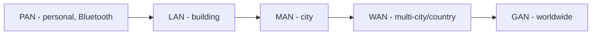

# Networking Basics and Definitions

## Overview

Core terminology you need before diving into protocols and devices. These terms show up as keywords on the exam.

## Directional Communication

| Term | Description | Example |
|------|-------------|---------|
| **Simplex** | One-way only | Stage speech; need two simplex channels for bidirectional |
| **Half-duplex** | Either direction, but not at once | Walkie-talkie — press to talk, release to listen |
| **Full-duplex** | Both directions simultaneously | Modern Ethernet, phone call |

## Baseband vs. Broadband

- **Baseband** — one channel, one signal at a time. Ethernet is baseband ("1000BASE-T" = 1 Gbps baseband over twisted pair / UTP)
- **Broadband** — multiple channels, multiple simultaneous signals

## Networks by Scope

| Type | Scope | Examples |
|------|-------|----------|
| **PAN** (Personal Area Network) | Immediate personal range | Bluetooth phone + laptop + headphones |
| **LAN** (Local Area Network) | Small geographic area — building, campus | Home, office floor, school |
| **MAN** (Metropolitan Area Network) | A city or large campus | University system, city government |
| **WAN** (Wide Area Network) | Multi-city, country, or continent | ISP backbone; corporate multi-site |
| **GAN** (Global Area Network) | Worldwide with seamless handoff | Cell networks roaming across countries |
| **VPN** | Tunnel, not a "size" | Secure tunnel across the internet |

**The Internet** is really thousands of WANs peered together.

## Internet / Intranet / Extranet

- **Internet** — public network of public networks
- **Intranet** — your organization's internal network (employee portal, company info, policies)
- **Extranet** — multiple intranets connected (your company + partner, or HQ + divisions)

## Circuit-Switched vs. Packet-Switched

| | Circuit-Switched | Packet-Switched |
|--|------------------|-----------------|
| **Path** | Same path, reserved bandwidth | Any path, shared bandwidth |
| **Cost** | Expensive (reserved) | Cheap (oversubscribed) |
| **Example** | T1/T3, old phone circuits | Regular internet |
| **Trade-off** | Guaranteed bandwidth; you pay whether used or not | Variable bandwidth; congestion possible |

ISPs typically **oversubscribe** packet-switched lines by 100× or more — works because few customers use their full bandwidth at once.

## Quality of Service (QoS)

Prioritize real-time traffic (voice, video) over bulk traffic (downloads, backups). Without QoS, a download can make a voice call unusable.

## TCP vs. UDP

| | TCP | UDP |
|--|-----|-----|
| **Connection** | Connection-oriented | Connectionless |
| **Reliability** | Guaranteed delivery (retransmits) | Best-effort |
| **Speed** | Slower | Faster |
| **Ordering** | Reassembles in order | No order guarantee |
| **Overhead** | Higher | Lower |
| **Use case** | Web, email, file transfer, banking | Voice, video, real-time gaming, DNS |

## Exam Tips

- Simplex = one-way; half-duplex = one-at-a-time; full-duplex = simultaneous
- Ethernet is baseband
- PAN < LAN < MAN < WAN < GAN
- Circuit-switched = expensive + reserved; packet-switched = shared + oversubscribed
- TCP = reliability; UDP = speed

## Diagrams

### Networks by Scope
Each scope nests inside the next larger one: PAN < LAN < MAN < WAN < GAN.

## Related Topics

- [OSI and TCP-IP Models](OSI%20and%20TCP-IP%20Models.md)
- [Network Devices and Components](Network%20Devices%20and%20Components.md)
- [Secure Network Architecture](Secure%20Network%20Architecture.md)
