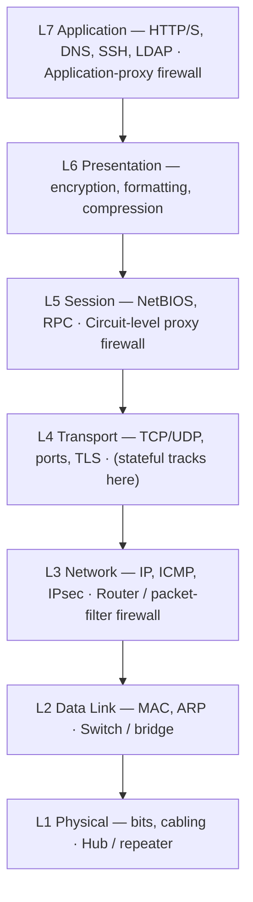
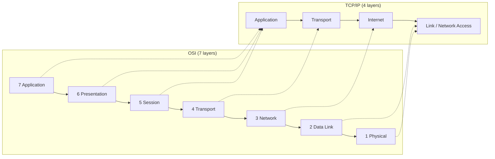

# OSI and TCP/IP Models

## Overview

Reference models that describe how data moves from one system to another across a network. They matter on the exam because nearly every networking question hides a layer cue: a control, attack, or device only makes sense once you know which layer it lives at (encryption at Layer 6, routing at Layer 3, a switch at Layer 2). Learn the seven OSI layers cold, then learn how the four-layer TCP/IP model collapses them. If you can place a protocol, you can usually answer the question.

## Key Concepts

### OSI Model (7 Layers)
| Layer | Name | Function | Protocols/Examples | PDU |
|-------|------|----------|-------------------|-----|
| 7 | **Application** | User interface, network services | HTTP, HTTPS, FTP, SMTP, DNS, SNMP | Data |
| 6 | **Presentation** | Data formatting, encryption, compression | SSL/TLS, JPEG, ASCII, MPEG | Data |
| 5 | **Session** | Session management, dialog control | NetBIOS, RPC, SQL, NFS | Data |
| 4 | **Transport** | End-to-end delivery, reliability | TCP, UDP | Segment |
| 3 | **Network** | Routing, logical addressing | IP, ICMP, IPsec, OSPF | Packet |
| 2 | **Data Link** | Framing, physical addressing, error detection | Ethernet, Wi-Fi, ARP, PPP, L2TP | Frame |
| 1 | **Physical** | Bits on the wire, physical signaling | Cables, hubs, repeaters, voltage | Bits |

**Mnemonic (top to bottom):** All People Seem To Need Data Processing
**Mnemonic (bottom to top):** Please Do Not Throw Sausage Pizza Away

### Layer-by-Layer Detail

**Layer 1 (Physical)** — cables, fiber, radio waves, hubs, NIC connector parts, signaling. Topologies live here (bus/star/ring/mesh). Threats: eavesdropping, sniffing, interference, data emanation, theft.

**Layer 2 (Data Link)** — MAC addresses (48-bit EUI-48 or 64-bit EUI-64), ARP (2/2.5), CSMA/CD (wired), CSMA/CA (wireless), token passing, LLC for error detection. Ethernet frames live here. Threats: MAC spoofing, MAC flooding, VLAN hopping.

**Layer 3 (Network)** — IP addresses, routing. Almost every protocol starting with "I" lives here (IP, ICMP, IPsec, IGMP, IGRP, IKE, ISAKMP, IPX) — **exception: IMAP is Layer 7**. Threats: ping of death, Smurf, spoofed source, directed broadcast, IP modification, DHCP attacks.

**Layer 4 (Transport)** — TCP + UDP, ports. SSL/TLS operates at layers 4-7. Threats: SYN flood (TCP), Fraggle (UDP flood — more successful than Smurf because UDP rarely blocked).

**Layer 5 (Session)** — establishes, maintains, tears down sessions.

**Layer 6 (Presentation)** — formatting, encryption, compression at the file level. Only layer with no protocols. This is where encryption happens — below Layer 6, the data is still encrypted, so lower-layer devices can't inspect it.

**Layer 7 (Application)** — user-facing; HTTP/HTTPS, FTP, SMTP, SNMP, IMAP, POP3, Active Directory integration, certificates, application proxies, deep packet inspection (only at this layer, where data is decrypted). Threats: viruses, worms, Trojans, buffer overflows, OS/app vulnerabilities.

### Upper vs Lower Layers

- Layers 1-3 (lower / media layers) — move data across the network, faster, "dumber"
- Layers 4-7 (upper / host layers) — handle data on the local host, slower, "smarter"

### TCP 3-Way Handshake

SYN → SYN-ACK → ACK. Session established.

### TCP Control Bits (Flags)

9 flags provide packet info:
- **SYN** — synchronize (start connection)
- **ACK** — acknowledge
- **FIN** — last packet from sender
- **RST** — reset / tear down connection
- **PSH** — push buffer to receiving app
- **URG** — urgent priority
- **NS** — nonce (random value used once)
- **ECE** — ECN-Echo; receiver signals to slow down (throttling)
- **CWR** — congestion window reduced

### TCP/IP Model (4 Layers)
Also called the Internet Protocol Suite or the DoD Model.

| TCP/IP Layer | OSI Equivalent | Protocols |
|-------------|----------------|-----------|
| **Application** | Application + Presentation + Session | HTTP, DNS, SMTP, SSH |
| **Transport** | Transport | TCP, UDP |
| **Internet / Internetwork** | Network | IP, ICMP, ARP |
| **Link / Physical** | Data Link + Physical | Ethernet, Wi-Fi |

### Encapsulation / Decapsulation

As data travels down the stack (or up on the receiving end), headers are added or stripped:
- **Application layer** — upper-layer header (e.g., HTTP)
- **Transport layer** — TCP/UDP header (source/dest port)
- **Internet layer** — IP header (source/dest IP)
- **Link layer** — Ethernet/frame header
- **Physical** — bits on the wire

Each layer wraps the data from the layer above.

### TCP vs. UDP
| Feature | TCP | UDP |
|---------|-----|-----|
| Connection | Connection-oriented | Connectionless |
| Reliability | Reliable (acknowledgments) | Unreliable (best effort) |
| Ordering | Ordered delivery | No ordering guarantee |
| Speed | Slower | Faster |
| Use cases | Web, email, file transfer | DNS, streaming, VoIP |
| Handshake | 3-way (SYN, SYN-ACK, ACK) | None |

### Important Port Numbers
| Port | Protocol | Service |
|------|----------|---------|
| 20/21 | TCP | FTP (data/control) |
| 22 | TCP | SSH, SCP, SFTP |
| 23 | TCP | Telnet (insecure) |
| 25 | TCP | SMTP (email sending) |
| 53 | TCP/UDP | DNS |
| 67/68 | UDP | DHCP |
| 80 | TCP | HTTP |
| 110 | TCP | POP3 |
| 143 | TCP | IMAP |
| 443 | TCP | HTTPS |
| 389 | TCP | LDAP |
| 636 | TCP | LDAPS |
| 3389 | TCP | RDP |
| 161/162 | UDP | SNMP |

## Exam Tips

- Know which layer each protocol operates at
- Encryption happens at Layer 6 (Presentation) in the OSI model
- IPsec operates at Layer 3 (Network)
- TCP 3-way handshake: SYN -> SYN-ACK -> ACK
- ARP resolves IP to MAC (Layer 2/3 bridge — often called "Layer 2.5")
- Know the common port numbers
- **IMAP is Layer 7** (exception to "I protocols live at Layer 3")
- **Fraggle** (UDP flood) succeeds more than Smurf (ICMP flood) because UDP is rarely blocked
- If a question mentions "frames" → Layer 2; "packets" → Layer 3; "segments" → Layer 4

## Diagrams

### OSI Model — Layers, Devices, Firewalls

**Takeaway:** Devices: hub(L1)/switch(L2)/router(L3). Firewalls: packet-filter(L3) < circuit(L5) < app-proxy(L7).

### OSI ↔ TCP/IP Model Mapping

**Takeaway:** TCP/IP collapses OSI: top 3 (App/Pres/Session) → **Application**; Transport → Transport; Network → **Internet**; bottom 2 → **Link**.

## Related Topics

- [Network Protocols](Network%20Protocols.md)
- [Network Devices and Components](Network%20Devices%20and%20Components.md)
- [Network Attacks](Network%20Attacks.md)
- [Secure Network Architecture](Secure%20Network%20Architecture.md)
