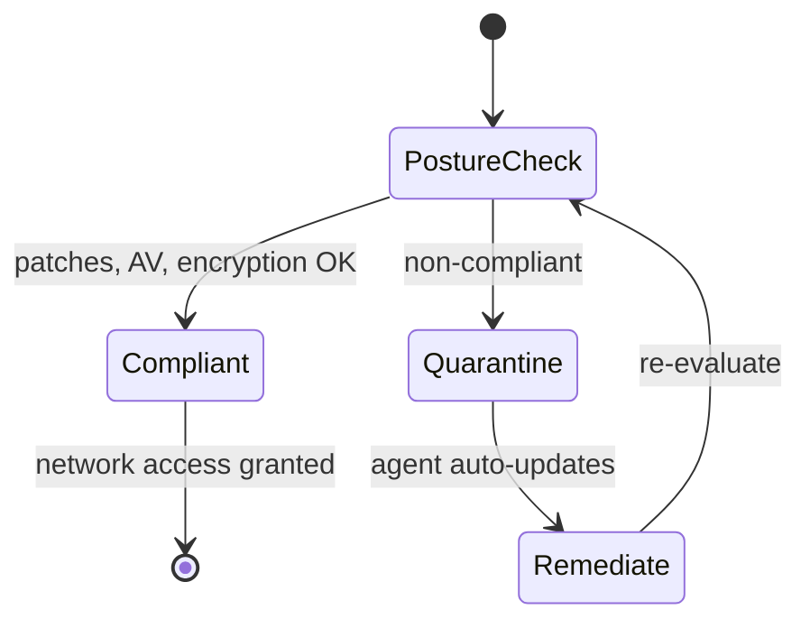

# Remote Access and Communications

## Overview

How we access systems remotely, communicate in real time, and distribute content to users.

## Callback (legacy)

Dial-up era: user calls server, identifies themselves, hangs up. Server looks up the user's phone number and calls back. Adds minimal authentication.

### Modern Equivalent (Vishing Defense)
When someone calls IT claiming to be Bob, the IT team calls Bob back at the phone number on file to confirm before acting. Caller ID was also used, though it's easy to spoof.

## Remote Administration

Log in to remote systems over the network to manage them — routers, switches, servers, storage, workstations. Near-universal today: very few tasks require physical presence.

### Security Requirements
- MFA for all remote admin
- Limit source IPs / jump-host architecture
- Log everything

### Common Remote Admin Protocols / Tools
| Tool | OS | Port | Notes |
|------|-----|------|-------|
| **RDP** (Remote Desktop Protocol) | Windows | TCP/UDP 3389 | Microsoft-proprietary; built into most Windows |
| **VNC** (Virtual Network Computing) | Any | 5900 | Cross-OS; screen scraping |
| **SSH** | Any | 22 | Command-line; widely used |
| **Chrome Remote Desktop, LogMeIn, GoToMyPC, support.me** | Any | Usually 443 (HTTPS) | Cloud-brokered remote access |

## Virtual Desktop Infrastructure (VDI)

Desktops run on servers in the data center. Endpoints connect and display the virtual desktop.

### Thin Client
- Has CPU/RAM/BIOS/OS but no local data storage
- Boots, connects to server, runs there
- Can also refer to **thin-client applications** — app runs on server, accessed via browser (much of SaaS is thin-client)

### Zero Client
- Even more minimal — almost nothing stored locally
- Cheaper, smaller, lower attack surface

### Security Advantage
Sensitive data stays on the server in the data center — stolen endpoints contain nothing useful.

## Instant Messaging (IM)

Almost every platform has it. Business-grade (Slack, Teams) or consumer (WhatsApp, Signal, iMessage, etc.).

### Security Reality
Many IM apps are designed for **features, not security**. Review of 18 top IM apps found only **2** with no significant concerns around sensitive attachment handling and data mining. **Signal** was one.

Opening UDP ports for IM traversal can introduce security issues.

## Web Conferencing

Explosive growth 2020-2021 (pandemic). Zoom, Webex, Teams, Google Meet, GoToMeeting.

- Point-to-point or multicast
- Must align with security policies
- Don't let them bypass other controls (e.g., allowing outbound encrypted tunnels that could exfiltrate data)

## CDN (Content Distribution Network)

Edge servers close to users. Reduces latency and bandwidth use.

### Typical Pattern
- Static content + entry pages → CDN edge
- Sensitive transactional content (e.g., checkout, login) → origin data center

### DDoS Resilience
Large CDN (e.g., Google with thousands of edge nodes) absorbs DDoS that would overwhelm a single site. If one edge node goes down, users route to the next nearest.

CDN is a type of **edge computing**, but not all edge computing is CDN.

## Third-Party Connectivity

Every medium-sized org has 20+ third-party apps; large orgs have 200+.

### Before Connecting
- Risk assessment on their security posture
- Use case justifies the connection
- **Least privilege** — minimum access needed
- No elevated / shared access unless senior leadership accepts the risk in writing

### Contractual Protections
- **MOU / MOA** (Memorandum of Understanding / Agreement)
- **ISA** (Interconnection Security Agreement)
- **Right to audit** + right to pen-test

## NAC (Network Access Control)

Enforces security policy at network edge. Checks device posture (patches, AV, encryption status) before granting network access. Detects and responds to policy violations.

NAC works best paired with strong policies, because it enforces what you've defined.

### NAC Agent Types (exam — frequently tested)
| Type | Behavior |
|------|----------|
| **Agent-based** | Installed agent can **quarantine** non-compliant devices and **apply updates automatically** |
| **Agentless** | No install; **scans** (port scans, service queries, vulnerability scans) to check whether a device is authorized + baseline-compliant. Cannot auto-remediate. |
| **Dissolvable agent** | Temporary agent set to **run once, then terminate/delete itself** |
| **Permanent (persistent) agent** | Stays installed on the device |
| **Preadmission** | Device must meet **all** security requirements (patches, AV updates) **before** it's allowed to communicate on the network |
| **Postadmission** | Decisions made based on user/device **behavior after** admission |

### Third-Party Connectivity — what counts
**Third-party** connectivity risk = an **actual outsider** connecting into your network (business partners, cloud services, telecommuters). A **branch-office VPN link is your OWN organization** connecting to itself — that is **not** third-party connectivity.

## Exam Tips

- RDP = Microsoft, TCP/UDP 3389
- VNC = cross-platform
- Thin client + zero client = sensitive data stays on server
- CDN = edge computing; reduces latency and mitigates DDoS
- Third-party connectivity: risk assessment, least privilege, MOA/ISA/right-to-audit
- NAC = enforces policy at network entry
- IM apps often prioritize features over security

## Diagrams

### NAC Posture Admission
Pre-admission posture check decides admit vs quarantine; an agent can auto-remediate.

## Related Topics

- [Virtualization Cloud and Distributed Computing](../03-security-architecture-and-engineering/Virtualization%20Cloud%20and%20Distributed%20Computing.md)
- [Third Party Acquisitions and Divestiture](../01-security-and-risk-management/Third%20Party%20Acquisitions%20and%20Divestiture.md)
- [Supply Chain Risk Management](../01-security-and-risk-management/Supply%20Chain%20Risk%20Management.md)
