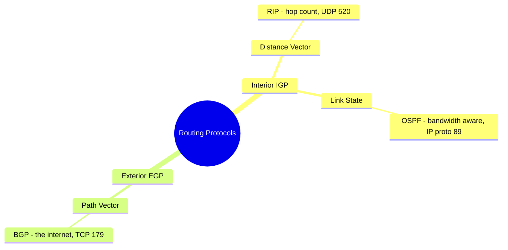

# Routing Protocols

## Overview

Routers exchange routing information via protocols so they can dynamically find the best paths. Static routes work for critical destinations; dynamic routes scale.

## Convergence

All routers in a routing domain agree on the network topology. Any change (router failure, new link) temporarily breaks convergence until all routers re-sync.

## Interior vs. Exterior Gateway Protocols

| | Interior (IGP) | Exterior (EGP) |
|--|----------------|----------------|
| **Scope** | Within a single network | Between networks (the internet) |
| **Convergence** | Yes — routers share info, converge | No — too many routes (millions) |
| **Examples** | RIP, OSPF, EIGRP, IS-IS | BGP |

## Distance Vector vs. Link State vs. Path Vector

### Distance Vector
- **Only metric**: hop count (number of routers between here and there)
- Doesn't care about bandwidth, latency, or reliability
- Example: **RIP**
- Limitation: a 1-Mbps 2-hop path wins over a 1-Gbps 3-hop path → often bad choice

### Link State
- Considers bandwidth AND hop count (and other factors)
- Each router runs algorithm independently; builds its own view
- Faster convergence, better path selection
- Example: **OSPF**

### Path Vector
- Uses path, network policies, and rules
- Example: **BGP**

## RIP (Routing Information Protocol)
- **Distance vector**, oldest
- UDP port 520
- **Only metric**: hop count (max 15; hop count 16 = unreachable)
- Updates every 30 seconds
- Loop prevention: **split horizon**, **route poisoning**, **hold-down timers**
- **Split horizon** — don't advertise a route back out the interface you learned it from
- **Split horizon with poison reverse** — advertise back out, but marked unreachable
- **Route poisoning** — when a route is lost, immediately announce unreachable
- **Hold-down timer** — after a route's metric worsens, no changes allowed for a period (prevents flapping)

## OSPF (Open Shortest Path First)
- **Link state**, widely used
- Single routing domain divided into logical areas
- Supports IPv4 + IPv6, CIDR
- Detects topology changes quickly; sub-second convergence
- **No transport protocol** — encapsulated directly in IP (protocol 89)

## BGP (Border Gateway Protocol)
- **Path vector** — the routing protocol of the **internet**; runs over **TCP 179**
- Connects Autonomous Systems (ASes) identified by AS numbers
- Uses pre-agreed metrics (path, policies, rules) to decide
- Tables are huge: ~700K IPv4 routes (2018), approaching 1M (2023); 100K+ IPv6 routes
- **No convergence** — too many routes

## Exam Tips

- RIP = distance vector = hops only = UDP 520 = max 15 hops
- OSPF = link state = bandwidth-aware
- BGP = path vector = the internet = TCP 179
- IGP = within a domain (converges); EGP = between domains (doesn't)
- Split horizon / route poisoning / hold-down = loop prevention in RIP

## Diagrams

### Routing Protocol Categories
Scope (IGP vs EGP) over algorithm (distance vector / link state / path vector).

## Related Topics

- [Network Devices and Components](Network%20Devices%20and%20Components.md) — routers + planes
- [OSI and TCP-IP Models](OSI%20and%20TCP-IP%20Models.md)
