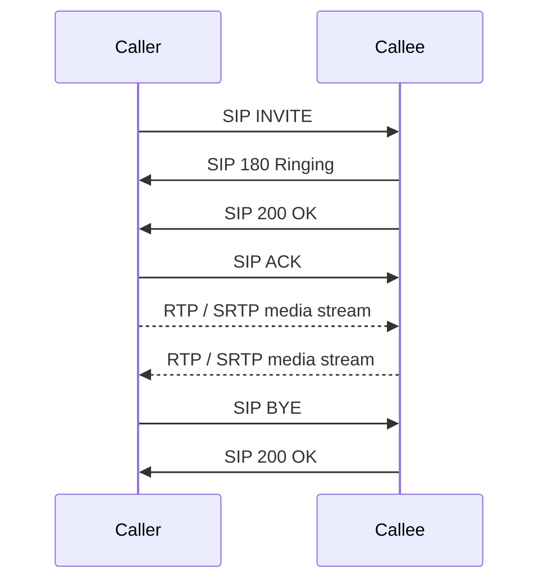

# SAN and VoIP Protocols

## Overview

Two unrelated topics that share a chapter because both move specialized traffic over the network. A **SAN** delivers block storage to servers so a remote disk looks local; the exam tests which SAN protocols stay inside one data center versus which can be routed across sites. **VoIP** carries phone calls over IP; the key idea is that real-time voice uses UDP and tolerates lost packets rather than waiting for retransmission. Match the trigger word (routable, LUN, 53-byte cell, session setup, media stream) to the right acronym.

## Storage Area Networks (SAN)

Storage presented to servers over the network, appearing as directly attached.

### FCoE (Fiber Channel over Ethernet)
- **Not routable** (uses Ethernet, not IP)
- Same data center only
- Uses **HBAs** (Host Bus Adapters), often combined with NICs
- Fiber channel typically uses fiber cables (copper possible but uncommon)

### FCIP (Fiber Channel over IP)
- **Routable** — can go across data centers
- Encapsulates fiber channel in TCP/IP frames
- Adds overhead and latency

### iSCSI (Internet Small Computer System Interface)
- **Routable** — uses upper TCP/IP layers (transport + application, OSI 4-7)
- Uses your existing infrastructure — no HBAs required
- Uses **LUNs** (Logical Unit Numbers) for addressing
- LUN also provides basic access control for storage

### VSAN (Virtual SAN)
Segments ports on a SAN switch (or across switches) into virtual fabrics — similar to VLANs for storage. Logical separation of storage traffic.

## Voice over IP (VoIP)

Delivers voice (and often video) over IP networks. Uses **UDP** for real-time transmission.

### Why UDP?
Connectionless = low latency. Missing packets aren't worth retransmitting (you'd re-hear what someone said half a second ago, making the conversation sound weird).

### Transport Medium
Can run over any IP network: wired, Wi-Fi, cellular (3G/4G/5G), satellite (if latency is low enough).

### Codecs
Compress voice/video on send, decompress on receive. Example codecs: G.711, G.729, Opus.

### VoIP Advantages
- Much cheaper than analog phone lines
- Easier to implement and manage now (plug-and-play boxes available)
- Full-featured: calls, text, video, collaboration

### When Analog Still Makes Sense
- Backup for power/internet failure (emergency lines)
- Specific regulatory requirements

### Key VoIP Protocols
| Protocol | Role |
|----------|------|
| **SIP** (Session Initiation Protocol) | Set up, manage, tear down sessions |
| **MGCP** (Media Gateway Control Protocol) | Control media gateways |
| **H.323** | Older signaling stack |
| **RTP** (Real-time Transport Protocol) | Carries the actual audio/video streams |
| **SRTP** (Secure RTP) | Encrypts the RTP media stream — protects voice/video from eavesdropping |

## Exam Tips

- FCoE = same data center (not routable)
- FCIP / iSCSI = routable (cross-data-center possible)
- iSCSI uses LUNs, runs on existing network infrastructure
- VoIP uses UDP — real-time, no retransmission
- SIP = session setup; RTP = the actual media stream; **SRTP = encrypted RTP**
- If you see "control protocol" or "transport protocol" in a VoIP question, look for SIP/MGCP/RTP

## Diagrams

### VoIP Call: SIP Signaling + RTP Media
SIP sets up/tears down the session; RTP/SRTP carries the actual audio over UDP.

## Related Topics

- [Virtualization Cloud and Distributed Computing](../03-security-architecture-and-engineering/Virtualization%20Cloud%20and%20Distributed%20Computing.md)
- [Network Protocols](Network%20Protocols.md)
