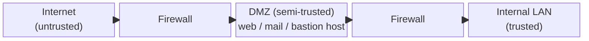

# Secure Network Architecture

## Overview

Designing networks with security built in through segmentation, defense in depth, and secure topologies.

## Key Concepts

### Network Topologies
- **Bus** - single cable, all devices share (collision-prone, legacy)
- **Star** - central device (hub/switch), most common today
- **Ring** - circular, token passing (FDDI, legacy)
- **Mesh** - every device connects to every other (full or partial)
- **Full Mesh** - maximum redundancy, n(n-1)/2 connections

### Segmentation Strategies
- **DMZ** - buffer zone for public-facing services (dual-firewall recommended)
- **VLANs** - logical separation on shared physical infrastructure
- **Subnets** - IP-based network division
- **Micro-segmentation** - workload-level isolation (Zero Trust, SDN)
- **Extranet** - controlled access for partners/vendors
- **Intranet** - internal-only network

### Cloud Network Considerations
- **VPC** (Virtual Private Cloud) - isolated network in the cloud
- **Security Groups** - virtual firewalls for cloud instances
- **SDN** (Software-Defined Networking) - centralized, programmable network control; separates control plane from forwarding plane; vendor-agnostic
  - **Northbound API** - talks **UP** to applications / orchestration (what the network should do)
  - **Southbound API** - talks **DOWN** to the network devices (e.g., OpenFlow programming the forwarding plane)
- **SD-WAN** - software-defined WAN; cheaper than MPLS; automatic failover between multiple links (fiber + DSL + satellite); flexible scaling; 85%+ of surveyed orgs deploying
- **CASB** (Cloud Access Security Broker) - monitors and enforces policy for cloud services
- **SASE** (Secure Access Service Edge) - converges networking and security in the cloud
- **VXLAN** (Virtual eXtensible LAN) — 24-bit VLAN ID gives 16M VLANs (vs. 4,094 for regular VLAN); can span subnets and geographic locations; MAC-in-UDP encapsulation
- **SDx** — Software-Defined Everything (networking, storage, data center, WAN, security)

### MPLS (Multiprotocol Label Switching)
- Routes using **labels**, not IP addresses
- Operates between OSI layers 2 and 3 (sometimes "Layer 2.5")
- Used to connect geographically dispersed organization sites via dedicated paths
- Hardware-based, expensive, leased — being displaced by SD-WAN

### Network Address Translation (NAT)
- Hides internal IP addresses from external networks
- Types: static NAT, dynamic NAT, PAT (Port Address Translation)
- Provides obscurity, not security

### CDN and Edge Security
- **CDN** (Content Delivery Network) - distributed content caching
- Helps mitigate DDoS through distribution
- Edge computing moves processing closer to users

## Exam Tips

- A properly designed DMZ uses **two firewalls** (external and internal)
- VLANs provide logical separation but can be bypassed (VLAN hopping) if misconfigured
- SDN separates the control plane from the data plane; **northbound API = up to apps, southbound API = down to devices**
- NAT is NOT a security control (obscurity, not protection)
- SASE combines network and security services in the cloud (SD-WAN + security)
- **VXLAN vs SDN vs SD-WAN vs VPN** (commonly confused): **VXLAN** = encapsulation protocol that *stretches switch-created VLAN segments across subnets and geographic distance*. **SDN** = centrally programmable, vendor-neutral network (separates control/data plane). **SD-WAN** = SDN applied to WAN links (manages connectivity between sites/cloud). **VPN** = a secured/encrypted tunnel connecting networks. If the question says "encapsulation that stretches switch segments across subnets/distance" → **VXLAN**.

## Diagrams

### Network Zones / DMZ — Block Diagram

**Takeaway:** Public-facing servers live in the **DMZ** between two firewalls; the internal LAN stays isolated. A **bastion host** is a hardened, exposed system in the DMZ.

## Related Topics

- [Network Devices and Components](Network%20Devices%20and%20Components.md) - devices that implement the architecture
- [Defense in Depth](../01-security-and-risk-management/Defense%20in%20Depth.md)
- [Secure Design Principles](../03-security-architecture-and-engineering/Secure%20Design%20Principles.md) - Zero Trust
- [Domain 7 - Security Operations](../07-security-operations/00%20Domain%207%20-%20Security%20Operations.md) - monitoring the architecture
