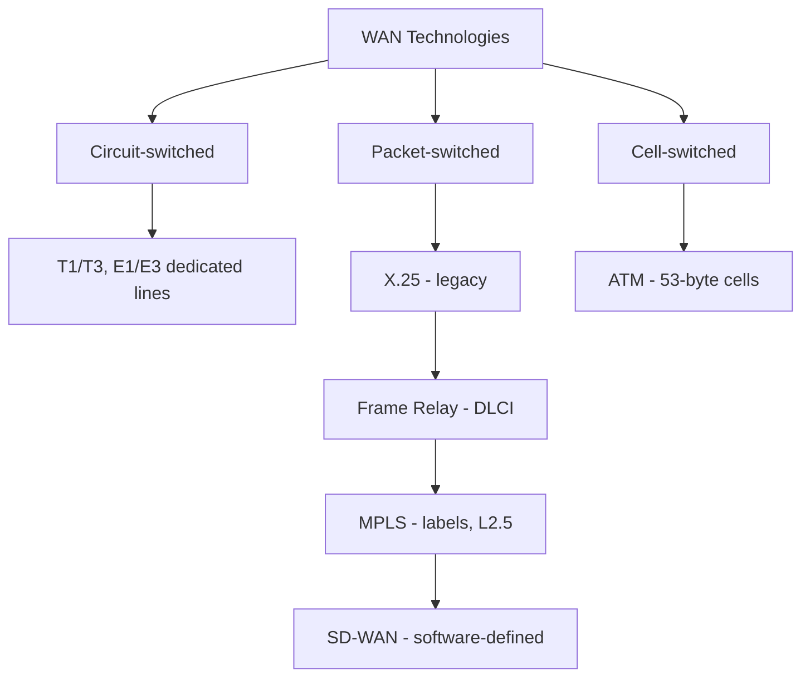

# WAN Technologies and Protocols

## Overview

The "Internet" is really thousands of WAN providers peered together. Understand legacy + modern WAN technologies.

## Legacy WAN (know for exam)

### Dedicated Lines (T/E)
| Connection | Speed | Region |
|------------|-------|--------|
| T1 | 1.5 Mbps (24 × 64-Kbps DS0) | US |
| T3 | 44.7 Mbps (28 × T1) | US |
| E1 | 2 Mbps (30 × 64-Kbps channels) | Europe |
| E3 | 34 Mbps (16 × E1) | Europe |

Dedicated — you pay for the line whether used or not.

### Frame Relay
- Layer 2 packet-switching, legacy
- No error recovery (delegates to higher layers)
- **PVC** (Permanent Virtual Circuit) — always up
- **SVC** (Switched Virtual Circuit) — up on demand (like dial-up)
- **DLCI** (Data Link Connection Identifier) — identifies each virtual connection

### ATM (Asynchronous Transfer Mode)
- Cell-switched WAN technology using **fixed 53-byte cells** (5-byte header + 48-byte payload)
- Fixed cell size = predictable, **low-latency** transport with good QoS (favoured for voice/video)
- Legacy; often carried over SONET

### X.25
- Legacy packet-switched WAN protocol suite (**Frame Relay was its successor**)
- Uses **PSE** (Packet Switching Exchange) nodes (routers)
- Error correction built in

### SONET (Synchronous Optical Network)
- Carries multiple T-circuits over fiber
- Ring topology
- Legacy

## Modern WAN

### MPLS (Multiprotocol Label Switching)
- Routes using **labels**, not IPs
- Layer 2.5 (between data link and network)
- Encapsulates many protocols (ATM, DSL, etc.)
- Used for geographically distributed organizations
- Hardware-based, dedicated lines, **expensive**

### SD-WAN
The evolution from MPLS:
- **Software-defined** — not hardware-leased lines
- Uses whatever connections you have (fiber, DSL, cellular, satellite)
- **Cheaper, higher bandwidth, faster failover**
- Centralized management, traffic engineering, reporting
- Instant failover: if fiber dies, drops to satellite automatically
- ~85% of surveyed companies deploying SD-WAN
- Often paired with next-gen firewalls + IPsec

### SDLC / HDLC
- **SDLC** (Synchronous Data Link Control) — Layer 2, polling-based. Primary polls secondary; only polled secondary can transmit. Legacy.
- **HDLC** (High-Level Data Link Control) — successor; adds error correction, flow control, and modes:
  - **NRM** — secondary transmits only when permitted
  - **ARM** — secondary can initiate communication
  - **ABM** — Asynchronous Balanced Mode — either node can initiate. Most common.

### DNP3 (Distributed Network Protocol 3)
- Used for SCADA / industrial control systems
- Lightweight, designed for slow / intermittent links
- Communicates between master station and RTUs / IEDs in the field
- Key keyword on the exam: **SCADA protocol**

## Exam Tips

- Dedicated lines (T1/T3/E1/E3) = legacy, expensive
- MPLS = label-based routing, Layer 2.5
- SD-WAN = modern, flexible, cheaper, multi-link failover
- Frame Relay uses DLCIs (packet-switched virtual circuits; successor to X.25)
- ATM = fixed **53-byte cells** → predictable low latency
- HDLC/ABM = most common async mode
- DNP3 = industrial control systems (SCADA)

## Diagrams

### WAN Technologies by Switching Type
Packet-switched line shows the legacy-to-modern evolution; ATM is the cell-switched outlier.

## Related Topics

- [Networking Basics and Definitions](Networking%20Basics%20and%20Definitions.md) — circuit vs packet switching
- [Secure Network Architecture](Secure%20Network%20Architecture.md) — SD-WAN, SDN, SASE
- [Industrial Control Systems](../03-security-architecture-and-engineering/Industrial%20Control%20Systems.md) — DNP3 context
