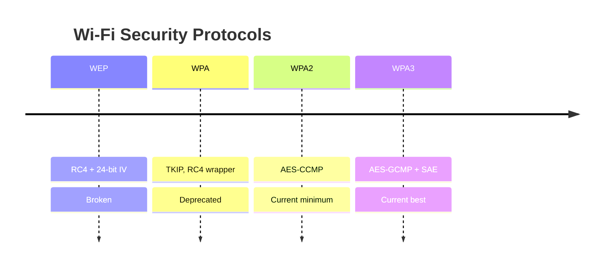
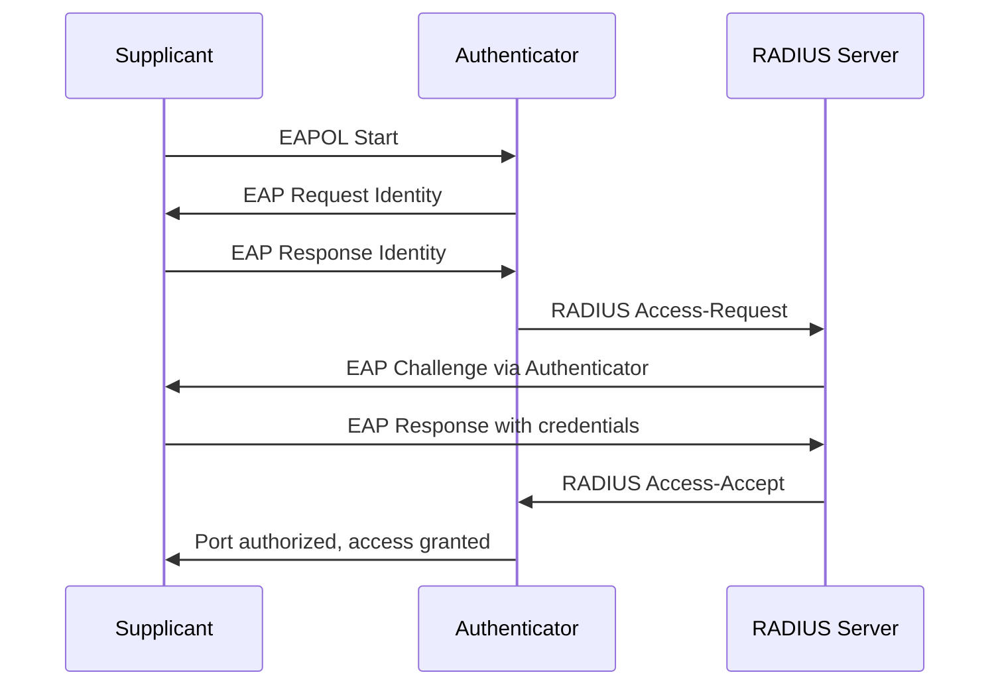

# Wireless Security

## Overview

Wireless is a shared medium that anyone in radio range can listen to, so the signal itself can't be physically contained the way a cable can. That makes encryption and authentication the real perimeter. The exam centers on the WEP → WPA → WPA2 → WPA3 progression (which cipher each uses and why the old ones broke), on Personal vs Enterprise (802.1X with RADIUS) authentication, and on a handful of named attacks like the evil twin and rogue AP. Anchor the chapter on one fact: turning off SSID broadcast or filtering MACs is security-through-obscurity, not real protection.

## Key Concepts

### Wireless Standards (IEEE 802.11)
| Standard | Frequency | Max Speed | Notes |
|----------|-----------|-----------|-------|
| 802.11a | 5 GHz | 54 Mbps | Shorter range |
| 802.11b | 2.4 GHz | 11 Mbps | Legacy |
| 802.11g | 2.4 GHz | 54 Mbps | Backward compatible with b |
| 802.11n (Wi-Fi 4) | 2.4/5 GHz | 600 Mbps | MIMO |
| 802.11ac (Wi-Fi 5) | 5 GHz | 6.9 Gbps | Beamforming |
| 802.11ax (Wi-Fi 6) | 2.4/5/6 GHz | 9.6 Gbps | OFDMA, WPA3 |

### Wireless Security Protocols
| Protocol | Encryption | Status |
|----------|-----------|--------|
| **WEP** | RC4 (24-bit IV) | Broken - never use |
| **WPA** | TKIP (RC4 wrapper) | Deprecated |
| **WPA2** | AES-CCMP | Current minimum standard |
| **WPA3** | AES-GCMP, SAE | Current best |

### WPA2/WPA3 Modes
- **Personal (PSK)** - pre-shared key (home use)
- **Enterprise** - 802.1X authentication with RADIUS server (corporate use)
- **WPA3-SAE** (Simultaneous Authentication of Equals, aka the **Dragonfly** handshake) - replaces PSK, resistant to offline dictionary attacks; provides **individual data encryption** even on open networks
- WPA3 blocks brute-force after N failed attempts — passwords don't need to be as complex

### WEP Weakness Origin
WEP was deliberately weakened to comply with the **Wassenaar Arrangement** (40-bit encryption exportable) — breaking it takes minutes regardless of password length.

### SSID Notes
- SSID broadcast can be turned off — attackers with a sniffer in range still see it (radio signals can't hide from monitor mode). Security-through-obscurity.
- MAC filtering is similarly bypassable (spoofing MAC takes seconds).

### 802.1X (Port-Based Network Access Control)
- **Supplicant** - device requesting access
- **Authenticator** - network device (AP, switch)
- **Authentication Server** - RADIUS server
- Uses EAP (Extensible Authentication Protocol) for authentication

### Wireless Attacks
| Attack | Description |
|--------|-------------|
| **Rogue AP** | Unauthorized access point on the network — often employee-installed for coverage (e.g., Bob plugs in a personal router). Defense: port security, sticky MAC, shut unused ports. |
| **Evil Twin** | Attacker-run AP with the same SSID as yours, no password. Devices with better signal auto-connect. Internal evil twin = on your network; external evil twin = not on your network (but users lose access to internal resources — a tell). |
| **Deauthentication** | Forcing clients to disconnect (often to capture WPA handshake for cracking) |
| **War Driving** | Scanning for wireless networks from a vehicle |
| **Jamming / Interference** | Intentional (DoS) or unintentional (microwaves, baby monitors). Use channel analysis; switch bands. |
| **Bluejacking** | Sending unsolicited messages via Bluetooth (annoying, harmless) |
| **Bluesnarfing** | Stealing data from a Bluetooth device |
| **Bluebugging** | Taking full control of a Bluetooth device (mainly affects older phones without auto-updates) |

### Wireless NIC Modes
- **Managed / Client** — connects only to AP; can't communicate directly with other clients
- **Infrastructure** — connects to AP; can communicate with other clients on the same SSID
- **Ad-hoc** — peer-to-peer, no AP needed; shared SSID + channel
- **Monitor / RFMON** — captures all wireless traffic without associating (like promiscuous mode on wired) — no encryption = attacker can sniff everything

### 2.4 / 5 / 6 GHz Trade-offs
| Band | Range | Speed | Penetration | Congestion |
|------|-------|-------|-------------|-----------|
| 2.4 GHz | Largest | Slowest | Best through walls | Most congested |
| 5 GHz | Smaller | Faster | Weaker through walls | Less congested |
| 6 GHz | Smallest | Fastest | Weakest | Newest / least congested |

### 802.11 Standards (general trajectory)
- 802.11a/b/g — legacy
- 802.11n (Wi-Fi 4) — 2.4/5 GHz
- 802.11ac (Wi-Fi 5) — 5 GHz, widely deployed
- 802.11ax (Wi-Fi 6 / 6E) — 2.4/5/6 GHz

Don't memorize speeds. Know the trajectory: newer = faster, shorter range, backwards-compatible.

### Wi-Fi Infrastructure Deployment Modes (don't confuse with NIC modes above)
| Mode | Meaning |
|------|---------|
| **Stand-alone** | A WAP **not** connected to any wired network |
| **Wired extension** | A **single** WAP extending the wired LAN wirelessly |
| **Enterprise extension** | **One SSID across many WAPs** — single logon works anywhere in the building (large physical coverage). The answer to "single SSID, multiple APs, one logon event." |
| **Wireless bridge** | Connects **two networks** together using **two** bridge WAPs (across moderate distance) |

## Exam Tips

- **WEP** is broken (RC4 + short IV) - always the wrong answer for security
- **Enterprise extension** = one SSID + many APs + single logon (vs stand-alone = no wired net; wired extension = one AP; bridge = connects two nets)
- **WPA2 Enterprise** with 802.1X is the best answer for corporate wireless security
- **WPA3** uses SAE which prevents offline dictionary attacks
- Evil twin attacks target users, not the network infrastructure
- 802.1X is used for both wired and wireless NAC

## Diagrams

### Frequency, Bands & Spread Spectrum (FHSS / DSSS / OFDM)

The foundation under all wireless terminology. Build it bottom-up:
**frequency → band → bandwidth → baseband/broadband → how signals fill the band.**

---

#### 1. Frequency — the starting point

A radio signal is a wave that oscillates (rises and falls). **Frequency = how many times per second it oscillates**, in **Hertz (Hz)**. Radio = millions (MHz) or billions (GHz) of cycles/sec.
> Intuition = **pitch**. Low frequency = bass note; high frequency = treble note. The whole **spectrum** is a giant piano keyboard from very low to very high notes.

#### 2. A "band" = a section of the keyboard

A **band** = a **contiguous range of frequencies**. Regulators carve the spectrum into bands and assign each a purpose:
```
Low freq ◄─────────────────────────────────────────► High freq
  | AM | FM |  ...  | 2.4 GHz Wi-Fi | 5 GHz Wi-Fi | cellular | ...
       each labelled slice = a "band"
```
"Transmitting **over a band**" = your signal lives within that assigned range (e.g. 2.4 GHz Wi-Fi ≈ 2.400–2.4835 GHz).

#### 3. Bandwidth = the WIDTH of the band

```
   |◄────────── one band ──────────►|
  2.400 GHz                     2.4835 GHz
   width ≈ 83 MHz  =  the bandwidth
```
> Wider band → more room to encode data → **more capacity.** (That's why "bandwidth" = slang for capacity.)

#### 4. Baseband vs Broadband — HOW you use the band  ⚠️ (reversed-pair trap)

**Baseband — ONE signal uses the ENTIRE bandwidth, one at a time (single channel, digital):**
```
  |████████████████████████|   one signal, the whole pipe
```
Example: **Ethernet** — the "BASE" in `10BASE-T` = **baseband**. Intuition: single-lane road, one car uses all of it.

**Broadband — bandwidth DIVIDED into many channels, many signals at once:**
```
  |██ ch1 ██|██ ch2 ██|██ ch3 ██|██ ch4 ██|   many signals in parallel
```
Example: **cable TV, DSL.** Intuition: multi-lane highway, many cars side by side.

> **Baseband = one signal, whole bandwidth (single channel). Broadband = bandwidth split into many channels at once.**
> Anchor against the reversal: **broad**band = **broad/wide = MANY** channels; **base**band = **base/plain = ONE** channel.

---

#### 5. Filling the band: FHSS vs DSSS vs OFDM

Picture a chart: vertical = **frequency**, horizontal = **time**. Each technique paints a different shape.

**FHSS — Frequency Hopping Spread Spectrum** (one narrow freq at a time, hops on a secret pattern):
```
Freq
 f5 |          ███
 f4 |  ███               ███
 f3 |             ███
 f2 |                        ███
 f1 |  ███            ███
    +--------------------------------> Time
```

**DSSS — Direct Sequence Spread Spectrum** (ONE signal smeared across the whole wide band, via a "chipping code"):
```
Freq
 f5 |████████████████████████████
 f4 |████████████████████████████   one wide signal,
 f3 |████████████████████████████   SAME data spread
 f2 |████████████████████████████   redundantly everywhere
 f1 |████████████████████████████
    +--------------------------------> Time
```

**OFDM — Orthogonal Frequency-Division Multiplexing** (band split into many parallel subcarriers, each carrying DIFFERENT data):
```
Freq
 f5 |▬▬▬▬▬▬▬▬▬▬▬▬▬▬▬▬▬▬  subcarrier 5 (data E)
 f4 |▬▬▬▬▬▬▬▬▬▬▬▬▬▬▬▬▬▬  subcarrier 4 (data D)
 f3 |▬▬▬▬▬▬▬▬▬▬▬▬▬▬▬▬▬▬  subcarrier 3 (data C)
 f2 |▬▬▬▬▬▬▬▬▬▬▬▬▬▬▬▬▬▬  subcarrier 2 (data B)
 f1 |▬▬▬▬▬▬▬▬▬▬▬▬▬▬▬▬▬▬  subcarrier 1 (data A)
    +--------------------------------> Time
```
> Key difference: **DSSS = one signal fills the band** (resilience). **OFDM = many independent signals fill the band** (speed). OFDM is "broadband thinking" applied to wireless.

##### Why OFDM's lanes don't collide — "orthogonal"
Each subcarrier's **peak sits exactly where its neighbours are at zero**, so they overlap without interfering → you pack them tight → almost no wasted spectrum.
```
   /\    /\    /\    /\
  /  \  /  \  /  \  /  \
 /    \/    \/    \/    \
─ peak  0   peak  0   peak ─   at each peak, neighbours = 0
```

#### 6. Compare — where used, benefits, drawbacks

| | How it works | Where used | Benefits | Drawbacks |
|---|---|---|---|---|
| **FHSS** | hops between narrow frequencies on a pattern | Classic Bluetooth, military radios, 1997 Wi-Fi | resists jamming/interference; stealthy; simple | **lowest throughput**; hop overhead |
| **DSSS** | spreads one signal across a wide band via a chipping code | 802.11b, GPS, 3G CDMA, Zigbee | noise-resilient (redundancy); stealthy; faster than FHSS | needs **wide bandwidth**; moderate speed |
| **OFDM** | many orthogonal parallel subcarriers | Wi-Fi a/g/n/ac/ax, 4G/5G, DSL, digital TV/radio | **highest throughput**; spectrally efficient; resists multipath | complex; sync-sensitive; high peak power |

> **FHSS & DSSS optimize for robustness/stealth (military roots) → trade away speed. OFDM optimizes for throughput/efficiency → modern fast standards.**
> Exam: "greatest throughput + least interference" → **OFDM** (it claims both). "hopping" → FHSS. "chipping code / spread wide" → DSSS.

### Wireless Security Evolution (WEP → WPA3)
Each step replaced a broken cipher; know what each one uses.


### 802.1X / EAP Authentication (Enterprise)
The supplicant never talks directly to the RADIUS server; the authenticator relays EAP.


## Related Topics

- [Network Attacks](Network%20Attacks.md)
- [Network Devices and Components](Network%20Devices%20and%20Components.md)
- [Cryptography](../03-security-architecture-and-engineering/Cryptography.md) - wireless encryption algorithms
- [Domain 5 - Identity and Access Management](../05-identity-and-access-management/00%20Domain%205%20-%20Identity%20and%20Access%20Management.md) - 802.1X authentication
