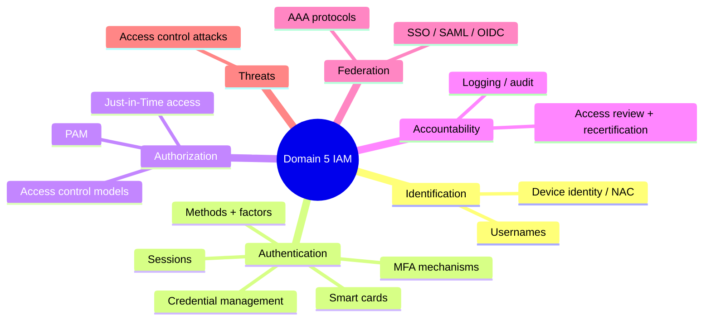

# Domain 5 - Identity and Access Management (13%)

This domain is about controlling who can access what, and proving they are who they claim to be. Everything here hangs on the IAAA chain — identification, authentication, authorization, accountability — so use that as your map through the notes below.

---

## Topics Checklist

**Authentication & credentials**
- [ ] [Authentication Methods](Authentication%20Methods.md)
- [ ] [Multifactor Authentication Mechanisms](Multifactor%20Authentication%20Mechanisms.md)
- [ ] [Smart Card Types](Smart%20Card%20Types.md)
- [ ] [Credential Management Systems](Credential%20Management%20Systems.md)
- [ ] [Session Management](Session%20Management.md)

**Authorization & access control models**
- [ ] [Access Control Models](Access%20Control%20Models.md)
- [ ] [Authorization and Accountability](Authorization%20and%20Accountability.md)

**Identity lifecycle & governance**
- [ ] [Identity Management](Identity%20Management.md)
- [ ] [Identity Proofing and Assurance Levels](Identity%20Proofing%20and%20Assurance%20Levels.md)
- [ ] [Account Access Review and Recertification](Account%20Access%20Review%20and%20Recertification.md)
- [ ] [Privileged Access Management](Privileged%20Access%20Management.md)
- [ ] [Just-in-Time Access](Just-in-Time%20Access.md)

**Federation & authentication systems**
- [ ] [Identity Federation and SSO](Identity%20Federation%20and%20SSO.md)
- [ ] [AAA Protocols](AAA%20Protocols.md)
- [ ] [Device Identity and Network Access Control](Device%20Identity%20and%20Network%20Access%20Control.md)

**Attacks**
- [ ] [Access Control Attacks](Access%20Control%20Attacks.md)

---

## Domain Summary

This domain focuses on:

- **Identification** - claiming an identity (username)
- **Authentication** - proving that identity (password, biometrics)
- **Authorization** - what you're allowed to do (permissions)
- **Accountability** - tracking what you did (logging, audit)

---

## Key Relationships

- Access control models implement [Security Models](../03-security-architecture-and-engineering/Security%20Models.md) from Domain 3
- Personnel security from [Domain 1 - Security and Risk Management](../01-security-and-risk-management/00%20Domain%201%20-%20Security%20and%20Risk%20Management.md) drives provisioning
- Monitoring access ties to [Domain 7 - Security Operations](../07-security-operations/00%20Domain%207%20-%20Security%20Operations.md)
- Testing access controls in [Domain 6 - Security Assessment and Testing](../06-security-assessment-and-testing/00%20Domain%206%20-%20Security%20Assessment%20and%20Testing.md)
- Network access via [Domain 4 - Communication and Network Security](../04-communication-and-network-security/00%20Domain%204%20-%20Communication%20and%20Network%20Security.md)

---

## Diagrams

### Domain 5 map (IAAA chain)
Every topic in this domain hangs off one of the four IAAA stages plus the federation and attack layers.

---
