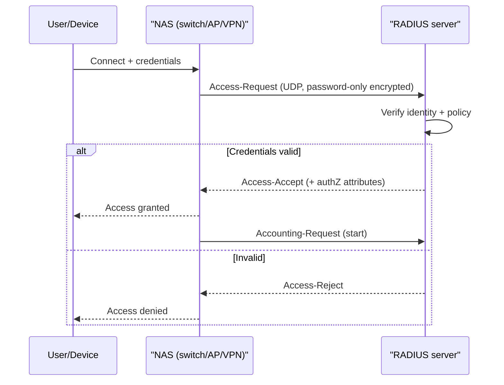

# AAA Protocols

## Overview

When a user connects to Wi-Fi, dials a VPN, or an admin logs into a router, the device they hit usually does not store the password itself. Instead it forwards the request to a central server that performs **Authentication** (who are you), **Authorization** (what may you do), and **Accounting** (what did you do) — the three A's. AAA protocols are the languages that the network device (the client) and that central server speak to each other. Centralising AAA means one place to manage credentials, one policy, and one audit trail, instead of separately configuring every switch and access point. The exam mostly tests **RADIUS vs. TACACS+** — their transport, what they encrypt, and what each is used for.

## Key Concepts

### The three A's

- **Authentication** — verify the identity presenting credentials.
- **Authorization** — decide what that identity is permitted to do.
- **Accounting** — record session details (start/stop, data used, commands run) for billing, audit, and accountability. ("Accounting" here is the AAA term; it overlaps with accountability.)

### RADIUS

Remote Authentication Dial-In User Service is the workhorse for **network access** — Wi-Fi (with 802.1X), VPN, and dial-up. Key facts:

- Runs over **UDP**.
- Encrypts **only the password** in the access request; the rest of the packet (including username and accounting data) is sent in the clear.
- **Combines authentication and authorization** into one exchange; accounting is a separate function.
- Cross-vendor standard, widely supported.

### TACACS+

Terminal Access Controller Access-Control System Plus is Cisco-originated and used mainly for **device administration** — controlling who can log into routers, switches, and firewalls, and which commands they may run. Key facts:

- Runs over **TCP** (port 49).
- Encrypts the **entire packet payload**, not just the password.
- **Separates** authentication, authorization, and accounting into independent functions — so you can, for example, authenticate against one source and authorize commands granularly per administrator.
- This per-command authorization is why it is preferred for managing network gear.

### RADIUS vs. TACACS+ (the core comparison)

| Feature | RADIUS | TACACS+ |
|---------|--------|---------|
| Transport | **UDP** | **TCP** (port 49) |
| Encryption | **Password only** | **Entire payload** |
| AAA separation | AuthN + AuthZ combined | **AuthN, AuthZ, Acct separated** |
| Primary use | **Network access** (Wi-Fi, VPN) | **Device administration** (routers/switches) |
| Origin | Open standard (IETF) | Cisco |
| Granular command control | Limited | **Yes (per-command authZ)** |

### Diameter

Diameter is the intended **successor to RADIUS**, named as a pun (twice the radius). It runs over reliable transports (TCP/SCTP), supports stronger security, and is used heavily in **mobile/telecom networks** (3G/4G/IMS) rather than typical enterprise LANs. For the exam: "enhanced RADIUS successor, used in mobile/carrier networks" = Diameter.

### Where these sit vs. Kerberos

RADIUS/TACACS+/Diameter are AAA protocols that *broker* access decisions for network devices. **Kerberos** is a different beast — an SSO authentication protocol using tickets within a realm (covered with SSO). Don't pick RADIUS/TACACS+ when the stem describes ticket-based SSO.

## Common traps / easily confused

- **RADIUS vs. TACACS+ — memorise the pair:** RADIUS = **UDP, password-only encryption, network access**; TACACS+ = **TCP, full-payload encryption, device administration, AAA separated**. "Encrypts the whole packet / per-command control / Cisco device admin" = TACACS+.
- **"RADIUS encrypts the password" is a real limitation** — username and accounting are in the clear. If confidentiality of the whole exchange matters, that points to TACACS+.
- **Diameter is not just "better RADIUS" generically** — its exam home is **mobile/carrier** networks.
- **Accounting ≠ Authorization.** The third A is recording what happened, not deciding what is allowed.
- **AAA protocol ≠ federation protocol.** SAML/OAuth/OIDC federate web identities; RADIUS/TACACS+ broker network/device access.

## Exam Tips

- TCP + entire-payload encryption + device administration + AAA separated → **TACACS+**.
- UDP + password-only encryption + Wi-Fi/VPN network access → **RADIUS**.
- Mobile/telecom AAA, RADIUS successor → **Diameter**.
- 802.1X port-based network access control uses an authentication server that is almost always **RADIUS**.
- The three A's: Authentication, Authorization, **Accounting** (the AAA spelling of accountability).

## Diagrams

### RADIUS access exchange
The network device (NAS) brokers the request to a central RADIUS server, which combines authentication and authorization; accounting is a separate message.

## Related Topics

- [Authorization and Accountability](Authorization%20and%20Accountability.md) - the AAA framework
- [Device Identity and Network Access Control](Device%20Identity%20and%20Network%20Access%20Control.md) - 802.1X uses RADIUS
- [Identity Federation and SSO](Identity%20Federation%20and%20SSO.md) - Kerberos and federation protocols
- [Domain 4 - Communication and Network Security](../04-communication-and-network-security/00%20Domain%204%20-%20Communication%20and%20Network%20Security.md)
