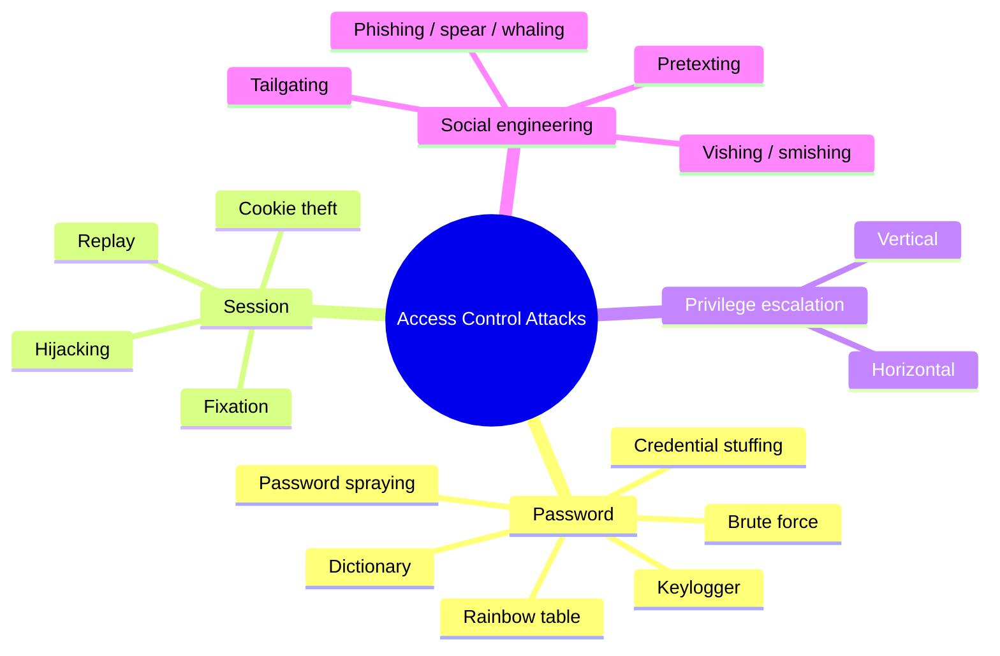

# Access Control Attacks

## Overview

These are the attacks aimed at the front door: identification, authentication, and authorization. Most of them are really attacks on credentials — guessing them, stealing them, or reusing them. That is why one control, MFA, blunts so many of them at once: even a correct password is no longer enough to get in. Learn each attack by what makes it distinct, because the exam loves to offer two similar attacks as choices.

## Key Concepts

### Password Attacks
| Attack | Description | Defense |
|--------|-------------|---------|
| **Brute Force** | Try all possible combinations | Account lockout, long passwords |
| **Dictionary** | Try common words/passwords | Complex passwords, not words |
| **Credential Stuffing** | Use leaked credentials from other breaches | MFA, unique passwords |
| **Password Spraying** | Try common passwords across many accounts | Account lockout, MFA |
| **Rainbow Table** | Pre-computed hash lookup | Salted hashes |
| **Phishing** | Social engineering to steal credentials | Security awareness, MFA |
| **Keylogger** | Captures keystrokes | Anti-malware, MFA with hardware tokens |

### Session Attacks
- **Session Hijacking** - stealing an active session token
- **Session Fixation** - forcing a known session ID on a user
- **Replay Attack** - re-sending captured authentication data
- **Cookie Theft** - stealing session cookies (XSS, sniffing)

### Privilege Escalation
- **Vertical** - gaining higher privileges (user -> admin)
- **Horizontal** - accessing another user's resources at the same level

### Social Engineering
- **Phishing** - fraudulent emails to steal credentials
- **Spear Phishing** - targeted phishing at specific individuals
- **Whaling** - phishing targeting executives
- **Vishing** - voice-based phishing (phone calls)
- **Smishing** - SMS-based phishing
- **Pretexting** - creating a fabricated scenario to extract information
- **Tailgating/Piggybacking** - following someone through a secure door

### Defenses
- Multi-factor authentication (strongest single defense)
- Account lockout policies
- Security awareness training
- Session management (timeouts, secure cookies)
- Privileged access management (PAM)
- Monitoring and alerting on suspicious authentication activity

## Exam Tips

- **MFA** is the best defense against most credential-based attacks
- **Credential stuffing** exploits password reuse across sites
- **Password spraying** avoids lockout by trying few passwords across many accounts
- Social engineering targets **people**, not technology
- Vertical escalation is more dangerous than horizontal

## Common Traps

- **Credential stuffing vs. password spraying:** stuffing reuses *known* leaked username+password pairs (exploits reuse across sites); spraying tries a *few common passwords* against *many accounts* to stay under lockout thresholds. Watch the direction: many passwords vs. one account = brute force; one password vs. many accounts = spraying.
- **Rainbow table** is defeated by **salting** (salt makes precomputed hashes useless), not by complexity alone — that is the answer when the stem mentions precomputed hashes.
- **Session fixation vs. hijacking:** fixation plants a session ID *before* login; hijacking steals one *after* login.

## Diagrams

### Attack taxonomy
A map of the main attack families on the identification/authentication/authorization front door.

## Related Topics

- [Authentication Methods](Authentication%20Methods.md) - what's being attacked
- [Cryptographic Attacks](../03-security-architecture-and-engineering/Cryptographic%20Attacks.md) - attacks on password hashing
- [Network Attacks](../04-communication-and-network-security/Network%20Attacks.md) - network-level credential theft
- [Domain 7 - Security Operations](../07-security-operations/00%20Domain%207%20-%20Security%20Operations.md) - detecting these attacks
