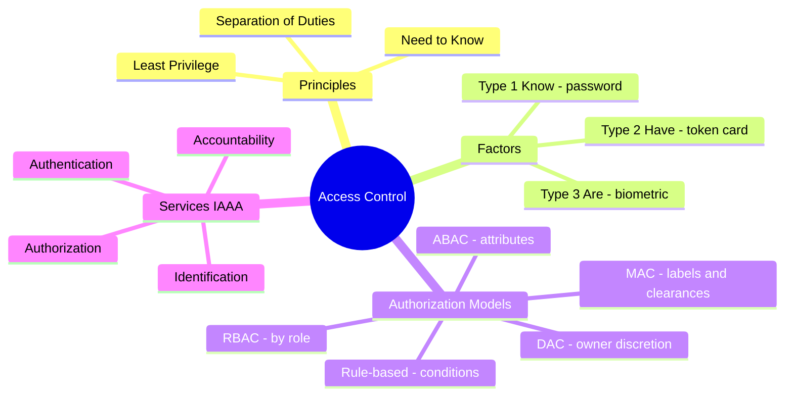

# Access Control Models

## Overview

An access control model is the rulebook for *who decides* access and *how* the decision gets made. The key question for every model is exactly that: who holds the discretion. With DAC the owner decides; with MAC the system decides from labels; with RBAC your job role decides; with ABAC a policy engine weighs attributes. Get that one distinction straight and most exam questions answer themselves.

## Key Concepts

### Access Control Models
| Model | Description | Who decides | Use case |
|-------|-------------|------------|----------|
| **DAC** (Discretionary) | Owner decides who gets access | Resource owner | Windows NTFS, Unix permissions |
| **MAC** (Mandatory) | System enforces labels/clearances | System/policy | Military, classified systems |
| **RBAC** (Role-Based) | Access based on job role | Administrator | Most enterprises |
| **ABAC** (Attribute-Based) | Access based on attributes (user, resource, environment) | Policy engine | Complex, dynamic environments |
| **Rule-Based** | Access based on rules (ACLs, firewall rules) | Administrator | Firewalls, routers |

### DAC (Discretionary Access Control)
- Owner controls access to their resources
- Flexible but least secure (users can share access)
- Identity-based: access control lists (ACLs)
- Vulnerable to Trojan horses (runs with user's permissions)

### MAC (Mandatory Access Control)
- System enforces access based on **labels** and **clearances**
- Users cannot change permissions (non-discretionary)
- Uses sensitivity labels (Top Secret, Secret, Confidential, Unclassified)
- Based on Bell-LaPadula (confidentiality) or Biba (integrity) models
- Most restrictive model

### RBAC (Role-Based Access Control)
- Access based on job function/role, not individual identity
- Users are assigned to roles; roles have permissions
- Simplifies management in large organizations
- Supports least privilege and separation of duties
- Most commonly used in enterprise environments
- **Non-discretionary** - a central authority (not the data owner) sets access

> **Non-discretionary access control** = a central authority/system, not the resource owner, decides access. This includes both **MAC** (system enforces labels/clearances) and **RBAC** (admin assigns roles). DAC is the discretionary counterpart.

### ABAC (Attribute-Based Access Control)
- Decisions based on attributes of subject, object, and environment
- Very flexible and granular
- Example: "Allow access if user.department=finance AND time=business_hours AND resource.classification=internal"
- Can implement other models (DAC, MAC, RBAC) as subsets

### Access Control Matrix
- Table of subjects (rows) vs. objects (columns)
- Each cell contains permissions
- **Capability table** = row (what a subject can do)
- **ACL** = column (who can access an object)

### Access Aggregation
- **Access aggregation** = gathering enough individual access rights or pieces of information to gain more than any single grant intended. Related to **authorization creep** and to **inference** (deriving sensitive facts from combined non-sensitive ones).

### Rule-Based Access Control (RuBAC) in depth

RuBAC applies the *same global rules to everyone*, independent of identity or role. The textbook example is a firewall: "block port 23 from any source" applies to all subjects equally. RuBAC is **non-discretionary** (a central authority sets the rules) and is usually expressed as conditions — if a request matches a rule, the rule's action fires. Watch the abbreviation collision: **RBAC = Role**-based, **RuBAC = Rule**-based. If the stem says "rules that apply uniformly regardless of who the user is" (firewall/router ACLs, time-of-day restrictions enforced for all), it is **rule-based**.

### Risk-based and context/adaptive access control

These models make the *strength of the decision change with the situation* rather than being fixed:

- **Risk-based (adaptive) access control** computes a risk score for each access attempt from signals like device health, location, impossible travel, time, and behaviour anomalies, then adapts: allow, step up to MFA, or deny. A login from a managed laptop in the office passes silently; the same account from a new country at 3 a.m. is challenged or blocked. This is the engine behind adaptive MFA and a pillar of Zero Trust.
- **Context-based (context-aware) access control** decides using contextual attributes — time of day, location, device, connection type — rather than identity alone. Risk-based is essentially context-based with an explicit risk calculation and adaptive response on top.

### ABAC in depth (and how it generalises the others)

ABAC evaluates **policies** written over attributes of four things: the **subject** (department, clearance, role), the **resource/object** (classification, owner, type), the **action** (read, write, delete), and the **environment** (time, location, device, threat level). A policy decision point (PDP) evaluates the rule and a policy enforcement point (PEP) applies it. Because attributes can encode role (giving RBAC), labels (giving MAC), ownership (giving DAC), or context (giving risk/context-based), **ABAC can express the other models as special cases** — which is why it is the most flexible and granular, at the cost of complexity. ABAC is the natural way to implement fine-grained, dynamic, context-aware authorization in Zero Trust architectures.

### Picking the model (decision cues)

| If the stem stresses… | Model |
|---|---|
| Owner sets permissions on their own files | **DAC** |
| Labels/clearances, system-enforced, military | **MAC** |
| Access tied to job function | **RBAC** |
| Uniform rules for everyone (firewall, time windows) | **RuBAC (Rule-based)** |
| Many attributes / dynamic policy / fine-grained | **ABAC** |
| Decision adapts to risk signals (location, device, anomalies) | **Risk-based / adaptive** |

## Exam Tips

- **DAC** = owner decides (most flexible, least secure)
- **MAC** = labels and clearances (most restrictive, military use)
- **RBAC** = role-based (most common in enterprise)
- **ABAC** = attribute-based (most flexible, can encompass other models)
- MAC prevents Trojan horse attacks (unlike DAC)
- RBAC enforces least privilege through role assignments
- **RBAC vs. RuBAC:** Role-based ties access to job function; Rule-based applies uniform rules to everyone (firewall/time windows). Don't confuse the abbreviations.
- **Risk-based / adaptive** access changes the decision with context (device, location, anomalies) → the engine behind adaptive MFA and Zero Trust.

## Diagrams

### Access Control — Mindmap

**Takeaway:** MFA = factors from **different** types. DAC = owner; MAC = system labels; RBAC = role. IAAA = the four services.

## Related Topics

- [Security Models](../03-security-architecture-and-engineering/Security%20Models.md) - Bell-LaPadula, Biba underpin MAC
- [Authentication Methods](Authentication%20Methods.md) - authentication before authorization
- [Authorization and Accountability](Authorization%20and%20Accountability.md)
- [Least Privilege](../01-security-and-risk-management/Least%20Privilege.md)
- [Separation of Duties](../01-security-and-risk-management/Separation%20of%20Duties.md)
