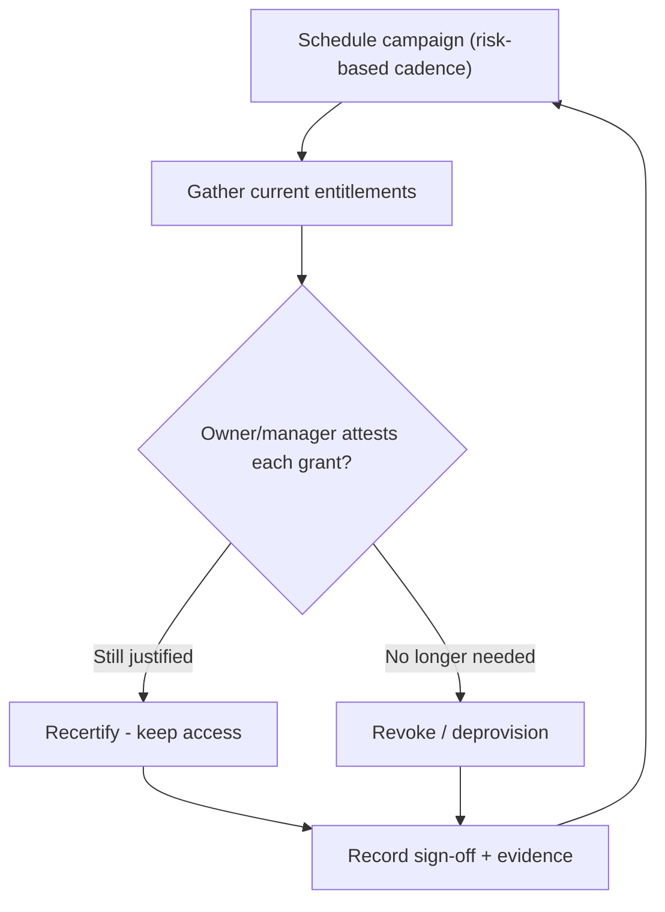

# Account Access Review and Recertification

## Overview

Provisioning grants access at a moment in time, but reality keeps moving — people change roles, projects end, contractors leave, temporary grants are forgotten. Without a periodic check, access only ever accumulates, never shrinks. **Access review and recertification** is that periodic check: someone with authority looks at who currently has access to what and confirms each grant is still justified, revoking what is not. The intuition: access is a liability that decays in correctness over time, so you re-prove it on a schedule the same way you re-prove a backup by restoring it. The classic problems this catches are **privilege creep** (rights piling up across role changes) and **orphaned accounts** (access that outlived the person's need or employment).

## Key Concepts

### Review vs. recertification (attestation)

An **access review** is the act of examining current entitlements. **Recertification** (or **attestation**) is the formal sign-off where a responsible party — usually the data owner or the user's manager, not IT — *certifies* that each remaining grant is still appropriate. Attestation matters because it puts accountability on the business owner who understands the need, not on the administrator who merely executes changes.

### What gets reviewed

- **User access** — does each person still need each entitlement for their current role?
- **Privileged accounts** — admin and service accounts get extra scrutiny (highest risk).
- **Service accounts** — often over-privileged and rarely rotated; easy to forget.
- **Dormant/orphaned accounts** — accounts with no recent activity or no valid owner.
- **Separation-of-duties conflicts** — toxic combinations one person should not hold together (e.g., create vendor + approve payment).

### Privilege creep (authorization creep)

Privilege creep is the gradual accumulation of access beyond what the current role needs, typically because **Mover** events add new rights without removing the old ones. Reviews are its primary cure: they surface the leftover access that provisioning processes missed. The deeper fix is to *deprovision the old access at the moment of the role change*, not just rely on the periodic review to clean up.

### Cadence and risk-based scheduling

Reviews run on a cycle — commonly **quarterly for privileged/high-risk access and annually for general user access**, with **event-driven** reviews on role change or termination. Higher-risk entitlements deserve more frequent review; this risk-based cadence concentrates effort where the damage potential is greatest.

### Automation: IGA and entitlement management

Identity Governance and Administration (IGA) tooling automates campaigns — generating review tasks, routing them to the right approver, flagging anomalies (dormant accounts, SoD conflicts, outliers versus peers), and revoking on rejection. Automation matters because manual spreadsheet reviews are slow, error-prone, and often rubber-stamped. **Micro-certification** narrows a campaign to a triggered subset (e.g., review only the access of people who just changed departments) so reviews stay targeted and meaningful.

### The relationship to deprovisioning

A review that finds inappropriate access is only useful if the revocation actually happens. Reviews feed deprovisioning; the loop must close. Reviews are detective; the prompt revocation they trigger is corrective.

## Common traps / easily confused

- **Review vs. recertification:** the review *looks*; recertification/attestation is the *sign-off that certifies* the access. The exam often wants "attestation by the data/business owner."
- **Who recertifies?** The **data owner / manager** who understands business need — not IT, which only implements the result.
- **Reviews are the cure for privilege creep**, but the *better* control is removing old access at the role change itself. If both are options, the proactive Mover-time removal is stronger.
- **Orphaned accounts** are found by reviews but prevented by tying deprovisioning to **HR termination events**.
- **Recertification is detective/corrective, not preventive** — it catches what provisioning got wrong after the fact.

## Exam Tips

- "Users have accumulated access from past roles" → **privilege/authorization creep**, addressed by **access review and recertification**.
- The party who should **certify** continued access is the **data owner / manager**, not the administrator.
- Privileged access should be reviewed **more frequently** than general user access (risk-based cadence).
- Reviews must be **periodic and event-driven** (role change, termination), and must result in **actual revocation**.
- Best prevention of orphaned accounts: **automated deprovisioning tied to HR events**.

## Diagrams

### Recertification cycle
A risk-based campaign gathers entitlements, the business owner attests each one, and rejected access feeds deprovisioning — then the loop repeats.

## Related Topics

- [Identity Management](Identity%20Management.md) - the lifecycle reviews belong to
- [Privileged Access Management](Privileged%20Access%20Management.md) - reviewing privileged accounts
- [Separation of Duties](../01-security-and-risk-management/Separation%20of%20Duties.md) - conflicts reviews detect
- [Least Privilege](../01-security-and-risk-management/Least%20Privilege.md)
- [Personnel Security](../01-security-and-risk-management/Personnel%20Security.md) - termination triggers
